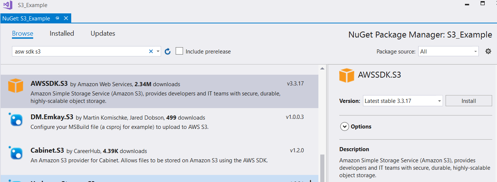
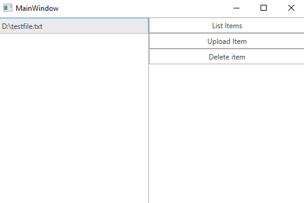

# Storage (S3) 

The **Amazon Simple Storage Service** (Amazon S3) is a storage service that allows you to upload any kind of data at any time, from anywhere. This article will demonstrate how one can use this service from a WPF application and manage the uploaded files.

## Step 1: Create the WPF Application

Create a standard WPF application and add 3 [RadButtons]() and a [RadListBox]() to it. The first button will list all of the files uploaded in our storage. The second button will upload a file and the third one will delete the selected file in the RadListBox.

#### __[XAML] Example 1: Defining the view __

{{region xaml-cloud-services-aws-storage-0}}
    <Grid>
        <Grid.ColumnDefinitions>
            <ColumnDefinition Width="250" />
            <ColumnDefinition />
        </Grid.ColumnDefinitions>

        <telerik:RadListBox x:Name="radListBox" ItemsSource="{Binding FileNames}" SelectedItem="{Binding SelectedItem, Mode=TwoWay}" />

        <Grid Grid.Column="1">
            <Grid.RowDefinitions>
                <RowDefinition Height="Auto" />
                <RowDefinition Height="Auto"/>
                <RowDefinition Height="Auto"/>
            </Grid.RowDefinitions>

            <telerik:RadButton Command="{Binding ListItemsCommand}"  Content="List Items"/>
            <telerik:RadButton Command="{Binding UploadItemCommand}" Content="Upload Item" Grid.Row="1"/>
            <telerik:RadButton Command="{Binding DeleteItemCommand}" Content="Delete item" Grid.Row="2"/>
        </Grid>
    </Grid>
{{endregion}}

## Step 2: Install the NuGet package

Open the NuGet Package Manager and install the **AWSSDK.S3** package.

In addition you need to add the following to your App.config file:

#### __[XAML] Example 2: Adding the AWS Profile in App.config__

{{region xaml-cloud-services-aws-storage-1}}
    <?xml version="1.0" encoding="utf-8" ?>
        <configuration>
            <appSettings>
                <add key="AWSProfileName" value="Telerik"/>
                <add key="AWSRegion" value="eu-west-3" />
            </appSettings>
        </configuration>
{{endregion}}

> If you do not have an AWS account in Visual Studio, please check the [Getting Started]() article.

## Step 3: Create a new bucket

Before proceeding with the example you will have to create a new bucket using the AWS Management Console. You can learn how to do that in the [Creating a Bucket](https://docs.aws.amazon.com/AmazonS3/latest/gsg/CreatingABucket.html) article.

## Step 4: Define the ViewModel

The next step is to create the ViewModel. It will need an [IAmazonS3](https://docs.aws.amazon.com/sdkfornet/latest/apidocs/items/TS3IS3NET45.html) client object which will be used for managing the data. We also need to implement all of the commands that the RadButtons are bound to.

#### __[C#] Example 3: Defining the ViewModel__

{{region cs-cloud-services-aws-storage-2}}
    public class ViewModel
    {
        string bucketName = "mytestbucket";
        IAmazonS3 client;

        private object selectedItem;
        private ObservableCollection<string> fileNames;
        private IFileDialogService fileDialogService;

        public ViewModel(IFileDialogService fileDialogService)
        {
            this.fileNames = new ObservableCollection<string>();
            this.ListItemsCommand = new DelegateCommand(OnListItems);
            this.UploadItemCommand = new DelegateCommand(OnUploadItem);
            this.DeleteItemCommand = new DelegateCommand(OnDeleteItem);
            this.fileDialogService = fileDialogService;
            this.client = new AmazonS3Client();
        }

        public object SelectedItem
        {
            get { return this.selectedItem; }
            set { this.selectedItem = value; }
        }

        public ObservableCollection<string> FileNames
        {
            get { return this.fileNames; }
            set { this.fileNames = value; }
        }

        private ICommand listItemsCommand;

        public ICommand ListItemsCommand
        {
            get { return this.listItemsCommand; }
            set { this.listItemsCommand = value; }
        }

        private ICommand deleteItemCommand;

        public ICommand DeleteItemCommand
        {
            get { return this.deleteItemCommand; }
            set { this.deleteItemCommand = value; }
        }

        private ICommand uploadItemCommand;

        public ICommand UploadItemCommand
        {
            get { return this.uploadItemCommand; }
            set { this.uploadItemCommand = value; }
        }

        private void OnDeleteItem(object obj)
        {
            if (this.SelectedItem == null)
            {
                MessageBox.Show("Please select an Item");
                return;
            }

            string keyName = this.SelectedItem.ToString();
            DeleteObjectRequest request = new DeleteObjectRequest()
            {
                BucketName = bucketName,
                Key = keyName
            };

            var response = client.DeleteObject(request);
        }

        private void OnUploadItem(object obj)
        {
            var fileName = fileDialogService.OpenFileDialog();
            PutObjectRequest request = new PutObjectRequest()
            {
                BucketName = bucketName,
                Key = fileName
            };

            PutObjectResponse response = client.PutObject(request);
        }

        private void OnListItems(object obj)
        {
            var objects = client.ListObjects(bucketName);

            this.FileNames.Clear();

            foreach (S3Object item in objects.S3Objects)
            {
                this.FileNames.Add(item.Key);
            }
        }
    }
{{endregion}}

#### __[VB.NET] Example 3: Defining the ViewModel__

{{region vb-cloud-services-aws-storage-3}}
    Public Class ViewModel
        Private bucketName As String = "mytestbucket"

        Private client As IAmazonS3

        Private selectedItem As Object

        Private fileNames As ObservableCollection(Of String)

        Private fileDialogService As IFileDialogService

        Public Sub New(ByVal fileDialogService As IFileDialogService)
            Me.fileNames = New ObservableCollection(Of String)()
            Me.ListItemsCommand = New DelegateCommand(AddressOf OnListItems)
            Me.UploadItemCommand = New DelegateCommand(AddressOf OnUploadItem)
            Me.DeleteItemCommand = New DelegateCommand(AddressOf OnDeleteItem)
            Me.fileDialogService = fileDialogService
            Me.client = New AmazonS3Client()
        End Sub

        Public Property SelectedItem As Object
            Get
                Return Me.selectedItem
            End Get

            Set(ByVal value As Object)
                Me.selectedItem = value
            End Set
        End Property

        Public Property FileNames As ObservableCollection(Of String)
            Get
                Return Me.fileNames
            End Get

            Set(ByVal value As ObservableCollection(Of String))
                Me.fileNames = value
            End Set
        End Property

        Private listItemsCommand As ICommand

        Public Property ListItemsCommand As ICommand
            Get
                Return Me.listItemsCommand
            End Get

            Set(ByVal value As ICommand)
                Me.listItemsCommand = value
            End Set
        End Property

        Private deleteItemCommand As ICommand

        Public Property DeleteItemCommand As ICommand
            Get
                Return Me.deleteItemCommand
            End Get

            Set(ByVal value As ICommand)
                Me.deleteItemCommand = value
            End Set
        End Property

        Private uploadItemCommand As ICommand

        Public Property UploadItemCommand As ICommand
            Get
                Return Me.uploadItemCommand
            End Get

            Set(ByVal value As ICommand)
                Me.uploadItemCommand = value
            End Set
        End Property

        Private Sub OnDeleteItem(ByVal obj As Object)
            If Me.SelectedItem Is Nothing Then
                MessageBox.Show("Please select an Item")
                Return
            End If

            Dim keyName As String = Me.SelectedItem.ToString()
            Dim request As DeleteObjectRequest = New DeleteObjectRequest() With {.BucketName = bucketName, .Key = keyName}
            Dim response = client.DeleteObject(request)
        End Sub

        Private Sub OnUploadItem(ByVal obj As Object)
            Dim fileName = fileDialogService.OpenFileDialog()
            Dim request As PutObjectRequest = New PutObjectRequest() With {.BucketName = bucketName, .Key = fileName}
            Dim response As PutObjectResponse = client.PutObject(request)
        End Sub

        Private Sub OnListItems(ByVal obj As Object)
            Dim objects = client.ListObjects(bucketName)
            Me.FileNames.Clear()
            For Each item As S3Object In objects.S3Objects
                Me.FileNames.Add(item.Key)
            Next
        End Sub
    End Class
{{endregion}}

## Step 5: Define the OpenFileDialogService

The only thing left is to define the interface through which we are opening the [RadOpenFileDialog](). We also need to define the implementation of that interface which will simply open a RadOpenFileDialog and return the path of the opened file.

#### __[C#] Example 4: Defining the OpenFileDialogService and IFileDialogService__

{{region cs-cloud-services-aws-storage-4}}
    public interface IFileDialogService
    {
        string OpenFileDialog();
    }

    public class OpenFileDialogService : IFileDialogService
    {
        public string OpenFileDialog()
        {
            RadOpenFileDialog choosefiledialog = new RadOpenFileDialog();
            choosefiledialog.Filter = "All Files (*.*)|*.*";
            choosefiledialog.FilterIndex = 1;
            choosefiledialog.Multiselect = false;
            choosefiledialog.ShowDialog();

            if (choosefiledialog.DialogResult == true)
            {
                return choosefiledialog.FileName;
            }

            return string.Empty;
        }
    }
{{endregion}}

#### __[VB.NET] Example 4: Defining the OpenFileDialogService and FileDialogService__

{{region cs-cloud-services-aws-storage-5}}
    Interface IFileDialogService
        Function OpenFileDialog() As String
    End Interface

    Public Class OpenFileDialogService
    Inherits IFileDialogService

        Public Function OpenFileDialog() As String
            Dim choosefiledialog As RadOpenFileDialog = New RadOpenFileDialog()
            choosefiledialog.Filter = "All Files (*.*)|*.*"
            choosefiledialog.FilterIndex = 1
            choosefiledialog.Multiselect = False
            choosefiledialog.ShowDialog()
            If choosefiledialog.DialogResult = True Then
                Return choosefiledialog.FileName
            End If

            Return String.Empty
        End Function
    End Class
{{endregion}}

All that is left is to set the DataContext to our ViewModel and pass an instance of the OpenFileDialogService.

#### __[C#] Example 5: Set the DataContext__

{{region cs-cloud-services-aws-storage-6}}
    public MainWindow()
    {
        InitializeComponent();
        this.DataContext = new ViewModel(new OpenFileDialogService());
    }
{{endregion}}

#### __[VB.NET] Example 5: Set the DataContext__

{{region vb-cloud-services-aws-storage-7}}
    Public Sub MainWindow()
        InitializeComponent()
        Me.DataContext = New ViewModel(New OpenFileDialogService())
    End Sub
{{endregion}}

#### Figure 1: Example after uploading a file and listing it in the Office2016 theme

# See Also

* [DynamoDB]()
* [Relational Database Service]()
* [Getting started with Amazon S3 Storage](https://aws.amazon.com/s3/getting-started/)
* [Working with Amazon S3 Buckets](https://docs.aws.amazon.com/AmazonS3/latest/dev/UsingBucket.html)