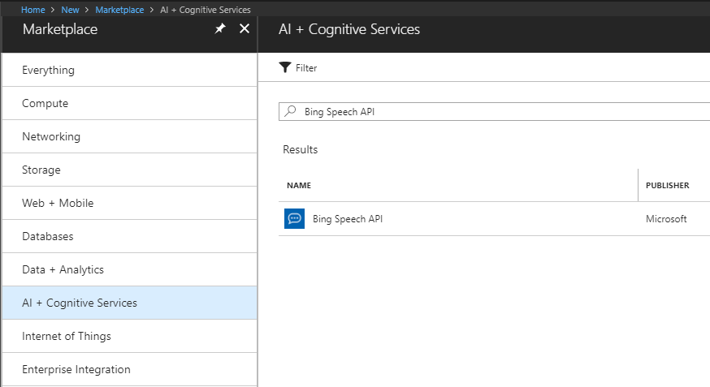

# Speech-to-Text

This article will guide you through the process of integrating Azure's [Bing Speech API](https://azure.microsoft.com/en-us/services/cognitive-services/speech/) with the controls from the UI for {{ site.framework_name }} suite. More specifically, you will use the [RadWatermarkTextBox](), [RadToggleButton]() and [RadGlyph]() to create a simple user control which transforms the recorded speech to text.

## Create a Bing Speech API Account

Before you start, you need to create a new Bing Speech API account through the Azure portal. This has been explained in great detail in [this article](https://docs.microsoft.com/en-us/azure/cognitive-services/cognitive-services-apis-create-account).

Once you've created the account, you have to obtain the subscription keys that have been generated for you. You will require them later on in order to make API calls from your application.

## Create the Application

[Create a new WPF application]()[Create a new Silverlight application]() and add the following assemblies which you will need.

* **Telerik.Windows.Controls**
* **Telerik.Windows.Data**

You can then [set a theme]() for the application.

Once you've set a theme for your application, add the following dictionary to your list of merged dictionaries which will enable you to use the **TelerikWebUI** [font glyphs]() for the icons in the project.

#### __[XAML] Example 1: The User Control's Definition__

{{region cloud-integration-cognitive-services-speech-to-text-1}}
    <Application.Resources>
		<ResourceDictionary>
			<ResourceDictionary.MergedDictionaries>
				<!-- ... -->
				<ResourceDictionary Source="/Telerik.Windows.Controls;component/Themes/FontResources.xaml"/>
			</ResourceDictionary.MergedDictionaries>
		</ResourceDictionary>
	</Application.Resources>
{{endregion}}

## Define the User Control's Layout

Now, add a new **UserControl** to your project. You can give it a descriptive name, such as RecordVoiceControl, for example. Next, define the following XAML:

#### __[XAML] Example 2: The User Control's Definition__

{{region cloud-integration-cognitive-services-speech-to-text-1}}
    <UserControl x:Class="AzureCognitiveServices.RecordVoiceControl"
                xmlns="http://schemas.microsoft.com/winfx/2006/xaml/presentation"
                xmlns:x="http://schemas.microsoft.com/winfx/2006/xaml"
                xmlns:mc="http://schemas.openxmlformats.org/markup-compatibility/2006" 
                xmlns:d="http://schemas.microsoft.com/expression/blend/2008" 
                xmlns:telerik="http://schemas.telerik.com/2008/xaml/presentation"
                xmlns:local="clr-namespace:AzureCognitiveServices"
                mc:Ignorable="d" 
                d:DesignHeight="300" d:DesignWidth="300">
        <Grid>
            <Grid.ColumnDefinitions>
                <ColumnDefinition Width="Auto" />
                <ColumnDefinition Width="*" />
            </Grid.ColumnDefinitions>
            <telerik:RadToggleButton x:Name="recordButton" 
                                    Checked="recordButton_Checked" 
                                    Unchecked="recordButton_Unchecked">
                <Path Fill="{Binding (TextElement.Foreground), RelativeSource={RelativeSource AncestorType=ContentPresenter}}" 
                    Width="20" Height="20" Stretch="UniformToFill" 
                    Data="{telerik:RadGlyph Glyph={StaticResource GlyphRadioButtonChecked}}" />
            </telerik:RadToggleButton>
            <telerik:RadWatermarkTextBox Text="{Binding Text, Mode=TwoWay, RelativeSource={RelativeSource AncestorType=local:RecordVoiceControl}}" 
									    AcceptsReturn="True"
                                        Grid.Column="1" MinLines="3" 
                                        WatermarkContent="Write your short description here or press the record button to the left..." />
        </Grid>
    </UserControl>
{{endregion}}

## Add the Speech Recognition NuGet Package

You now have to add the **Microsoft.ProjectOxford.SpeechRecognition** NuGet package corresponding to your application's build configuration.

## Use the Speech Recognition API

All that's left to do is actually handle the button's **Checked** and **Unchecked** events and use the Bing Speech API to pass the recognized text to the **RadWatermarkTextBox**.

#### __[XAML] Example 3: The User Control's Definition__

{{region cloud-integration-cognitive-services-speech-to-text-2}}
    public partial class RecordVoiceControl : UserControl
	{
		private MicrophoneRecognitionClient micClient;
		const string subscriptionKey = "the subscription key you obtained from Azure";

		public RecordVoiceControl()
		{
			InitializeComponent();
		}

		public string Text
		{
			get { return (string) GetValue(TextProperty); }
			set { SetValue(TextProperty, value); }
		}
		
		public static readonly DependencyProperty TextProperty =
			DependencyProperty.Register("Text", typeof(string), typeof(RecordVoiceControl), new PropertyMetadata(null));

		private void recordButton_Checked(object sender, RoutedEventArgs e)
		{
			if (this.micClient == null)
			{
				this.micClient = SpeechRecognitionServiceFactory.CreateMicrophoneClient(
					SpeechRecognitionMode.LongDictation,
					"en-US",
					subscriptionKey);

				this.micClient.OnResponseReceived += (s, a) => { this.WriteResponseResult(a); };
			}

			this.micClient.StartMicAndRecognition();
		}

		private void recordButton_Unchecked(object sender, RoutedEventArgs e)
		{
			this.micClient.EndMicAndRecognition();
		}

		private void WriteResponseResult(SpeechResponseEventArgs e)
		{
			Dispatcher.BeginInvoke(new Action(() =>
			{
				for (int i = 0; i < e.PhraseResponse.Results.Length; i++)
				{
					this.Text += e.PhraseResponse.Results[i].DisplayText;
				}
			}), DispatcherPriority.Background);
		}
    }
{{endregion}}

The Checked handler creates a new instance of the **MicrophoneRecognitionClient** class via the **CreateMicrophoneClient** factory method if one has not already been created. This method requires the type of recognition mode, the language which the client will listen for and the subscription key from the Azure account you've set up. It then calls the speech recognition by invoking the **StartMicAndRecognition** which in turn starts listening for input. Once the button is pressed a second time, the **EndMicAndRecognition** method is invoked and the detected phrases are added to the RadWatermarkTextBox's **Text** property.

## Use the User Control

That's it. You can now use the control however you find necessary to record you speech.

#### __[XAML] Example 4: Use the User Control__

{{region cloud-integration-cognitive-services-speech-to-text-3}}
    <local:RecordVoiceControl Text="{Binding Text, Mode=TwoWay}" Height="60" />
{{endregion}}

**Figure 1** shows the final result in the Office2016 theme.

#### Figure 1: The custom speech recognition control in the Office2016 theme

## See Also

* [Image Analysis]()
* [Text Analysis]()
* [Blob Storage]()
* [Azure SQL Database]()