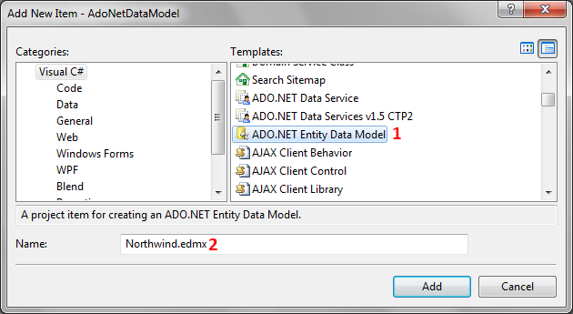

# Using LINQ to ADO.NET Entity Data Model

The purpose of this article is to show you how to use __LINQ__ against __ADO.NET Entity Data Model__. It will cover how to:
      

* [Query an entity from the database](#Query_an_Entity_from_the_Database)

* [Update an entity in the database](#Update_an_Entity_in_the_Database)

* [Insert a new record(s) in the database](#Insert_a_New_Record(s)_in_the_Database)

* [Delete a record from the database](#Delete_a_Record_from_the_Database)

* [Retrieve a record with Server Side Paging](#Retreive_a_Records_with_Server_Side_Paging)

>tipThis tutorial uses the __Northwind__ database, which can be downloaded from [here](http://www.microsoft.com/downloads/details.aspx?FamilyID=06616212-0356-46A0-8DA2-EEBC53A68034&displaylang=en).
          Before trying out any of the examples below you need to create a new ADO.NET Data Model. The topic is described in more details in MSDN
          [here](http://msdn.microsoft.com/en-us/library/vstudio/cc716703(v=vs.100).aspx).
        

Add a new ADO.NET Data Model.

Figure 1: Add ADO.NET Entity Data Model

Using the ADO.NET Entity Framework wizard you can easily create a representation of the sample Northwind database like the one show in __Figure 2__:
      

Figure 2: Nortwind in Entity Designer

## Query an Entity from the Database

The code in __Example 1__ shows how to use LINQ query syntax to retrieve an __IEnumerable__ sequence of __Product__ objects.
        

#### __[C#] Example 1: Query Product by CategoryName__

{{region consuming-data-linq-to-ado-net-entity-data-model_0}}
	NorthwindEntities dbContext = new NorthwindEntities();
	var query = from p in dbContext.ProductSet
	            where p.Categories.CategoryName == "Seafood"
	            select p;
	IEnumerable<Product> products = query.ToList();
	{{endregion}}

#### __[VB] Example 1: Query Product by CategoryName__

{{region consuming-data-linq-to-ado-net-entity-data-model_1}}
	Dim dbContext As New NorthwindEntities()
	Dim query = From p In dbContext.ProductSet _
	    Where p.Categories.CategoryName = "Seafood" _
	    Select p
	Dim products As IEnumerable(Of Product) = query.ToList()
	{{endregion}}

## Update an Entity in the Database

The code in __Example 2__ demonstrates how to grab a single __Product__ object from the database, update its price, and then save the changes back to the database.
        

#### __[C#] Example 2: Update UnitPrice of Product__

{{region consuming-data-linq-to-ado-net-entity-data-model_2}}
	NorthwindEntities dbContext = new NorthwindEntities();
	Product product = dbContext.ProductSet.Single( p => p.ProductName == "Aniseed Syrup" );
	product.UnitPrice = 1000;
	dbContext.SaveChanges();
	{{endregion}}

#### __[VB] Example 2: Update UnitPrice of Product__

{{region consuming-data-linq-to-ado-net-entity-data-model_3}}
	Dim dbContext As New NorthwindEntities()
	Dim query = From p In dbContext.ProductSet_
	            Where p.ProductName = "Aniseed Syrup" _
	            Select p
	product.UnitPrice = 1000
	dbContext.SaveChanges()
	{{endregion}}

## Insert a New Record(s) in the Database

The code in __Example 3__ shows you how to create a new __Category__ object. Then, it shows how to create two new __Products__ and associate them with the __Category__. Finally, all three objects are saved in the database.
        

#### __[C#] Example 3: Insert Products with new Category__

{{region consuming-data-linq-to-ado-net-entity-data-model_4}}
	NorthwindEntities dbContext = new NorthwindEntities();
	
	Category category = new Category();
	category.CategoryName = "Test Category";
	
	Product firstProduct = new Product();
	firstProduct.ProductName = "Test Product 1";
	
	Product secondProduct = new Product();
	secondProduct.ProductName = "Test Product 2";
	
	category.Products.Add( firstProduct );
	category.Products.Add( secondProduct );
	
	dbContext.AddToCategorySet( category );
	dbContext.SaveChanges();
	{{endregion}}

#### __[VB] Example 3: Insert Products with new Category__

{{region consuming-data-linq-to-ado-net-entity-data-model_5}}
	Dim dbContext As New NorthwindEntities()
	
	Dim category As New Category()
	category.CategoryName = "Test Category"
	
	Dim firstProduct As New Product()
	firstProduct.ProductName = "Test Product 1"
	
	Dim secondProduct As New Product()
	secondProduct.ProductName = "Test Product 2"
	
	category.Products.Add(firstProduct)
	category.Products.Add(secondProduct)
	
	dbContext.AddToCategorySet(category)
	dbContext.SaveChanges()
	{{endregion}}

## Delete a Record from the Database

__Example 4__ demonstrates you how to delete all 'Test' products from the database.
        

#### __[C#] Example 4: Delete a record based on a condition__

{{region consuming-data-linq-to-ado-net-entity-data-model_6}}
	NorthwindEntities dbContext = new NorthwindEntities();
	var query = from p in dbContext.ProductSet
	            where p.ProductName.Contains( "Test" )
	            select p;
	foreach ( Product p in query )
	    dbContext.DeleteObject( p );
	dbContext.SaveChanges();
	{{endregion}}

#### __[VB] Example 4: Delete a record based on a condition__

{{region consuming-data-linq-to-ado-net-entity-data-model_7}}
	Dim dbContext As New NorthwindEntities()
	Dim query = From p In dbContext.ProductSet _
	    Where p.ProductName.Contains("Test") _
	    Select p
	For Each p As Product In query
	    dbContext.DeleteObject(p)
	Next
	dbContext.SaveChanges()
	{{endregion}}

## Retrieve a Record with Server-side Paging

__Example 5__ shows you how to implement efficient server-side database paging. By using the __Skip()__ and __Take()__ methods, you will return 15 rows from the database - starting with row 300.
        

#### __[C#] Example 5:Server-side Paging__

{{region consuming-data-linq-to-ado-net-entity-data-model_8}}
	NorthwindEntities dbContext = new NorthwindEntities();
	var query = ( from p in dbContext.ProductSet
	              where p.Categories.CategoryName == "Aniseed Syrup"
	              select p ).Skip( 300 ).Take( 15 );
	IEnumerable<Product> products = query.ToList();
	{{endregion}}

#### __[VB] Example 5:Server-side Paging__

{{region consuming-data-linq-to-ado-net-entity-data-model_9}}
	Dim dbContext As New NorthwindEntities()
	Dim query = (From p In dbContext.ProductSet _
	    Where p.Categories.CategoryName = "Aniseed Syrup" _
	    Select p).Skip(300).Take(15)
	Dim products As IEnumerable(Of Product) = query.ToList()
	{{endregion}}

# See Also

 * [Consuming WCF Service]()

 * [Consuming WCF Data Service]()

 * [Consuming Web (asmx) Service]()
