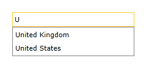
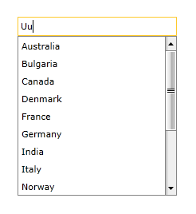

# Filtering Behavior

The main functionality of the __RadAutoCompleteBox__ control is its filtering mechanism which filters the collection that is bound to the ItemsSource of the control based on the input in its TextBox. This article will explain the benefits of the built-in __AsyncFilteringBehavior__ and will demonstrate how to implement a custom __FilteringBehavior__.

## Async Filtering Behavior

When it comes to filtering a huge amount of data the performance is that what really matters. Now with the Q2 2014 release version of UI for WPFSilverlight, __RadAutoCompleteBox__ provides a new built-in __AsyncFilteringBehavior__ which solves that scenario really easy and makes the filtering of huge amount of items unnoticeable. Unlike the default __FilteringBehavior__ the new __AsyncFilteringBehavior__ performes the filtering operation on a different threads if possible and helps you to achieve a better user experience.

The behavior should be set up the following way:

#### __[XAML] RadAutoCompleteBox with AsyncFilteringBehavior__

{{region radautocompletebox-features-filteringbehavior-1}}
	<telerik:RadAutoCompleteBox>
		<telerik:RadAutoCompleteBox.FilteringBehavior>
			<telerik:AsyncFilteringBehavior />
		</telerik:RadAutoCompleteBox.FilteringBehavior>
	</telerik:RadAutoCompleteBox>
{{endregion}}

## Custom Filtering Behavior

Customizing the logic behind this filtering mechanism is a simple task and only requires the creation of a custom __FilteringBehavior__ which could implement any custom filtering logic. The next example will demonstrate how to create a custom __FilteringBehavior__ in order to achieve a functionality that populates the DropDown portion of the control with the entire ItemsSource collection when no match is found.

>Before proceeding with this tutorial you should get familiar with [Binding To Object]().

1. First you will need to create a custom class that inherits the default __FilteringBehavior__ of the AutoCompleteBox control:

	#### __[C#] Custom class that inherits the default FilteringBehavior__

	{{region radautocompletebox-features-filteringbehavior-0}}
		public class MyCustomFilteringBehavior : FilteringBehavior
		{
		
		}
	{{endregion}}

1. After that you will need to override its __FindMatchingItems()__ method with a custom logic that will return the entire items collection when no watch is found:

	#### __[C#] Overriding FindMatchingItems__

	{{region radautocompletebox-features-filteringbehavior-1}}
		public class MyCustomFilteringBehavior : FilteringBehavior
		{
			public override IEnumerable<object> FindMatchingItems(string searchText, IList items, IEnumerable<object> escapedItems, string textSearchPath, TextSearchMode textSearchMode)
			{
				var result = base.FindMatchingItems(searchText, items, escapedItems, textSearchPath, textSearchMode) as IEnumerable<object>;
		 
				if (string.IsNullOrEmpty(searchText) || !result.Any())
				{
					return ((IEnumerable<object>)items).Where(x => !escapedItems.Contains(x));
				}
		
				return result;
			}
		}
	{{endregion}}

1. Finally all you need to do is set the newly created behavior to the __FilteringBehavior__ of the AutoCompleteBox control. The xaml of the control should look like this:

	#### __[XAML] Setting the newly created behavior__

	{{region radautocompletebox-features-filteringbehavior-0}}
		<telerik:RadAutoCompleteBox ItemsSource="{Binding Countries, Source={StaticResource ViewModel}}"
									DisplayMemberPath="Name" 
									TextSearchMode="StartsWith"
									WatermarkContent="Enter Country Name"
									FilteringBehavior="{StaticResource CustomFilteringBehavior}"/>
	{{endregion}}

>tipYou can download a runnable project of the previous example from our online SDK repository [here](https://github.com/telerik/xaml-sdk), the example is listed as __AutoCompleteBox / NoMatchFilteringBehavior__.

The next screenshots show the finally result:

__With__ the custom FilteringBehavior (the DropDown portion is populated although no watches were found):

__Without__ the custom FilteringBehavior (the default FilteringBehavior) (the DropDown portion is not populated because no watch were found):

# See Also

 * [Binding To Object]()
