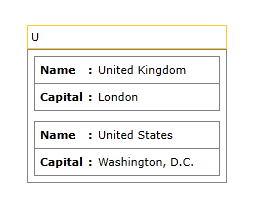
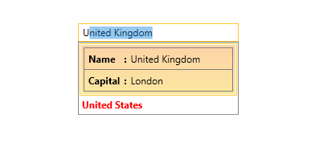

# Customizing the DropDownItemTemplate and DropDownItemTemplateSelector

In the __RadAutoCompleteBox__ control you can customize the way items are rendered in the DropDown portion of the control. You can do that by setting the __DropDownItemTemplate__ or __DropDownItemTemplateSelector__ properties. They allow you to show different templates for the DropDown items.

## Creating custom DropDownItemTemplate

The next example will demonstrate how to create a custom DropDownItemTemplate in order to show two of the properties of the bound items from the ItemsSource collection.

>Before proceeding with this example you should get familiar with [Binding To Object]().

The next steps show how to create and set a custom DropDownItemTemplate to the RadAutoCompleteBox control:

1. First we will need to create and populate the __ViewModel__ with some sample data, more details can be found [here]().

1. Next we need to create a valid __DataTemplate__ and set the necessary binding for the __Name__, __Capital__ properties of the ItemsSource items:

#### __[XAML] Example 1: Declaring valid DataTemplate__
{{region xaml-radautocompletebox-customizing-drop-down-itemtemplate-0}}
	<DataTemplate x:Key="CustomDropDownItemTemplate">
		<Border BorderBrush="Gray" BorderThickness="1" Margin="2">
			<Grid>
				<Grid.ColumnDefinitions>
					<ColumnDefinition Width="Auto"/>
					<ColumnDefinition Width="Auto"/>
					<ColumnDefinition Width="*"/>
				</Grid.ColumnDefinitions>
				<Grid.RowDefinitions>
					<RowDefinition/>
					<RowDefinition/>
					<RowDefinition/>
				</Grid.RowDefinitions>
				<TextBlock Grid.Column="0" Grid.Row="0"
							Margin="5"
							FontWeight="Bold"
							Text="Name" />
				<TextBlock Grid.Row="0" Grid.Column="1" Margin="0 5 0 0"
							Text=":"
							FontWeight="Bold"/>
				<TextBlock Grid.Column="2" Grid.Row="0" Margin="5"
							Text="{Binding Name}" />
				<Border BorderBrush="Gray" BorderThickness="0.5" Grid.Row="1" Grid.Column="0" Grid.ColumnSpan="3"/>
				<TextBlock Grid.Column="0" Grid.Row="2" Margin="5"
							FontWeight="Bold"
							Text="Capital" />
				<TextBlock Grid.Row="2" Grid.Column="1" Margin="0 5 0 0"
							Text=":"
							FontWeight="Bold"/>
				<TextBlock Grid.Column="2" Grid.Row="2" Margin="5"
							Text="{Binding Capital}" />
			</Grid>
		</Border>
	</DataTemplate>
{{endregion}}

1. Finally you will need to declare the __RadAutoCompleteBox__ in the xaml and set its __ItemsSource__, __DisplayMemberPath__ and __DropDownItemTemplate__ properties:

#### __[XAML] Example 2: Setting the DropDownItemTemplate__
{{region xaml-radautocompletebox-customizing-drop-down-itemtemplate-1}}
	<telerik:RadAutoCompleteBox ItemsSource="{Binding Countries}"
								Width="200"
								DisplayMemberPath="Name"
								DropDownItemTemplate="{StaticResource CustomDropDownItemTemplate}"/>
{{endregion}}

The next screenshots show the final result:
#### __Figure 1__

#### __Figure 2__

#### __Figure 3__

## Creating custom DropDownItemTemplateSelector

This section will describe how you can create a custom __DropDownItemTemplateSelector__ in order to display different template depending on a property. We are going to extend the __Example 1__. First, we need to create a class which derives from __DataTemplateSelector__ and overrides the SelectTemplate method. Inside the method, we can return different template depending on our condition.

#### __[XAML]Example 3: Custom DataTemplateSelector class__
{{region xaml-radautocompletebox-customizing-drop-down-itemtemplate-0}}
	public class MyDropDownItemTemplateSelector : DataTemplateSelector
	{
		public DataTemplate CustomDropDownItemTemplate { get; set; }
		public DataTemplate RegularDropDownItemTemplate { get; set; }
		
		public override DataTemplate SelectTemplate(object item, DependencyObject container)
		{
			var country = item as Country;
			if(country.Name == "United States")
			{
				return RegularDropDownItemTemplate;
			}
			return CustomDropDownItemTemplate;
		}
	}
{{endregion}}

The next step is to specify the MyDropDownItemTemplateSelector in the Resources of the Window and set our custom templates. Then we can set our custom DataTemplateSelector to the __DropDownItemTemplateSelector__ property.

#### __[XAML] Example 4: Setting the DropDownItemTemplateSelector__
{{region xaml-radautocompletebox-customizing-drop-down-itemtemplate-1}}
	<Window.Resources>
        <DataTemplate x:Key="CustomDropDownItemTemplate">
            <Border BorderBrush="Gray" BorderThickness="1" Margin="2">
                <Grid>
                    <Grid.ColumnDefinitions>
                        <ColumnDefinition Width="Auto"/>
                        <ColumnDefinition Width="Auto"/>
                        <ColumnDefinition Width="*"/>
                    </Grid.ColumnDefinitions>
                    <Grid.RowDefinitions>
                        <RowDefinition/>
                        <RowDefinition/>
                        <RowDefinition/>
                    </Grid.RowDefinitions>
                    <TextBlock Grid.Column="0" Grid.Row="0" 
                            Margin="5" 
                            FontWeight="Bold" 
                            Text="Name" />
                    <TextBlock Grid.Row="0" Grid.Column="1" Margin="0 5 0 0" 
                            Text=":" 
                            FontWeight="Bold"/>
                    <TextBlock Grid.Column="2" Grid.Row="0" Margin="5" 
                            Text="{Binding Name}" />
                    <Border BorderBrush="Gray" BorderThickness="0.5" Grid.Row="1" Grid.Column="0" Grid.ColumnSpan="3"/>
                    <TextBlock Grid.Column="0" Grid.Row="2" Margin="5" 
                            FontWeight="Bold" 
                            Text="Capital" />
                    <TextBlock Grid.Row="2" Grid.Column="1" Margin="0 5 0 0" 
                            Text=":" 
                            FontWeight="Bold"/>
                    <TextBlock Grid.Column="2" Grid.Row="2" Margin="5" 
                            Text="{Binding Capital}" />
                </Grid>
            </Border>
        </DataTemplate>

        <DataTemplate x:Key="RegularDropDownItemTemplate">
            <TextBlock Text="{Binding Name}" Foreground="Red" FontWeight="Bold"/>
        </DataTemplate>
        
        <local:MyDropDownItemTemplateSelector x:Key="dropDownItemTemplateSelector" CustomDropDownItemTemplate="{StaticResource CustomDropDownItemTemplate}"
                                              RegularDropDownItemTemplate="{StaticResource RegularDropDownItemTemplate}" />
    </Window.Resources>
    <Grid>
        <telerik:RadAutoCompleteBox ItemsSource="{Binding Countries}" 
                                Width="200" VerticalAlignment="Center"
                                DisplayMemberPath="Name" 
                                DropDownItemTemplateSelector="{StaticResource dropDownItemTemplateSelector}"/>
    </Grid>
{{endregion}}

## See Also

 * [Binding To Object]()
