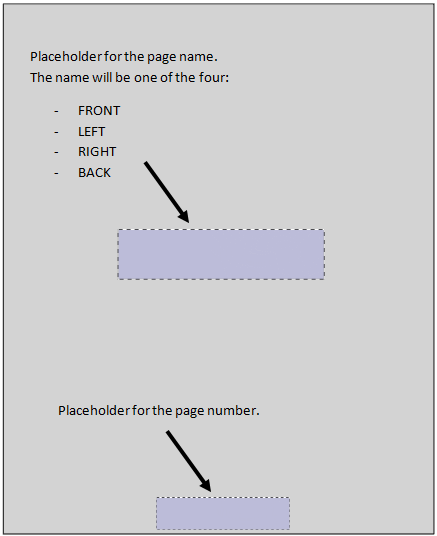
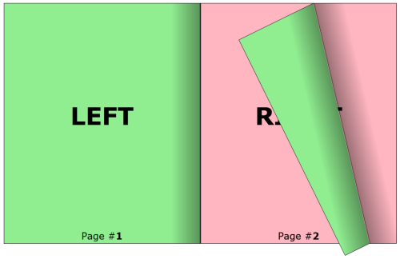

# How to apply different templates for front and back cover page.

## 

Currently __RadBook__ does not expose separate properties for setting templates for the front and back cover pages(first and last pages in RadBook's items collection). In this case, you can use the already available __DataTemplateSelectors__ - __LeftPageTemplateSelector__ and __RightPageTemplateSelector__. Depending on the index of each page, we will decide what template to apply on the page.

First, lets begin by creating 4 different templates:
        

* front cover page template

* left inner page template

* right inner page template

* back cover page template

For the sake of the example, each template will will have the following structure:

This how the four templates look like in XAML code:

#### __XAML__

{{region radbook-cover-template_0}}
	<!--  Front Cover Template  -->
	<DataTemplate x:Key="FrontCoverTemplate">
	    <Border BorderBrush="Black" BorderThickness="1">
	        <Grid Background="LightGray">
	            <Grid.RowDefinitions>
	                <RowDefinition />
	                <RowDefinition Height="Auto" />
	            </Grid.RowDefinitions>
	            <TextBlock HorizontalAlignment="Center" 
	                        VerticalAlignment="Center"
	                        FontSize="50"
	                        FontWeight="Bold"
	                        Text="FRONT" />
	            <StackPanel Grid.Row="1" 
	                        HorizontalAlignment="Center"
	                        Orientation="Horizontal">
	                <TextBlock FontSize="20" Text="Page #" />
	                <TextBlock FontSize="20" 
	                            FontWeight="Bold"
	                            Text="{Binding}" />
	            </StackPanel>
	        </Grid>
	    </Border>
	</DataTemplate>
	
	<!--  Inner Left Page Template  -->
	<DataTemplate x:Key="LeftPageTemplate">
	    <Border BorderBrush="Black" BorderThickness="1">
	        <Grid Background="LightGreen">
	            <Grid.RowDefinitions>
	                <RowDefinition />
	                <RowDefinition Height="Auto" />
	            </Grid.RowDefinitions>
	            <TextBlock HorizontalAlignment="Center" 
	                        VerticalAlignment="Center"
	                        FontSize="50"
	                        FontWeight="Bold"
	                        Text="LEFT" />
	            <StackPanel Grid.Row="1" 
	                        HorizontalAlignment="Center"
	                        Orientation="Horizontal">
	                <TextBlock FontSize="20" Text="Page #" />
	                <TextBlock FontSize="20" 
	                            FontWeight="Bold"
	                            Text="{Binding}" />
	            </StackPanel>
	        </Grid>
	    </Border>
	</DataTemplate>
	
	<!--  Inner Right Page Template  -->
	<DataTemplate x:Key="RightPageTemplate">
	    <Border BorderBrush="Black" BorderThickness="1">
	        <Grid Background="LightPink">
	            <Grid.RowDefinitions>
	                <RowDefinition />
	                <RowDefinition Height="Auto" />
	            </Grid.RowDefinitions>
	            <TextBlock HorizontalAlignment="Center" 
	                        VerticalAlignment="Center"
	                        FontSize="50"
	                        FontWeight="Bold"
	                        Text="RIGHT" />
	            <StackPanel Grid.Row="1" 
	                        HorizontalAlignment="Center"
	                        Orientation="Horizontal">
	                <TextBlock FontSize="20" Text="Page #" />
	                <TextBlock FontSize="20" 
	                            FontWeight="Bold"
	                            Text="{Binding}" />
	            </StackPanel>
	        </Grid>
	    </Border>
	</DataTemplate>
	
	<!--  Back Cover Template  -->
	<DataTemplate x:Key="BackCoverTemplate">
	    <Border BorderBrush="Black" BorderThickness="1">
	        <Grid Background="LightYellow">
	            <Grid.RowDefinitions>
	                <RowDefinition />
	                <RowDefinition Height="Auto" />
	            </Grid.RowDefinitions>
	            <TextBlock HorizontalAlignment="Center" 
	                        VerticalAlignment="Center"
	                        FontSize="50"
	                        FontWeight="Bold"
	                        Text="BACK" />
	            <StackPanel Grid.Row="1" 
	                        HorizontalAlignment="Center"
	                        Orientation="Horizontal">
	                <TextBlock FontSize="20" Text="Page #" />
	                <TextBlock FontSize="20" 
	                            FontWeight="Bold"
	                            Text="{Binding}" />
	            </StackPanel>
	        </Grid>
	    </Border>
	</DataTemplate>
	{{endregion}}

The next step is to create two __DataTemplateSelectors__, that will take care of picking the right template out. The first __DataTemplateSelector__ will provide template for the front cover page and every consecutive right page, while the second __DataTemplateSelector__ will provide template for the back cover page and every consecutive left page.

#### __C#__

{{region radbook-cover-template_1}}
	/// 

	 /// DataTemplateSelector responsible for picking template for the back cover page and every consecutive left page.
	 /// 

	 public class LeftPageTemplateSelector : DataTemplateSelector
	 {
	  /// 

	  /// Gets or sets the back cover template.
	  /// 

	  /// <value>The back cover template.</value>
	  public DataTemplate BackCoverTemplate { get; set; }
	  /// 

	  /// Gets or sets template for every left page in the book, except only in the case of a last page.
	  /// 

	  /// <value>The left page template.</value>
	  public DataTemplate LeftPageTemplate { get; set; }
	  public override DataTemplate SelectTemplate(object item, DependencyObject container)
	  {
	   RadBookItem page = container as RadBookItem;
	   // we need an instance of the book so that we can determine the whether the current page is the last page.
	   RadBook book = System.Windows.Controls.ItemsControl.ItemsControlFromItemContainer(container) as RadBook;
	   // Using the index property, we can determine whether the page is last page or it is one of the inner left pages.
	   if (page.Index == book.Items.Count - 1)
	   {
	    return this.BackCoverTemplate;
	   }
	   else
	   {
	    return this.LeftPageTemplate;
	   }
	  }
	 }
	 /// 

	 /// DataTemplateSelector responsible for picking template for the fron cover page and every consecutive right page.
	 /// 

	 public class RightPageTemplateSelector : DataTemplateSelector
	 {
	  /// 

	  /// Gets or sets the front cover template.
	  /// 

	  /// <value>The front cover template.</value>
	  public DataTemplate FrontCoverTemplate { get; set; }
	  /// 

	  /// Gets or sets template for every right page in the book, except only in the case of a first page.
	  /// 

	  /// <value>The right page template.</value>
	  public DataTemplate RightPageTemplate { get; set; }
	  public override DataTemplate SelectTemplate(object item, DependencyObject container)
	  {
	   RadBookItem page = container as RadBookItem;
	   // Using the index property, we can determine whether the page is first page or it is one of the inner right pages.
	   if (page.Index == 0)
	   {
	    return this.FrontCoverTemplate;
	   }
	   else
	   {
	    return this.RightPageTemplate;
	   }
	  }
	 }
{{endregion}}

#### __VB.NET__

{{region radbook-cover-template_1}}
		''' 

		''' DataTemplateSelector responsible for picking template for the back cover page and every consecutive left page.
		''' 

		Public Class LeftPageTemplateSelector
			Inherits DataTemplateSelector
			''' 

			''' Gets or sets the back cover template.
			''' 

			''' <value>The back cover template.</value>
			Public Property BackCoverTemplate() As DataTemplate
				Get
					Return m_BackCoverTemplate
				End Get
				Set(ByVal value As DataTemplate)
					m_BackCoverTemplate = Value
				End Set
			End Property
			Private m_BackCoverTemplate As DataTemplate
			''' 

			''' Gets or sets template for every left page in the book, except only in the case of a last page.
			''' 

			''' <value>The left page template.</value>
			Public Property LeftPageTemplate() As DataTemplate
				Get
					Return m_LeftPageTemplate
				End Get
				Set(ByVal value As DataTemplate)
					m_LeftPageTemplate = Value
				End Set
			End Property
			Private m_LeftPageTemplate As DataTemplate
			Public Overrides Function SelectTemplate(ByVal item As Object, ByVal container As DependencyObject) As DataTemplate
				Dim page As RadBookItem = TryCast(container, RadBookItem)
				'''we need an instance of the book so that we can determine the whether the current page is the last page.
				Dim book As RadBook = TryCast(System.Windows.Controls.ItemsControl.ItemsControlFromItemContainer(container), RadBook)
				'''Using the index property, we can determine whether the page is last page or it is one of the inner left pages.
				If page.Index = book.Items.Count - 1 Then
					Return Me.BackCoverTemplate
				Else
					Return Me.LeftPageTemplate
				End If
			End Function
		End Class
		''' 

		''' DataTemplateSelector responsible for picking template for the fron cover page and every consecutive right page.
		''' 

		Public Class RightPageTemplateSelector
			Inherits DataTemplateSelector
			''' 

			''' Gets or sets the front cover template.
			''' 

			''' <value>The front cover template.</value>
			Public Property FrontCoverTemplate() As DataTemplate
				Get
					Return m_FrontCoverTemplate
				End Get
				Set(ByVal value As DataTemplate)
					m_FrontCoverTemplate = Value
				End Set
			End Property
			Private m_FrontCoverTemplate As DataTemplate
			''' 

			''' Gets or sets template for every right page in the book, except only in the case of a first page.
			''' 

			''' <value>The right page template.</value>
			Public Property RightPageTemplate() As DataTemplate
				Get
					Return m_RightPageTemplate
				End Get
				Set(ByVal value As DataTemplate)
					m_RightPageTemplate = Value
				End Set
			End Property
			Private m_RightPageTemplate As DataTemplate
			Public Overrides Function SelectTemplate(ByVal item As Object, ByVal container As DependencyObject) As DataTemplate
				Dim page As RadBookItem = TryCast(container, RadBookItem)
				'''Using the index property, we can determine whether the page is first page or it is one of the inner right pages.
				If page.Index = 0 Then
					Return Me.FrontCoverTemplate
				Else
					Return Me.RightPageTemplate
				End If
			End Function
		End Class
{{endregion}}

Next, we can instantiate the two template selectors in XAML...

#### __XAML__

{{region radbook-cover-template_2}}
	<local:LeftPageTemplateSelector x:Key="LeftPageTemplateSelector"
			BackCoverTemplate="{StaticResource BackCoverTemplate}" LeftPageTemplate="{StaticResource LeftPageTemplate}" />
	<local:RightPageTemplateSelector x:Key="RightPageTemplateSelector"
			FrontCoverTemplate="{StaticResource FrontCoverTemplate}"
			RightPageTemplate="{StaticResource RightPageTemplate}" />
{{endregion}}

... and pass them to the book:

#### __XAML__

{{region radbook-cover-template_3}}
	<telerik:RadBook x:Name="book1" 
					 FirstPagePosition="Right"
					 LeftPageTemplateSelector="{StaticResource LeftPageTemplateSelector}"
					 RightPageIndex="0"
					 RightPageTemplateSelector="{StaticResource RightPageTemplateSelector}" />
{{endregion}}

Finally, all we have to do is populate the book with items. In this example, the book will be bound to an array of numbers.

#### __C#__

{{region radbook-cover-template_4}}
	public partial class MainPage : UserControl
	 {
	  public MainPage()
	  {
	   InitializeComponent();
	   book1.ItemsSource = Enumerable.Range(0, 10);
	  }
	 }
{{endregion}}

#### __VB.NET__

{{region radbook-cover-template_4}}
	Partial Public Class MainPage
		Inherits UserControl
		Public Sub New()
			InitializeComponent()
			book1.ItemsSource = Enumerable.Range(0, 10)
		End Sub
	End Class
{{endregion}}

This is how the final result looks like:

 

