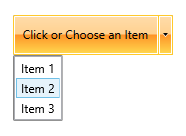
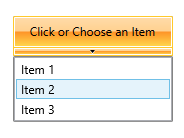

# Split Button

The __RadSplitButton__ control inherits from the __ContentControl__ control and implements the __ICommandSource__ interface. The __ICommandSource__ implementation allows you to attach commands to the button, that will be executed when the button is clicked.  

>tip To learn more about the members of the __RadSplitButton__ class you can read [here](https://docs.telerik.com/devtools/wpf/api/html/properties_t_telerik_windows_controls_radsplitbutton.htm)[here](https://docs.telerik.com/devtools/silverlight/api/html/properties_t_telerik_windows_controls_radsplitbutton.htm).

>tip You can see how to use an ICommand with a button in the [Commands]() topic.	  

Basically the __RadSplitButton__ is a UI combination of the __RadButton__ and the __RadDropDownButton__. The __RadButton__ element represents the __ButtonPart__ of the __RadSplitButton__, while the RadDropDownButton represents the drop down part. The first one can also behave as a toggle button.	  

## Instantiating RadSplitButton

You can instantiate your __RadSplitButton__ in both XAML and code. Here is an example:		

>The __RadSplitButton__ control is located in the __Telerik.Windows.Controls.dll__ and in order to use it in your project you have to add a reference to the assembly.  You can find more info [here](http://www.telerik.com/help/wpf/installation-installing-controls-dependencies-wpf.html). You can find more info [here](http://www.telerik.com/help/silverlight/installation-installing-controls-dependencies.html).  
>Then in XAML you have to declare the namespace: `xmlns:telerik="http://schemas.telerik.com/2008/xaml/presentation"`

#### __[XAML] Example 1: Defining a button in XAML__
{{region xaml-radbuttons-features-split-button_0}}
	<telerik:RadSplitButton Content="Click Me!" />
{{endregion}}

#### __[C#] Example 2: Defining a button in code__
{{region cs-radbuttons-features-split-button_1}}
	RadSplitButton radSplitButton = new RadSplitButton() { Content = "Click Me!" };
{{endregion}}

#### __[VB.NET] Example 2: Defining a button in code__
{{region vb-radbuttons-features-split-button_2}}
	Dim radSplitButton As New RadSplitButton() With { _
	    .Content = "Click Me!" _
	}
{{endregion}}

#### __Figure 1: The created split button__

## Adding DropDown Content

In order to add content to the drop down area of the __RadSplitButton__ you have to use its __DropDownContent__ property. It is of type object so you can add any control as a content of the drop down. Here is an example of a __ListBox__ control placed inside a __RadSplitButton.DropDownContent__.		

#### __[XAML] Example 3: Adding content to the drop down of the button__
{{region xaml-radbuttons-features-split-button_3}}
	<telerik:RadSplitButton AutoOpenDelay="0:0:0.0"
	                        Content="Click or Choose an Item">
	    <telerik:RadSplitButton.DropDownContent>
	        <ListBox>
	            <ListBoxItem Content="Item 1" />
	            <ListBoxItem Content="Item 2" />
	            <ListBoxItem Content="Item 3" />
	        </ListBox>
	    </telerik:RadSplitButton.DropDownContent>
	</telerik:RadSplitButton>
{{endregion}}

>tip If you want to display dynamic content inside the drop down area, you can use the __DropDownContentTemplate__ and the __DropDownContentTemplateSelector__ properties. To learn more about __TemplateSelectors__ you can read the [Data Templating Overview](https://msdn.microsoft.com/en-us/library/ms742521(v=vs.100).aspx) MSDN article.

#### __Figure 2: RadSplitButton with dropdown content__

## Toggling the RadSplitButton

The functional part of the __RadSplitButton__ is represented by a RadButton. This part handles the click event of the __RadSplitButton__ and it can behave as a toggle button. In order to take advantage of this feature you just have to set the __RadSplitButton.IsToggle__ property to __True__.		

#### __[XAML] Example 4: Manually toggling the button__
{{region xaml-radbuttons-features-split-button_4}}
	<telerik:RadSplitButton IsToggle="True" />
{{endregion}}

#### __Figure 3: RadSplitButton as toggle button__

## Auto Opening

You can allow the __RadSplitButton__ to automatically display its __DropDownContent__, when the mouse hovers over it. This behaviour is controlled via the __AutoOpenDelay__ property of the __RadSplitButton__, that specifies the time, after which you want to display the __RadSplitButton.DropDownContent__. In order to disable the auto opening feature of the control, you have to set the __AutoOpenDelay__ to __"0"__. Here is an example:		

#### __[XAML] Example 5: Setting the AutoOpenDelay property__
{{region xaml-radbuttons-features-split-button_5}}
	<telerik:RadSplitButton AutoOpenDelay="0:0:0.5" />
{{endregion}}

## Customizing the RadSplitButton

You can easily customize the __RadSplitButton__ by using the following properties:		

* __ButtonPartStyle__ - gets/sets the style of the __RadButton__ that represents the ButtonPart of the __RadSplitButton__.

* __CornerRadius__ - this property is of type __CornerRadius__ and it controls the __CornerRadius__ of the __RadSplitButton__ control.

* __CloseOnEscape__ - specifies whether the drop down should be closed when the __ESC__ key gets pressed. The default value is __True__.

* __DropDownButtonPosition__ - specifies the position of the drop down arrow. The possible values are __Bottom__, __Left__, __Right__ (default), __Top__.

* __DropDownHeight__ - specifies the height of the drop down area.

* __DropDownIndicatorVisibility__ - specifies whether the drop down arrow should be visible. The default value is __Visible__.

* __DropDownMaxHeight__ - specifies the maximal height of the drop down area.

* __DropDownMaxWidth__ - specifies the maximal width of the drop down area.

* __DropDownPlacement__ - specifies where the drop down area should be placed - __Absolute__, __Bottom__, __Center__, __Left__, __Right__, __Top__.

* __DropDownWidth__ - specifies the width of the drop down area.

* __IsBackgroundVisible__ - this property is of type bool and it controls the visibility of the background and the border of the __RadSplitButton__ control in normal state.

* __IsButtonPartVisible__ - gets/sets whether the button part is visible.

* __IsChecked__ - get/sets the checked state of the button when its __ButtonPart__ behaves like a __ToggleButton__.

* __IsOpen__ - gets or sets whether the __DropDownContent__ of the button is opened.

* __ToggleCornerRadius__ - gets/sets the __CornerRadius__ of the __RadSplitButton.ButtonPart__ when it behaves like a __ToggleButton__.

* __TogglePartStyle__ - gets/sets the style of the __RadToggleButton__ that represents the ButtonPart of the __RadSplitButton__, when it behaves like a __ToggleButton__.

#### __[XAML] Example 6: Customizing RadSplitButton__
{{region xaml-radbuttons-features-split-button_6}}
	<telerik:RadSplitButton DropDownButtonPosition="Bottom" 
							Content="Click or Choose an Item" 
							DropDownWidth="{Binding ActualWidth, RelativeSource={RelativeSource Self}}">
		<telerik:RadSplitButton.DropDownContent>
			<ListBox>
				<ListBoxItem Content="Item 1" />
				<ListBoxItem Content="Item 2" />
				<ListBoxItem Content="Item 3" />
			</ListBox>
		</telerik:RadSplitButton.DropDownContent>
	</telerik:RadSplitButton>
{{endregion}}

#### __Figure 4: Customized RadSplitButton__

## See Also
 * [Button]()
 * [DropDown Button]()
 * [Commands]()
 * [Appearance]()