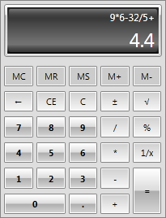

# RadCalculator

This tutorial will walk your through the creation of a sample application that contains __RadCalculator__ and will show you how:
		  

* Use RadCalculator in your project;

* Perform basic calculations;

* Perform more complicated calculations

For the purpose of this example, you will need to create an empty SilverlightWPF Application project and open it in Visual Studio.
		  

## Adding RadCalculator to the Project

* 
					  Create a new SilverlightWPF project;
				  

* 
					  Add references to the assemblies __Telerik.Windows.Controls__ and __Telerik.Windows.Controls.Input__;
				  

* Add the RadCalculator as demonstrated below:

#### __XAML__

{{region radcalculator-getting-started_0}}
	<UserControl x:Class="RadCalculator.MainPage"
	             xmlns="http://schemas.microsoft.com/winfx/2006/xaml/presentation"
	             xmlns:x="http://schemas.microsoft.com/winfx/2006/xaml"
	             xmlns:d="http://schemas.microsoft.com/expression/blend/2008"
	             xmlns:mc="http://schemas.openxmlformats.org/markup-compatibility/2006"
	             xmlns:telerik="http://schemas.telerik.com/2008/xaml/presentation"
	             xmlns:my="clr-namespace:RadCalculator"
	             mc:Ignorable="d" d:DesignHeight="700" d:DesignWidth="700">   
	  
		<Grid x:Name="LayoutRoot" Background="White" >
			<telerik:RadCalculator />		
	    </Grid>
	</UserControl>
	{{endregion}}



#### __XAML__

{{region radcalculator-getting-started_1}}
	<Window x:Class="RadCalculator.MainWindow"
	             xmlns="http://schemas.microsoft.com/winfx/2006/xaml/presentation"
	             xmlns:x="http://schemas.microsoft.com/winfx/2006/xaml"
	             xmlns:d="http://schemas.microsoft.com/expression/blend/2008"
	             xmlns:mc="http://schemas.openxmlformats.org/markup-compatibility/2006"
	             xmlns:telerik="http://schemas.telerik.com/2008/xaml/presentation"
	             xmlns:my="clr-namespace:RadCalculator"
	             mc:Ignorable="d" d:DesignHeight="700" d:DesignWidth="700">   
	  
		<Grid x:Name="LayoutRoot" Background="White" >
			<telerik:RadCalculator />		
	    </Grid>
	</Window>
	{{endregion}}



Two lines of code are important here:

* The import of the Telerik schema:

#### __XAML__

{{region radcalculator-getting-started_2}}
			xmlns:telerik="http://schemas.telerik.com/2008/xaml/presentation"
	{{endregion}}

* The declaration of the RadCalculator control inside the Grid:

#### __XAML__

{{region radcalculator-getting-started_3}}
			<telerik:RadCalculator />
	{{endregion}}

Now if you run the application, you have RadCalculator:

## Perform basic calculation with RadCalculator

RadCalculator allows you to perform all the basic calculations - addition, subtraction, multiplication, division. All of them can be executed either by its corresponding buttons or through the keyboard. Once a particular operation is executed, the history is updated accordingly:

## Perform complex calculation with RadCalculator

RadCalculator allows you to perform a couple of more complex calculations - square root, reciplorcal, percent, negate. All of them can be executed either by its corresponding buttons. Once a particular operation is executed, the history is updated accordingly:

