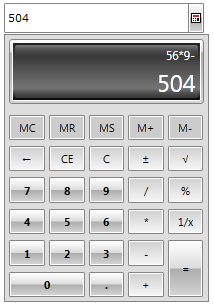
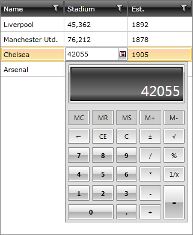

# RadCalculatorPicker

This tutorial will walk your through the creation of a sample application that contains __RadCalculatorPicker__ and will show you how:
		  

* Use RadCalculatorPicker in your project;

* User RadCalculatorPicker as editing element;

For the purpose of this example, you will need to create an empty SilverlightWPF Application project and open it in Visual Studio.
		  

## Adding RadCalculatorPicker to the Project

* Create a new SilverlightWPF project;
				  

* Add references to the assemblies __Telerik.Windows.Controls__ and __Telerik.Windows.Controls.Input__;
				  

* Add the RadCalculatorPicker as demonstrated below:

#### __XAML__

{{region radcalculatorpicker-getting-started_0}}

	<UserControl x:Class="RadCalculatorPicker.MainPage"
	             xmlns="http://schemas.microsoft.com/winfx/2006/xaml/presentation"
	             xmlns:x="http://schemas.microsoft.com/winfx/2006/xaml"
	             xmlns:d="http://schemas.microsoft.com/expression/blend/2008"
	             xmlns:mc="http://schemas.openxmlformats.org/markup-compatibility/2006"
	             xmlns:telerik="http://schemas.telerik.com/2008/xaml/presentation"
	             xmlns:my="clr-namespace:RadCalculatorPicker"
	             mc:Ignorable="d" d:DesignHeight="700" d:DesignWidth="700">   
	  
		<Grid x:Name="LayoutRoot" Background="White" >
			<telerik:RadCalculatorPicker Height="30" Width="200" />		
	    </Grid>
	</UserControl>
	{{endregion}}



#### __XAML__

{{region radcalculatorpicker-getting-started_1}}

	<Window x:Class="RadCalculatorPicker.MainWindow"
	             xmlns="http://schemas.microsoft.com/winfx/2006/xaml/presentation"
	             xmlns:x="http://schemas.microsoft.com/winfx/2006/xaml"
	             xmlns:d="http://schemas.microsoft.com/expression/blend/2008"
	             xmlns:mc="http://schemas.openxmlformats.org/markup-compatibility/2006"
	             xmlns:telerik="http://schemas.telerik.com/2008/xaml/presentation"
	             xmlns:my="clr-namespace:RadCalculatorPicker"
	             mc:Ignorable="d" d:DesignHeight="700" d:DesignWidth="700">   
	  
		<Grid x:Name="LayoutRoot" Background="White" >
			<telerik:RadCalculatorPicker Height="30" Width="200" />			
	    </Grid>
	</Window>
	{{endregion}}



Two lines of code are important here:

* The import of the Telerik schema:

#### __XAML__

{{region radcalculatorpicker-getting-started_2}}

	xmlns:telerik="http://schemas.telerik.com/2008/xaml/presentation"
	{{endregion}}

* The declaration of the RadCalculator control inside the Grid:

#### __XAML__

{{region radcalculatorpicker-getting-started_3}}

	<telerik:RadCalculatorPicker Height="30" Width="200" />	
	{{endregion}}

Now if you run the application, you have RadCalculatorPicker:

## Use RadCalculatorPicker as editing element

RadCalculatorPicker can be embeded as an editing element. In this case we will define it in a CellEditTemplate for a column in RadGridView. For this example we will create as simple grid  and customize one of its columns:

#### __XAML__

{{region radcalculatorpicker-getting-started_4}}

	<telerik:RadGridView Name="clubsGrid" CanUserFreezeColumns="False" 
						 ShowGroupPanel="False" RowIndicatorVisibility="Collapsed"
						 ItemsSource="{Binding Clubs}"
						 ColumnWidth="*"
						 AutoGenerateColumns="False">
		<telerik:RadGridView.Columns>
			<telerik:GridViewDataColumn DataMemberBinding="{Binding Name}"/>				
			<telerik:GridViewDataColumn DataMemberBinding="{Binding StadiumCapacity}" 
										Header="Stadium" 
										DataFormatString="{}{0:N0}">
				<telerik:GridViewDataColumn.CellEditTemplate>
					<DataTemplate>
						<telerik:RadCalculatorPicker Value="{Binding StadiumCapacity,Mode=TwoWay}" />
					</DataTemplate>
				</telerik:GridViewDataColumn.CellEditTemplate>
			</telerik:GridViewDataColumn>
			<telerik:GridViewDataColumn DataMemberBinding="{Binding Established}"
										Header="Est." 
										DataFormatString="{}{0:yyyy}"/>
		</telerik:RadGridView.Columns>
	</telerik:RadGridView>
	{{endregion}}

Once we start editing the column we have customized, we will get the following editor:

