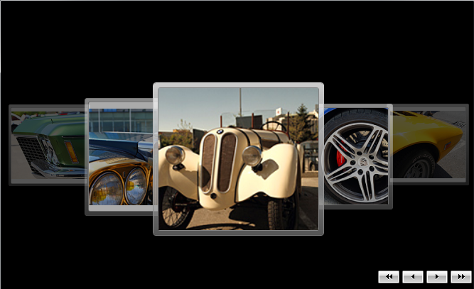

# Getting Started

This tutorial will walk you through the creation of a simple application containing RadCarousel and will show you how to:

* Add RadCarousel in your project;

* Bind RadCarousel to a collection of custom objects;

* Bind RadCarousel to a collection of images;

For the purpose of this example, you will need to create a empty WPF Application in Visual Studio.

## Add RadCarousel to the Project

Once a new WPF project is created, you will need to add references to the assemblies:

* Telerik.Windows.Controls;

* Telerik.Windows.Controls.Navigation;

* Telerik.Windows.Data;

Afterwards, you will need to add the uri namespace:

#### __XAML__

{{region carousel-getting-started_0}}
	xmlns:telerik="http://schemas.telerik.com/2008/xaml/presentation"
	{{endregion}}

and define the RadCarousel. You may set some of its basic properties like Background or Height. Furthermore, if you want to access it in the code-behind, you may declare its Key attribute: 

#### __XAML__

{{region carousel-getting-started_1}}
	<Window x:Class="RadCarousel_MyProject.MainWindow"
	        xmlns="http://schemas.microsoft.com/winfx/2006/xaml/presentation"
	        xmlns:x="http://schemas.microsoft.com/winfx/2006/xaml"
	        xmlns:telerik="http://schemas.telerik.com/2008/xaml/presentation"
	        Title="MainWindow" Height="450" Width="525"> 
	  <Grid Background="Black">  
	        <telerik:RadCarousel x:Name="MyCarousel" Background="Black" Height="400" />  
	  </Grid>
	</Window>
	{{endregion}}

## Bind RadCarousel to collection of custom objects

For the purpose of this tutorial we will create a new class - Employee with a couple of properties:

#### __C#__

{{region carousel-getting-started_2}}
	public class Employee
	 {
	  public string FirstName
	  {
	   get;
	   set;
	  }
	  public string LastName
	  {
	   get;
	   set;
	  }
	  public int Age
	  {
	   get;
	   set;
	  }
	  public string Position
	  {
	   get;
	   set;
	  }
	 }
	{{endregion}}

#### __VB.NET__

{{region carousel-getting-started_3}}
	Public Class Employee
	 Public Property FirstName() As String
	  Get
	   Return m_FirstName
	  End Get
	  Set
	   m_FirstName = Value
	  End Set
	 End Property
	 Private m_FirstName As String
	 Public Property LastName() As String
	  Get
	   Return m_LastName
	  End Get
	  Set
	   m_LastName = Value
	  End Set
	 End Property
	 Private m_LastName As String
	 Public Property Age() As Integer
	  Get
	   Return m_Age
	  End Get
	  Set
	   m_Age = Value
	  End Set
	 End Property
	 Private m_Age As Integer
	 Public Property Position() As String
	  Get
	   Return m_Position
	  End Get
	  Set
	   m_Position = Value
	  End Set
	 End Property
	 Private m_Position As String
	End Class
	{{endregion}}

Furthermore, as some data will be needed, we will create EmployeeService class that provides a static method GetEmployees():

#### __C#__

{{region carousel-getting-started_4}}
	public class EmployeeService
	 {
	  public static ObservableCollection<Employee> GetEmployees()
	  {
	   ObservableCollection<Employee> employees = new ObservableCollection<Employee>();
	   Employee employee = new Employee();
	   employee.FirstName = "Margaret";
	   employee.LastName = "Peacock";
	   employee.Position = "Sales Representative";
	   employee.Age = 24;
	   employees.Add(employee);
	   employee = new Employee();
	   employee.FirstName = "Steven";
	   employee.LastName = "Buchanan";
	   employee.Position = "Sales Manager";
	   employee.Age = 44;
	   employees.Add(employee);
	   employee = new Employee();
	   employee.FirstName = "Michael";
	   employee.LastName = "Suyama";
	   employee.Position = "Sales Representative";
	   employee.Age = 33;
	   employees.Add(employee);
	   employee = new Employee();
	   employee.FirstName = "Robert";
	   employee.LastName = "King";
	   employee.Position = "Sales Representative";
	   employee.Age = 28;
	   employees.Add(employee);
	   employee = new Employee();
	   employee.FirstName = "Laura";
	   employee.LastName = "Callahan";
	   employee.Position = "Inside Sales Coordinator";
	   employee.Age = 26;
	   employees.Add(employee);
	   employee = new Employee();
	   employee.FirstName = "Anne";
	   employee.LastName = "Dodsworth";
	   employee.Position = "Sales Representative";
	   employee.Age = 30;
	   employees.Add(employee);
	
	   return employees;
	  }
	 }
	{{endregion}}

#### __VB.NET__

{{region carousel-getting-started_5}}
	Public Class EmployeeService
	 Public Shared Function GetEmployees() As ObservableCollection(Of Employee)
	  Dim employees As New ObservableCollection(Of Employee)()
	  Dim employee As New Employee()
	  employee.FirstName = "Margaret"
	  employee.LastName = "Peacock"
	  employee.Position = "Sales Representative"
	  employee.Age = 24
	  employees.Add(employee)
	  employee = New Employee()
	  employee.FirstName = "Steven"
	  employee.LastName = "Buchanan"
	  employee.Position = "Sales Manager"
	  employee.Age = 44
	  employees.Add(employee)
	  employee = New Employee()
	  employee.FirstName = "Michael"
	  employee.LastName = "Suyama"
	  employee.Position = "Sales Representative"
	  employee.Age = 33
	  employees.Add(employee)
	  employee = New Employee()
	  employee.FirstName = "Robert"
	  employee.LastName = "King"
	  employee.Position = "Sales Representative"
	  employee.Age = 28
	  employees.Add(employee)
	  employee = New Employee()
	  employee.FirstName = "Laura"
	  employee.LastName = "Callahan"
	  employee.Position = "Inside Sales Coordinator"
	  employee.Age = 26
	  employees.Add(employee)
	  employee = New Employee()
	  employee.FirstName = "Anne"
	  employee.LastName = "Dodsworth"
	  employee.Position = "Sales Representative"
	  employee.Age = 30
	  employees.Add(employee)
	  Return employees
	 End Function
	End Class
	{{endregion}}

Once all the data is prepared, we may set the RadCarousel's ItemsSource:

#### __C#__

{{region carousel-getting-started_6}}
	public MainWindow()
	  {
	   InitializeComponent();
	   this.MyCarousel.ItemsSource = EmployeeService.GetEmployees();
	  }
	{{endregion}}

#### __VB.NET__

{{region carousel-getting-started_7}}
	Public Sub New()
	 InitializeComponent()
	 Me.MyCarousel.ItemsSource = EmployeeService.GetEmployees()
	End Sub
	{{endregion}}

After running the application, you will see the following result:

         
      

## Display images in RadCarousel

Generally, RadCarousel may be easily used for displaying images and navigating through them. All you need to do is to add those that you want to be visualized in a List<Image> for example and set the ItemsSource to it:

#### __C#__

{{region carousel-getting-started_8}}
	public MainWindow()
	  {
	   InitializeComponent();
	   List<Image> myImages = new List<Image>();
	   Image myImage = new Image();
	   myImage.Source = new BitmapImage(new Uri("/Images/nature1.jpg", UriKind.Relative));
	   myImage.Height = 200;
	   myImage.Width = 200;
	   myImages.Add(myImage);
	   Image myImage1 = new Image();
	   myImage1.Source = new BitmapImage(new Uri("/Images/nature2.jpg", UriKind.Relative));
	   myImage1.Height = 200;
	   myImage1.Height = 200;
	   myImages.Add(myImage1);
	   Image myImage2 = new Image();
	   myImage2.Source = new BitmapImage(new Uri("/Images/nature15.jpg", UriKind.Relative));
	   myImage2.Width = 200;
	   myImage.Height = 200;
	   myImages.Add(myImage2);
	   Image myImage3 = new Image();
	   myImage3.Source = new BitmapImage(new Uri("/Images/nature19.jpg", UriKind.Relative));
	   myImage3.Height = 200;
	   myImage3.Width = 200;
	   myImages.Add(myImage3);
	   Image myImage4 = new Image();
	   myImage4.Source = new BitmapImage(new Uri("/Images/nature26.jpg", UriKind.Relative));
	   myImage4.Height = 200;
	   myImage4.Width = 200;
	   myImages.Add(myImage4);
	   this.MyCarousel.ItemsSource = myImages;   
	  }
	{{endregion}}

#### __VB.NET__

{{region carousel-getting-started_9}}
	Public Sub New()
	 InitializeComponent()
	 Dim myImages As New List(Of Image)()
	 Dim myImage As New Image()
	 myImage.Source = New BitmapImage(New Uri("/Images/nature1.jpg", UriKind.Relative))
	 myImage.Height = 200
	 myImage.Width = 200
	 myImages.Add(myImage)
	 Dim myImage1 As New Image()
	 myImage1.Source = New BitmapImage(New Uri("/Images/nature2.jpg", UriKind.Relative))
	 myImage1.Height = 200
	 myImage1.Height = 200
	 myImages.Add(myImage1)
	 Dim myImage2 As New Image()
	 myImage2.Source = New BitmapImage(New Uri("/Images/nature15.jpg", UriKind.Relative))
	 myImage2.Width = 200
	 myImage.Height = 200
	 myImages.Add(myImage2)
	 Dim myImage3 As New Image()
	 myImage3.Source = New BitmapImage(New Uri("/Images/nature19.jpg", UriKind.Relative))
	 myImage3.Height = 200
	 myImage3.Width = 200
	 myImages.Add(myImage3)
	 Dim myImage4 As New Image()
	 myImage4.Source = New BitmapImage(New Uri("/Images/nature26.jpg", UriKind.Relative))
	 myImage4.Height = 200
	 myImage4.Width = 200
	 myImages.Add(myImage4)
	 Me.MyCarousel.ItemsSource = myImages
	End Sub
	{{endregion}}

Now the RadCarousel should look like the one below:

         
      
