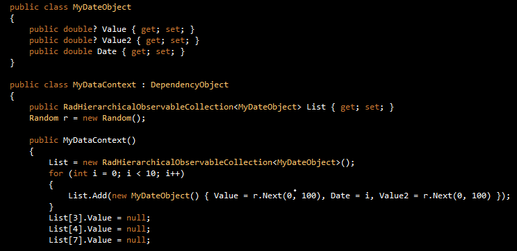
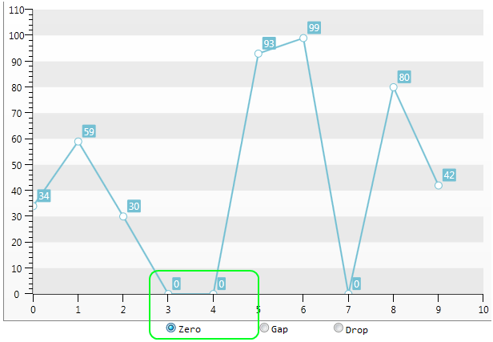
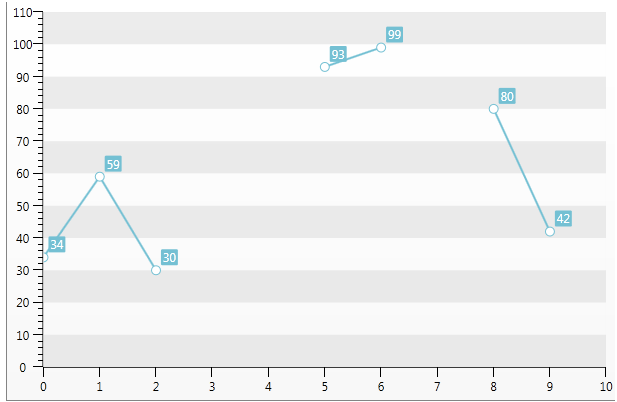
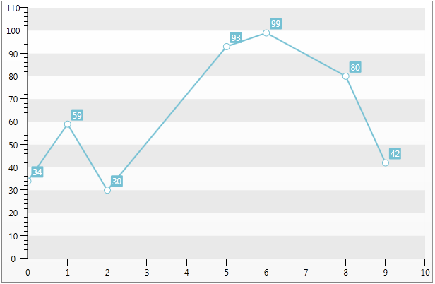

# Empty Values

## 

The __Q1 2011__ version of the Chart control includes code to support empty/null values. There are many scenarios, in which the property of an object, or a collection of objects, to which the Chart is data bound, is __null__. 

The following code example demonstrates a databound scenario where nullable double type is used:

The null values above are hard-coded, however they convey the general idea of null values being returned by the data layer, to which the Chart is data bound.

Internally, there are three ways in which these null values can be handled. This is specified by a property in the control, for the series definition, named __EmptyPointBehavior__. This is a dependency property, which is defined per Series Definition. It has three options:

1. __Zero__.This property is the default property of each series. When this option is used, each null value is replaced with a zero. The data entry is not removed from the data collection. Only its original null/empty value is replaced with zero. This behavior is demonstrated in the screenshot below, where the data points at positions 3 and 4 had originally been empty(null), and internally replaced by 0 :

2. __Gap__. This option visually removes the regions for each set of empty(null) points. The data entry is not removed from the data collection. Essentially, it connects the points neighboring the null point (or the collection of empty values). Again, assuming that the data points at positions 3 and 4 have null values, the rendered chart will look like this:

3. __Drop__ - this option clips, or visually removes each section/segment, corresponding to a set of empty points/values. A Chart rendered using this option would look like this:

