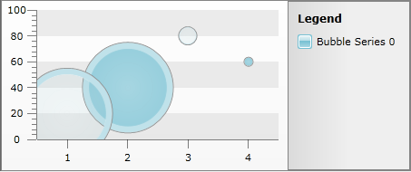

# Control the Series Items overlapping via ZIndex property

## 

The following article demonstrates how to control the overlapping of [Bubbles](http://demos.telerik.com/silverlight/#Chart/Gallery/Bubble) when they are positioned too close. By selecting one of the Bubbles the *Canvas.ZIndex* attached property will increase it's value (by default it is 0) which will cause the selected Bubble to be positioned over the others.

1. Create a class of Business Objects that will be used to populate the Chart:

#### __C#__

{{region radchart-howto-control-the-series_items-overlapping-via-zIndex-property_0}}
	public class UserDataPoint
	    {
	        private double _y;
	        private double _bubbleSize;
	        private string _legendLabel;
	
	        public UserDataPoint()
	        {
	        }
	
	        public UserDataPoint(double x, double y)
	        {
	            this._y = y;
	        }
	
	        public double Y
	        {
	            get
	            {
	                return _y;
	            }
	            set
	            {
	                this._y = value;
	            }
	        }
	
	        public double BubbleSize
	        {
	            get
	            {
	                return _bubbleSize;
	            }
	            set
	            {
	                this._bubbleSize = value;
	            }
	        }
	
	        public string LegendLabel
	        {
	            get
	            {
	                return _legendLabel;
	            }
	            set
	            {
	                this._legendLabel = value;
	            }
	        }
	    }
	
	    public static class SeriesExtensions
	    {    
	
	        public static List<UserDataPoint> GetUserBubbleData()
	        {
	            List<UserDataPoint> points = new List<UserDataPoint>();
	
	            points.Add(CreateBubbleUserDataPoint(20, -100));
	            points.Add(CreateBubbleUserDataPoint(40, 100));
	            points.Add(CreateBubbleUserDataPoint(80, -20));
	            points.Add(CreateBubbleUserDataPoint(60, 10));
	
	            return points;
	        }
	
	        private static UserDataPoint CreateBubbleUserDataPoint(double valueY, double bubbleSize)
	        {
	            UserDataPoint dataPnt = new UserDataPoint();
	            dataPnt.Y = valueY;
	            dataPnt.BubbleSize = bubbleSize;
	            return dataPnt;
	        }
	
	      }
	{{endregion}}

#### __VB.NET__

{{region radchart-howto-control-the-series_items-overlapping-via-zIndex-property_1}}
	Public Class UserDataPoint
	            Private _y As Double
	            Private _bubbleSize As Double
	            Private _legendLabel As String
	
	            Public Sub New()
	            End Sub
	
	            Public Sub New(ByVal x As Double, ByVal y As Double)
	                  Me._y = y
	            End Sub
	
	            Public Property Y() As Double
	                  Get
	                        Return _y
	                  End Get
	                  Set(ByVal value As Double)
	                        Me._y = value
	                  End Set
	            End Property
	
	            Public Property BubbleSize() As Double
	                  Get
	                        Return _bubbleSize
	                  End Get
	                  Set(ByVal value As Double)
	                        Me._bubbleSize = value
	                  End Set
	            End Property
	
	            Public Property LegendLabel() As String
	                  Get
	                        Return _legendLabel
	                  End Get
	                  Set(ByVal value As String)
	                        Me._legendLabel = value
	                  End Set
	            End Property
	End Class
	
	      Public NotInheritable Class SeriesExtensions
	
	            Private Sub New()
	            End Sub
	            Public Shared Function GetUserBubbleData() As List(Of UserDataPoint)
	                  Dim points As New List(Of UserDataPoint)()
	
	                  points.Add(CreateBubbleUserDataPoint(20, -100))
	                  points.Add(CreateBubbleUserDataPoint(40, 100))
	                  points.Add(CreateBubbleUserDataPoint(80, -20))
	                  points.Add(CreateBubbleUserDataPoint(60, 10))
	
	                  Return points
	            End Function
	
	            Private Shared Function CreateBubbleUserDataPoint(ByVal valueY As Double, ByVal bubbleSize As Double) As UserDataPoint
	                  Dim dataPnt As New UserDataPoint()
	                  dataPnt.Y = valueY
	                  dataPnt.BubbleSize = bubbleSize
	                  Return dataPnt
	            End Function
	
	      End Class
	{{endregion}}

2. Create a BubbleViewModel class:

#### __C#__

{{region radchart-howto-control-the-series_items-overlapping-via-zIndex-property_2}}
	public class BubbleViewModel
	    {
	        private List<UserDataPoint> _bubbleData;
	
	        public List<UserDataPoint> BubbleData
	        {
	            get
	            {
	                if (this._bubbleData == null)
	                {
	                    this._bubbleData = SeriesExtensions.GetUserBubbleData();
	                }
	
	                return this._bubbleData;
	            }
	        }
	    }
	{{endregion}}

#### __VB.NET__

{{region radchart-howto-control-the-series_items-overlapping-via-zIndex-property_3}}
	Public Class BubbleViewModel
	Private _bubbleData As List(Of UserDataPoint)
	Public ReadOnly Property BubbleData() As List(Of UserDataPoint)
	Get
	If Me._bubbleData Is Nothing Then
	Me._bubbleData = SeriesExtensions.GetUserBubbleData()
	End If
	Return Me._bubbleData
	End Get
	End Property
	End Class
	{{endregion}}

3. Add a new RadChart declaration and new SeriesMapping (the Chart is populated via [Manual Series Mapping]()). 

#### __XAML__

{{region radchart-howto-control-the-series_items-overlapping-via-zIndex-property_4}}
	<TelerikChart:RadChart x:Name="RadChart1" ItemsSource="{Binding BubbleData}">
	            <TelerikChart:RadChart.SeriesMappings>
	                <TelerikCharting:SeriesMapping LegendLabel="Bubble Series 0">
	                    <TelerikCharting:SeriesMapping.SeriesDefinition>
	                        <TelerikCharting:BubbleSeriesDefinition  ItemStyle="{StaticResource CustomBubble}" BubbleSizeRelative="False">
	                            <TelerikCharting:BubbleSeriesDefinition.InteractivitySettings>
	                                <TelerikCharting:InteractivitySettings HoverScope="Item" SelectionMode="Single" SelectionScope="Item" />
	                            </TelerikCharting:BubbleSeriesDefinition.InteractivitySettings>
	                        </TelerikCharting:BubbleSeriesDefinition>
	                    </TelerikCharting:SeriesMapping.SeriesDefinition>
	                    <TelerikCharting:SeriesMapping.ItemMappings>
	                        <TelerikCharting:ItemMapping FieldName="Y" DataPointMember="YValue" />
	                        <TelerikCharting:ItemMapping FieldName="BubbleSize" DataPointMember="BubbleSize" />
	                    </TelerikCharting:SeriesMapping.ItemMappings>
	                </TelerikCharting:SeriesMapping>  
	            </TelerikChart:RadChart.SeriesMappings>
	        </TelerikChart:RadChart>
	{{endregion}}

Selection of Bubble Items is achieved via [Interactivity Effects](http://www.telerik.com/help/silverlight/radchart-features-interactivity-effects.html) feature of the RadChart.

4. In the MainPage.xaml.cs subscribe to __SelectionChanged__ event of the ChartArea and make sure there is only one Bubble Item Selected. Set the __Canvas.ZIndex__property of the selected Bubble to 2000 and make it 0 for all others:

#### __C#__

{{region radchart-howto-control-the-series_items-overlapping-via-zIndex-property_5}}
	public MainPage()
	        {
	            InitializeComponent();
	
	            this.RadChart1.DefaultView.ChartArea.SelectionChanged += new EventHandler<ChartSelectionChangedEventArgs>(ChartArea_SelectionChanged);
	        }
	
	        void ChartArea_SelectionChanged(object sender, ChartSelectionChangedEventArgs e)
	        {
	            if (e.AddedItems.Count == 1)
	                SelectItem(e.AddedItems[0]);
	        }
	
	        private void SelectItem(DataPoint point)
	        {
	            var bubbles = this.RadChart1.DefaultView.ChartArea.ChildrenOfType<Bubble>();
	
	            foreach (Bubble item in bubbles)
	                item.ClearValue(Canvas.ZIndexProperty);
	
	            Bubble selectedBubble = bubbles.SingleOrDefault(bubble => bubble.DataContext == point);
	
	            if (selectedBubble != null)
	                Canvas.SetZIndex(selectedBubble, 2000);
	        }
	}
	{{endregion}}

#### __VB.NET__

{{region radchart-howto-control-the-series_items-overlapping-via-zIndex-property_6}}
	Public Sub New()　
	InitializeComponent()
	AddHandler RadChart1.DefaultView.ChartArea.SelectionChanged, AddressOf ChartArea_SelectionChanged
	End Sub　
	Private Sub ChartArea_SelectionChanged(ByVal sender As Object, ByVal e As ChartSelectionChangedEventArgs)
	If e.AddedItems.Count = 1 Then
	SelectItem(e.AddedItems(0))
	End If
	End Sub
	Private Sub SelectItem(ByVal point As DataPoint)
	Dim bubbles = Me.RadChart1.DefaultView.ChartArea.ChildrenOfType(Of Bubble)()
	For Each item As Bubble In bubbles
	item.ClearValue(Canvas.ZIndexProperty)
	Next item
	Dim selectedBubble As Bubble = bubbles.SingleOrDefault(Function(bubble) bubble.DataContext Is point)
	If selectedBubble IsNot Nothing Then
	Canvas.SetZIndex(selectedBubble, 2000)
	End If
	End Sub
	{{endregion}}

5. The result:

         
      
