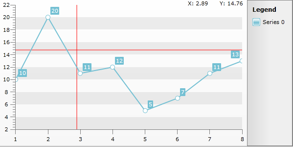

# Create Location Crosshair for RadChart

## 

This help topic will demonstrate how to add location crosshair for RadChart as well as location indicator (achieved by two TextBlock-s that track the current mouse location).

         
      

To achieve the crosshair functionality you will add two [
        custom gridlines]() to the ChartArea (each of them parallel to one of the axes). Also, you will need three events – 
        MouseEnter, MouseLeave and MouseMove to track the mouse cursor position and “move” the gridlines across the plot area (represented by ClipPanel element in the ChartArea template).
        First you need to hook up to the chart's Loaded event. When the chart is loaded you can easily get hold of the panel via
        the ChildrenOfType<T> extension method (add reference to the __Telerik.Windows.Controls__ namespace) like this:

#### __C#__

{{region radchart-howto-create-location-crosshair-for-radchart_0}}
	private void OnChartLoaded(object sender, RoutedEventArgs e)
	{
		var plotAreaPanel = this.chart.DefaultView.ChartArea.ChildrenOfType<ClipPanel>().FirstOrDefault();
		plotAreaPanel.MouseEnter += this.OnPlotAreaPanelMouseEnter;
		plotAreaPanel.MouseMove += this.OnPlotAreaPanelMouseMove;
		plotAreaPanel.MouseLeave += this.OnPlotAreaPanelMouseLeave;
	}
	{{endregion}}

#### __VB.NET__

{{region radchart-howto-create-location-crosshair-for-radchart_1}}
	Private Sub OnChartLoaded(ByVal sender As Object, ByVal e As RoutedEventArgs)
		Dim plotAreaPanel = Me.chart.DefaultView.ChartArea.ChildrenOfType(Of ClipPanel)().FirstOrDefault()
		plotAreaPanel.MouseEnter += Me.OnPlotAreaPanelMouseEnter
		plotAreaPanel.MouseMove += Me.OnPlotAreaPanelMouseMove
		plotAreaPanel.MouseLeave += Me.OnPlotAreaPanelMouseLeave
	End Sub
	{{endregion}}

By handling the MouseEnter and MouseLeave events you can add and remove the gridlines 
        whenever the mouse cursor enters or leaves the bounds of the plot area. The Mouse Move event handler in the code behind
        finds the current mouse position within the plot area. Note that you need to calculate the respective mouse coordinates
        relative to the plot area and not to the ChartArea itself.
        Now that you have the correct mouse coordinates, you need to pass the information to the custom gridline elements as well.
        However, the gridlines expect and work with data units and not physical pixels so a transformation must be applied first.
        Each axis exposes *ConvertPhysicalUnitsToData*() method that can handle the actual conversion 
        from physical pixels to data units.

>If you need the same functionality on mouse click, you do not need to perform 
        the conversion manually, as RadChart provides already converted values through the event arguments for the 
        __ChartArea.PlotAreaMouseLeftButtonDown__ / __ChartArea.PlotAreaMouseLeftButtonUp__ events.

Knowing the current X and Y data values of the mouse cursor you can bind the pair of lines to the X and Y properties of their DataContext, ensuring that the two lines will intersect at the current mouse location. 

#### __C#__

{{region radchart-howto-create-location-crosshair-for-radchart_2}}
	private void OnPlotAreaPanelMouseEnter(object sender, MouseEventArgs e)
	{
		this.chart.DefaultView.ChartArea.Annotations.Add(xGridLine);
		this.chart.DefaultView.ChartArea.Annotations.Add(yGridLine);
	}
	
	private void OnPlotAreaPanelMouseMove(object sender, MouseEventArgs e)
	{
		var plotAreaPanel = sender as ClipPanel;
		var position = e.GetPosition(plotAreaPanel);
	
		var x = this.chart.DefaultView.ChartArea.AxisX.ConvertPhysicalUnitsToData(position.X);
		var y = this.chart.DefaultView.ChartArea.AxisY.ConvertPhysicalUnitsToData(position.Y);
	
		xGridLine.XIntercept = x;
		yGridLine.YIntercept = y;
	
		this.textX.Text = string.Format("X: {0:N2}", x);
		this.textY.Text = string.Format("Y: {0:N2}", y);
	}
	
	private void OnPlotAreaPanelMouseLeave(object sender, MouseEventArgs e)
	{
		this.chart.DefaultView.ChartArea.Annotations.Remove(xGridLine);
		this.chart.DefaultView.ChartArea.Annotations.Remove(yGridLine);
	}
	{{endregion}}

#### __VB.NET__

{{region radchart-howto-create-location-crosshair-for-radchart_3}}
	Private Sub OnPlotAreaPanelMouseEnter(ByVal sender As Object, ByVal e As MouseEventArgs)
		Me.chart.DefaultView.ChartArea.Annotations.Add(xGridLine)
		Me.chart.DefaultView.ChartArea.Annotations.Add(yGridLine)
	End Sub
	
	Private Sub OnPlotAreaPanelMouseMove(ByVal sender As Object, ByVal e As MouseEventArgs)
		Dim plotAreaPanel = TryCast(sender, ClipPanel)
		Dim position = e.GetPosition(plotAreaPanel)
	
		Dim x = Me.chart.DefaultView.ChartArea.AxisX.ConvertPhysicalUnitsToData(position.X)
		Dim y = Me.chart.DefaultView.ChartArea.AxisY.ConvertPhysicalUnitsToData(position.Y)
	
		xGridLine.XIntercept = x
		yGridLine.YIntercept = y
	
		Me.textX.Text = String.Format("X: {0:N2}", x)
		Me.textY.Text = String.Format("Y: {0:N2}", y)
	End Sub
	
	Private Sub OnPlotAreaPanelMouseLeave(ByVal sender As Object, ByVal e As MouseEventArgs)
		Me.chart.DefaultView.ChartArea.Annotations.Remove(xGridLine)
		Me.chart.DefaultView.ChartArea.Annotations.Remove(yGridLine)
	End Sub
	{{endregion}}

The Location Indicator consists of two textblocks. We modify their values in code behind, but you can easily modify the code in an MVVM friendly way.

#### __XAML__

{{region radchart-howto-create-location-crosshair-for-radchart_4}}
	<StackPanel Orientation="Horizontal" Height="20" HorizontalAlignment="Right" VerticalAlignment="Top">
		<TextBlock Name="textX" Width="50" Margin="0,0,15,0" />
		<TextBlock Name="textY" Width="50" />
	</StackPanel>
	{{endregion}}

