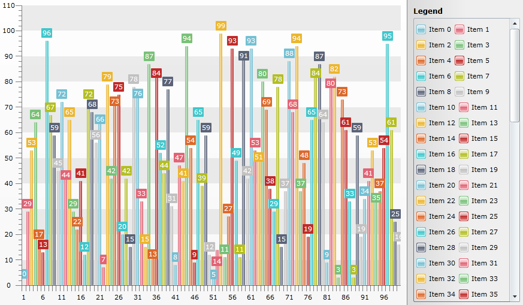

# Customize Chart Legend - Add ScrollViewer

## 

There are scenarios in which you have too much Items in the Chart Legend. Since the Legend is trying to visualize all of them this causes to reduced space for the Chart. Even if you set a Width for the Chart Legend the items maybe chopped off (not quite visible).
One possible solution is to decrease FontSize value of text and retemplate the LegendItemMarker to decreaze it's size too. This help topic will demonstrate another approach - how to add *ScrollViewer *(horizontal or/and vertical) in order to be able to show large number of chart legend items in a limited space.
For the purpose you should retemplate the default Legend Style and add ScrollViewer in it:

#### __XAML__

{{region radchart-howto-customize-chart-legend-add-scrollviewer_0}}
	<UserControl.Resources>
	        <telerik:TextToVisibilityConverter x:Key="textToVisibilityConverter" />
	
	        <SolidColorBrush x:Key="LegendForeground" Color="#FF000000" />
	        <LinearGradientBrush x:Key="LegendBackground" EndPoint="1.96,0.5" StartPoint="-0.96,0.5">
	            <GradientStop Color="#FFB5B5B5"/>
	            <GradientStop Color="#FFF0F0F0" Offset="0.5"/>
	        </LinearGradientBrush>
	        <SolidColorBrush x:Key="LegendBorderBrush" Color="#FF848484" />
	        <Thickness x:Key="LegendBorderThickness">1</Thickness>
	
	        <system:Double x:Key="LegendItemMarkerMaskStrokeThickness">1</system:Double>
	        <SolidColorBrush x:Key="LegendItemMarkerMaskStroke" Color="White" />
	        <LinearGradientBrush x:Key="LegendItemMarkerMask" EndPoint="0.5,1" StartPoint="0.5,0">
	            <GradientStop Color="#D8FFFFFF" Offset="0.009"/>
	            <GradientStop Color="#66FFFFFF" Offset="1"/>
	            <GradientStop Color="Transparent" Offset="0.43"/>
	            <GradientStop Color="#7FFFFFFF" Offset="0.42"/>
	        </LinearGradientBrush>
	        <SolidColorBrush x:Key="LegendItemMarkerMaskOpacityMask" Color="#FF000000" />
	        <SolidColorBrush x:Key="LegendItemMarkerMask2" Color="Transparent" />
	
	        <telerik:MarkerShape x:Key="LegendItemMarkerShape">SquareRounded</telerik:MarkerShape>
	
	        
	    </UserControl.Resources>
	{{endregion}}

The sample Chart shown below has [LegendDisplayMode](http://www.telerik.com/help/silverlight/radchart-features-chart-legend.html) set to DataPointLabel so that all Items in the Chart has LegendLabels:

#### __C#__

{{region radchart-howto-customize-chart-legend-add-scrollviewer_1}}
	public MainPage()
	        {
	            InitializeComponent();
	            Random r = new Random();
	            int[] myArray = new int[100];
	            for (int i = 0; i < myArray.Length; i++)
	            {
	                myArray[i] = r.Next(0, 100);
	            }
	            RadChart1.ItemsSource = myArray;
	            RadChart1.DefaultView.ChartArea.EnableAnimations = false;
	            RadChart1.DefaultView.ChartLegend.Width = 200;
	            RadChart1.DefaultSeriesDefinition.LegendDisplayMode = LegendDisplayMode.DataPointLabel;
	            RadChart1.DefaultView.ChartLegend.Style = (Style)this.Resources["ChartLegendStyle"];
	        }
	{{endregion}}

#### __VB.NET__

{{region radchart-howto-customize-chart-legend-add-scrollviewer_2}}
	Public Sub New()
	InitializeComponent()
	Dim r As New Random()
	Dim myArray(99) As Integer
	For i As Integer = 0 To myArray.Length - 1
	myArray(i) = r.Next(0, 100)
	Next i
	RadChart1.ItemsSource = myArray
	RadChart1.DefaultView.ChartArea.EnableAnimations = False
	RadChart1.DefaultView.ChartLegend.Width = 200
	RadChart1.DefaultSeriesDefinition.LegendDisplayMode = LegendDisplayMode.DataPointLabel
	RadChart1.DefaultView.ChartLegend.Style = CType(Me.Resources("ChartLegendStyle"), Style)
	End Sub
	{{endregion}}

The result can be seen on the following picture:

         
      

