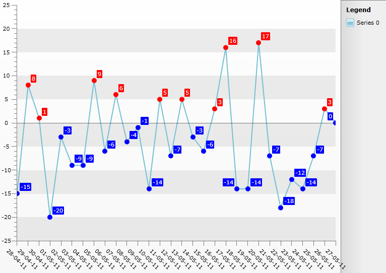

# Set Custom Fill For PointMarks Depending On Condition

## 

It is common scenario that you would like to customize the appearance of the PointMarks in a Line Series. However since Line Series are Self-Drawing Series changing a property affects all PointMarks. This help article will demonstrate how to set custom Fill for PointMarks in a single Line Serie where it is set according to their YValue - *Blue *SolidColorBrush for those that are negative and *Red *for the positive ones. Additionally the Series Items Labels are set with Color according to their corresponding PointMark.

* Create a new class named __Data__, which implements the __INotifyPropertyChanged__ interface. It will be used as an __ItemsSource__ for the chart control. The class has three properties:

__- Date__ - will be displayed on the X axis. 

- __YValue__ - will be displayed on the Y axis.

- __PointMarkFill__ - will be applied to the PointMark Style to set the Fill for the PointMark.

#### __C#__

{{region radchart-howto-set-custom-fill-for-pointmarks-depending-on-condition_0}}
	public class Data : INotifyPropertyChanged
	    {
	        private DateTime _date;
	        private SolidColorBrush _pointMarkFill;
	        private int _yvalue;
	        public Data(DateTime date, int yvalue)
	        {
	            this._date = date;
	            this._yvalue = yvalue;
	            this.UpdatePointMarkVisibility();
	        }
	        public event PropertyChangedEventHandler PropertyChanged;
	        public DateTime Date
	        {
	            get
	            {
	                return _date;
	            }
	            set
	            {
	                if (this._date == value)
	                    return;
	                this._date = value;
	                this.OnPropertyChanged("Date");
	            }
	        }
	        public int YValue
	        {
	            get
	            {
	                return _yvalue;
	            }
	            set
	            {
	                if (this._yvalue == value)
	                    return;
	                this._yvalue = value;
	                this.OnPropertyChanged("YValue");
	            }
	        }
	        public SolidColorBrush PointMarkFill
	        {
	            get
	            {
	                return _pointMarkFill;
	            }
	            private set
	            {
	                if (object.Equals(this._pointMarkFill, value))
	                    return;
	                this._pointMarkFill = value;
	                this.OnPropertyChanged("PointMarkVisibility");
	            }
	        }
	        protected virtual void OnPropertyChanged(string propertyName)
	        {
	            if (this.PropertyChanged != null)
	                this.PropertyChanged(this, new PropertyChangedEventArgs(propertyName));
	        }
	        private void UpdatePointMarkVisibility()
	        {
	            if (this.YValue > 0)
	                this.PointMarkFill = new SolidColorBrush(Colors.Red);
	            else
	                this.PointMarkFill = new SolidColorBrush(Colors.Blue);
	        }
	
	    }
	{{endregion}}

#### __VB.NET__

{{region radchart-howto-set-custom-fill-for-pointmarks-depending-on-condition_1}}
	Public Class Data
	      Implements INotifyPropertyChanged
	            Private _date As Date
	            Private _pointMarkFill As SolidColorBrush
	            Private _yvalue As Integer
	            Public Sub New(ByVal [date] As Date, ByVal yvalue As Integer)
	                  Me._date = [date]
	                  Me._yvalue = yvalue
	                  Me.UpdatePointMarkVisibility()
	            End Sub
	            Public Event PropertyChanged As PropertyChangedEventHandler
	            Public Property [Date]() As Date
	                  Get
	                        Return _date
	                  End Get
	                  Set(ByVal value As Date)
	                        If Me._date Is value Then
	                              Return
	                        End If
	                        Me._date = value
	                        Me.OnPropertyChanged("Date")
	                  End Set
	            End Property
	            Public Property YValue() As Integer
	                  Get
	                        Return _yvalue
	                  End Get
	                  Set(ByVal value As Integer)
	                        If Me._yvalue = value Then
	                              Return
	                        End If
	                        Me._yvalue = value
	                        Me.OnPropertyChanged("YValue")
	                  End Set
	            End Property
	            Public Property PointMarkFill() As SolidColorBrush
	                  Get
	                        Return _pointMarkFill
	                  End Get
	                  Private Set(ByVal value As SolidColorBrush)
	                        If Object.Equals(Me._pointMarkFill, value) Then
	                              Return
	                        End If
	                        Me._pointMarkFill = value
	                        Me.OnPropertyChanged("PointMarkVisibility")
	                  End Set
	            End Property
	            Protected Overridable Sub OnPropertyChanged(ByVal propertyName As String)
	                  If Me.PropertyChangedEvent IsNot Nothing Then
	                        RaiseEvent PropertyChanged(Me, New PropertyChangedEventArgs(propertyName))
	                  End If
	            End Sub
	            Private Sub UpdatePointMarkVisibility()
	                  If Me.YValue > 0 Then
	                        Me.PointMarkFill = New SolidColorBrush(Colors.Red)
	                  Else
	                        Me.PointMarkFill = New SolidColorBrush(Colors.Blue)
	                  End If
	            End Sub
	
	End Class
	{{endregion}}

Note that the check for setting the *PointMarkFill's* value is added in the end of the code snippet above.Add the RadChart declaration:

#### __XAML__

{{region radchart-howto-set-custom-fill-for-pointmarks-depending-on-condition_2}}
	<telerik:RadChart Name="chart"/>
	{{endregion}}

Retemplate the default PointMark Style - Add *Fill *Property databound to *DataItem.PointMarkFill* property of the class. Add the Style between the starting and ending tags of the UserControl:

#### __XAML__

{{region radchart-howto-set-custom-fill-for-pointmarks-depending-on-condition_3}}
	
	{{endregion}}

 Retemplate the default *SeriesItemLabel *Style so that the appropriate color will be set for each Label too:

#### __XAML__

{{region radchart-howto-set-custom-fill-for-pointmarks-depending-on-condition_4}}
	
	{{endregion}}

The chart is populated with data in code-behind using [Manual Series Mappings](). The last line in the code snippet demonstrates how the Style for the PointMarks can be set.

#### __C#__

{{region radchart-howto-set-custom-fill-for-pointmarks-depending-on-condition_5}}
	List<Data> exportData = new List<Data>();
	DateTime baseDate = DateTime.Today;
	Random r = new Random();
	for (int i = 0; i < 30; i++)
	{
	exportData.Add(new Data(baseDate.AddDays(i), r.Next(-20, 20)));
	}
	SeriesMapping mapping = new SeriesMapping();
	mapping.ItemMappings.Add(new ItemMapping("YValue", DataPointMember.YValue));
	mapping.ItemMappings.Add(new ItemMapping("Date", DataPointMember.XCategory));
	chart.ItemsSource = exportData;
	chart.SeriesMappings.Add(mapping);
	chart.DefaultView.ChartArea.AxisX.IsDateTime = true;
	chart.DefaultView.ChartArea.AxisX.LabelRotationAngle = 45;
	chart.DefaultView.ChartArea.AxisX.DefaultLabelFormat = "dd-MM-yy";
	LineSeriesDefinition line = new LineSeriesDefinition();
	chart.DefaultSeriesDefinition = line;
	line.ShowPointMarks = true;
	line.ShowItemLabels = true;
	chart.DefaultSeriesDefinition.PointMarkItemStyle = this.Resources["MyPointMark_Style"] as Style;
	chart.DefaultSeriesDefinition.SeriesItemLabelStyle = this.Resources["MySeriesItemLabel_Style"] as Style;
	{{endregion}}

#### __VB.NET__

{{region radchart-howto-set-custom-fill-for-pointmarks-depending-on-condition_6}}
	Dim exportData As New List(Of Data)()
	Dim baseDate As Date = Date.Today
	Dim r As New Random()
	For i As Integer = 0 To 29
	exportData.Add(New Data(baseDate.AddDays(i), r.Next(-20, 20)))
	Next i
	Dim mapping As New SeriesMapping()
	mapping.ItemMappings.Add(New ItemMapping("YValue", DataPointMember.YValue))
	mapping.ItemMappings.Add(New ItemMapping("Date", DataPointMember.XCategory))
	chart.ItemsSource = exportData
	chart.SeriesMappings.Add(mapping)
	chart.DefaultView.ChartArea.AxisX.IsDateTime = True
	chart.DefaultView.ChartArea.AxisX.LabelRotationAngle = 45
	chart.DefaultView.ChartArea.AxisX.DefaultLabelFormat = "dd-MM-yy"
	Dim line As New LineSeriesDefinition()
	chart.DefaultSeriesDefinition = line
	line.ShowPointMarks = True
	line.ShowItemLabels = True
	chart.DefaultSeriesDefinition.PointMarkItemStyle = TryCast(Me.Resources("MyPointMark_Style"), Style)
	chart.DefaultSeriesDefinition.SeriesItemLabelStyle = TryCast(Me.Resources("MySeriesItemLabel_Style"), Style)
	{{endregion}}

The result can be seen on the image below:

         
      
