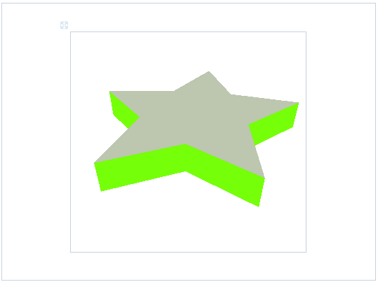
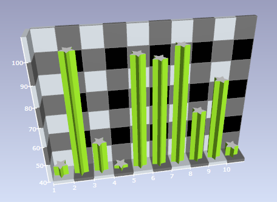

# Use Custom 3D Models

## 

__RadChart__ allows easy customization of the 3D models used in 3D series types thanks to its innovative extensible architecture. This is especially useful for customization of the 3D Bar series type i.e. substituting the bar models with bar-like figures that can be scaled vertically without visual distortion (e.g. star model). 

Basically there are three steps involved in the utilization of a custom 3D model with __RadChart__:

1. Creating the actual 3D model in a 3D modeling application like 3D Studio Max.

1. Exporting the 3D model (3ds file) to xaml via 3ds-to-xaml converter e.g. the Reader3ds library available [here](http://www.wpf-graphics.com/Reader3ds.aspx).

1. Substituting the default 3D Bar model used by __RadChart__ with the exported 3D custom model (xaml). Note that for best results, the Xaml model should be centered around the origin of the coordinate system. 

Here is a sample xaml export obtained by processing a custom 3D star model (produced by step 1.) with the Reader3ds library (step 2.):

         
      

#### __XAML__

{{region radchart-how-to-use-custom-3d-models_0}}
	<Viewport3D>
	    <Viewport3D.Resources>
	        <MaterialGroup x:Key="StarFace">
	            <DiffuseMaterial Brush="#55555555"/>
	            <SpecularMaterial Brush="#FFFFFFFF"/>
	        </MaterialGroup>
	        <MaterialGroup x:Key="StarSide">
	            <DiffuseMaterial Brush="GreenYellow"/>
	            <SpecularMaterial Brush="#FFFFFFFF" Color="#7FFFDD00"/>
	        </MaterialGroup>
	    </Viewport3D.Resources>
	    <Viewport3D.Camera>
	        <PerspectiveCamera Position="5,5,5" LookDirection="-1,-1,-1" />
	    </Viewport3D.Camera>
	    <Viewport3D.Children>
	        <ModelVisual3D x:Name="Light">
	            <ModelVisual3D.Content>
	                <AmbientLight Color="GreenYellow"/>
	            </ModelVisual3D.Content>
	        </ModelVisual3D>
	        <ModelVisual3D>
	            <ModelVisual3D.Content>
	                <Model3DGroup>
	                    <GeometryModel3D Material="{StaticResource StarFace}">
	                        <GeometryModel3D.Geometry>
	                            <MeshGeometry3D
	                                Positions="-9.995,0,2.351 -3.085,0,3.406 0.005,0,9.99 3.095,0,3.406 10.005,0,2.351 5.005,0,-2.773 6.186,0,-10.01 0.005,0,-6.594 -6.176,0,-10.01 -4.996,0,-2.773"
	                                TriangleIndices="0,9,1 1,3,2 3,5,4 5,7,6 7,9,8 1,9,3 3,9,5 5,9,7"/>
	                        </GeometryModel3D.Geometry>
	                    </GeometryModel3D>
	                    <GeometryModel3D Material="{StaticResource StarFace}">
	                        <GeometryModel3D.Geometry>
	                            <MeshGeometry3D
	                                Positions="-9.995,3,2.351 -3.085,3,3.406 0.005,3,9.99 3.095,3,3.406 10.005,3,2.351 5.005,3,-2.773 6.186,3,-10.01 0.005,3,-6.594 -6.176,3,-10.01 -4.996,3,-2.773"
	                                TriangleIndices="0,1,9 1,2,3 3,4,5 5,6,7 7,8,9 1,3,9 3,5,9 5,7,9"/>
	                        </GeometryModel3D.Geometry>
	                    </GeometryModel3D>
	                    <GeometryModel3D Material="{StaticResource StarSide}">
	                        <GeometryModel3D.Geometry>
	                            <MeshGeometry3D
	                                Positions="-9.995,0,2.351 -4.996,0,-2.773 -9.995,3,2.351 -4.996,3,-2.773"
	                                TriangleIndices="0,3,1 0,2,3"/>
	                        </GeometryModel3D.Geometry>
	                    </GeometryModel3D>
	                    <GeometryModel3D Material="{StaticResource StarSide}">
	                        <GeometryModel3D.Geometry>
	                            <MeshGeometry3D
	                                Positions="-9.995,0,2.351 -3.085,0,3.406 -9.995,3,2.351 -3.085,3,3.406"
	                                TriangleIndices="0,1,3 0,3,2"/>
	                        </GeometryModel3D.Geometry>
	                    </GeometryModel3D>
	                    <GeometryModel3D Material="{StaticResource StarSide}">
	                        <GeometryModel3D.Geometry>
	                            <MeshGeometry3D
	                                Positions="-3.085,0,3.406 0.005,0,9.99 -3.085,3,3.406 0.005,3,9.99"
	                                TriangleIndices="0,1,3 0,3,2"/>
	                        </GeometryModel3D.Geometry>
	                    </GeometryModel3D>
	                    <GeometryModel3D Material="{StaticResource StarSide}">
	                        <GeometryModel3D.Geometry>
	                            <MeshGeometry3D
	                                Positions="0.005,0,9.99 3.095,0,3.406 0.005,3,9.99 3.095,3,3.406"
	                                TriangleIndices="0,1,3 0,3,2"/>
	                        </GeometryModel3D.Geometry>
	                    </GeometryModel3D>
	                    <GeometryModel3D Material="{StaticResource StarSide}">
	                        <GeometryModel3D.Geometry>
	                            <MeshGeometry3D
	                                Positions="3.095,0,3.406 10.005,0,2.351 3.095,3,3.406 10.005,3,2.351"
	                                TriangleIndices="0,1,3 0,3,2"/>
	                        </GeometryModel3D.Geometry>
	                    </GeometryModel3D>
	                    <GeometryModel3D Material="{StaticResource StarSide}">
	                        <GeometryModel3D.Geometry>
	                            <MeshGeometry3D
	                                Positions="10.005,0,2.351 5.005,0,-2.773 10.005,3,2.351 5.005,3,-2.773"
	                                TriangleIndices="0,1,3 0,3,2"/>
	                        </GeometryModel3D.Geometry>
	                    </GeometryModel3D>
	                    <GeometryModel3D Material="{StaticResource StarSide}">
	                        <GeometryModel3D.Geometry>
	                            <MeshGeometry3D
	                                Positions="5.005,0,-2.773 6.186,0,-10.01 5.005,3,-2.773 6.186,3,-10.01"
	                                TriangleIndices="0,1,3 0,3,2"/>
	                        </GeometryModel3D.Geometry>
	                    </GeometryModel3D>
	                    <GeometryModel3D Material="{StaticResource StarSide}">
	                        <GeometryModel3D.Geometry>
	                            <MeshGeometry3D Positions="6.186,0,-10.01 0.005,0,-6.594 6.186,3,-10.01 0.005,3,-6.594" TriangleIndices="0,1,3 0,3,2"/>
	                        </GeometryModel3D.Geometry>
	                    </GeometryModel3D>
	                    <GeometryModel3D Material="{StaticResource StarSide}">
	                        <GeometryModel3D.Geometry>
	                            <MeshGeometry3D
	                                Positions="0.005,0,-6.594 -6.176,0,-10.01 0.005,3,-6.594 -6.176,3,-10.01"
	                                TriangleIndices="0,1,3 0,3,2"/>
	                        </GeometryModel3D.Geometry>
	                    </GeometryModel3D>
	                    <GeometryModel3D Material="{StaticResource StarSide}">
	                        <GeometryModel3D.Geometry>
	                            <MeshGeometry3D
	                                Positions="-6.176,0,-10.01 -4.996,0,-2.773 -6.176,3,-10.01 -4.996,3,-2.773"
	                                TriangleIndices="0,1,3 0,3,2"/>
	                        </GeometryModel3D.Geometry>
	                    </GeometryModel3D>
	                    <Model3DGroup.Transform>
	                        <ScaleTransform3D ScaleX="0.3" ScaleY="0.3" ScaleZ="0.3" />
	                    </Model3DGroup.Transform>
	                </Model3DGroup>
	            </ModelVisual3D.Content>
	        </ModelVisual3D>
	    </Viewport3D.Children>
	</Viewport3D>
	{{endregion}}

Take a look at step 3 - the actual incorporation of the custom 3D model in the chart control. First, you need some background on how the __RadChart__ control works when visualizing the __3D BarSeries__type. 

__RadChart__ uses innovative approach to incorporate custom 3D controls and item controls (WPF does not implement such controls out-of-the box). In effect the __3D BarSeries__ (__3D ItemsControl__) renders a number of 3D bar-like control primitives (3D controls). What you need to do in order to customize the appearance of the individual 3D controls is to set the __Bar3DSeriesDefinition.ItemStyle__ property to a custom Style that defines the desired star model. You can do this by creating the actual series definition itself:

>Note that by setting the __ItemStyle__ property, you are overriding the default appearance for all 3D controls within the series and they will not use the default style applied otherwise to __3D Bar__ controls.

#### __C#__

{{region radchart-how-to-use-custom-3d-models_1}}
	private void FillSampleChartData()
	{
	 DataSeries barSeries = new DataSeries();
	 barSeries.Definition = new Bar3DSeriesDefinition();
	 barSeries.Definition.ItemStyle = (Style) this.FindResource("MyStyle");
	 barSeries.FillWithSampleData();
	 this.RadChart1.DefaultView.ChartArea.DataSeries.Add(barSeries);
	}
	{{endregion}}

#### __VB.NET__

{{region radchart-how-to-use-custom-3d-models_2}}
	Private Sub FillSampleChartData()
	 Dim barSeries As New DataSeries()
	 barSeries.Definition = New Bar3DSeriesDefinition()
	 barSeries.Definition.ItemStyle = DirectCast(Me.FindResource("MyStyle"), Style)
	 barSeries.FillWithSampleData()
	 Me.RadChart1.DefaultView.ChartArea.DataSeries.Add(barSeries)
	End Sub
	{{endregion}}

Now you have to create the actual style resource labeled "__MyStyle__" and in order to do so the exported star model Xaml will be used.

In effect the control template for the __Bar3D__ class is customized. Note that when customizing the template for a 3D control there are some required elements / element names that should be present or otherwise the control will not work correctly:

<ControlTemplate __TargetType="{x:Type telerik:BarControl3D}"__>
 ...
 __<Grid x:Name="PART_Container" />__
 <Viewport3D __x:Name="PART_Viewport"__ ... >
  <Viewport3D.Children>
   __<ContainerUIElement3D x:Name="PART_ModelElement">__
    <ContainerUIElement3D.Children>
__<ModelVisual3D>
     
      <-- star model goes here -->
     
     </ModelVisual3D>__
    </ContainerUIElement3D.Children>
   </ContainerUIElement3D>
 </Viewport3D>
</ControlTemplate>

Here is the actual template that follows this pattern:

#### __XAML__

{{region radchart-how-to-use-custom-3d-models_3}}
	
	{{endregion}}

>

Note that in order to display the stars with correct height (like the default __3D Bars__), a __ScaleTransform3D__ has been applied that binds the __ScaleY__ property like this:

#### __XAML__

{{region radchart-how-to-use-custom-3d-models_4}}
	ScaleY="{Binding RelativeSource={RelativeSource FindAncestor, AncestorType={x:Type telerik:Bar3D}}, Path=Height}"
	{{endregion}}

Here is the resultant 3D bar series that uses the custom 3D star model instead of the default 3D bar model:

         
      
