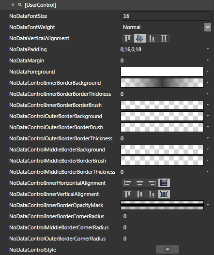
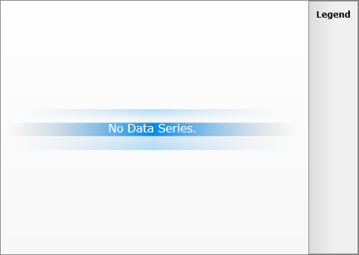

# Styling the No Data Control

The __RadChart No Data Control__ can be styled by creating an appropriate __Style__ and setting it to the __NoDataControlStyle__ property of the __ChartArea__. 

You have two options:

* To create an empty style and set it up on your own.

* To copy the default style of the control and modify it.

This topic will show you how to perform the second one.

## Modifying the Default Style

>The __NoDataControl__ control is located in the __Telerik.Windows.Controls.Charting__ namespace of the __Telerik.Windows.Controls.Charting__ assembly. In order to use it you have to declare it in XAML:

#### __XAML__

{{region xaml-radchart-styling-and-appearance-styling-no-data-control_0}}
	xmlns:telerikCharting=&quot;clr-namespace:Telerik.Windows.Controls.Charting;assembly=Telerik.Windows.Controls.Charting&quot;
{{endregion}}

When working in Expression Blend, the namespaces that are needed will be added automatically.

Load your project in Expression Blend and open the User Control that holds the __RadChart__. You have to use a dummy control in order to get the default style. To create one find the __NoDataControl__ control in the 'Assets' pane and draw one on the art board. In the 'Objects and Timeline' pane select the __NoDataControl__, you've drawn and from the menu choose *Object -> Edit Style -> Edit a Copy*. You will be prompted for the name of the style and where to be placed.

>tipIf you choose to define the style in Application, it would be available for the entire application. This allows you to define a style only once and then reuse it where needed.

After clicking 'OK', Expression Blend will generate the default style of the __NoDataControl__ control in the __Resources__ section of your User Control. The properties available for the style will be loaded in the 'Properties' pane and you will be able to modify their default values. You can also edit the generated XAML in the XAML View or in Visual Studio.

If you go to the 'Resources' pane, you will see an editable list of resources generated together with the style and used by it. In this list you will find the brushes, styles and templates needed to change the visual appearance of the __NoDataControl__. Their names indicate to which part of the __NoDataControl__ appearance they are assigned.



To apply the style to the real control, set it to the __NoDataControl__ property of the __ChartArea__.

#### __C#__

{{region cs-radchart-styling-and-appearance-styling-no-data-control_1}}
	this.radChart.DefaultView.ChartArea.NoDataControlStyle = this.Resources["NoDataControlStyle"] as Style;
{{endregion}}

#### __VB.NET__

{{region vb-radchart-styling-and-appearance-styling-no-data-control_2}}
	Me.radChart.DefaultView.ChartArea.NoDataControlStyle = TryCast(Me.Resources("NoDataControlStyle"), Style)
{{endregion}}

>Don't forget to delete the dummy __NoDataControl__ control, when you finish editing the style.

Here is an example of the described resources modified.



And here is the snapshot of the result.


Here is the final XAML for the __Style__after the modifications:

#### __XAML__

{{region xaml-radchart-styling-and-appearance-styling-no-data-control_3}}
	<System:Double x:Key="NoDataFontSize">16</System:Double>
	<FontWeight x:Key="NoDataFontWeight">Normal</FontWeight>
	<VerticalAlignment x:Key="NoDataVerticalAlignment">Center</VerticalAlignment>
	<Thickness x:Key="NoDataPadding">0,16,0,18</Thickness>
	<Thickness x:Key="NoDataMargin">0</Thickness>
	<SolidColorBrush x:Key="NoDataForeground" Color="White" />
	<LinearGradientBrush x:Key="NoDataControlInnerBorderBackground" StartPoint="0,0.5" EndPoint="1,0.5">
	    <GradientStop Offset="0.5" Color="#FF008CEF" />
	    <GradientStop Offset="1" Color="#00B3B3B3" />
	    <GradientStop Color="#00B3B3B3" />
	</LinearGradientBrush>
	<Thickness x:Key="NoDataControlInnerBorderBorderThickness">0</Thickness>
	<SolidColorBrush x:Key="NoDataControlInnerBorderBorderBrush" Color="Transparent" />
	<SolidColorBrush x:Key="NoDataControlOuterBorderBackground" Color="Transparent" />
	<SolidColorBrush x:Key="NoDataControlOuterBorderBorderBrush" Color="Transparent" />
	<Thickness x:Key="NoDataControlOuterBorderBorderThickness">0</Thickness>
	<SolidColorBrush x:Key="NoDataControlMiddleBorderBackground" Color="Transparent" />
	<SolidColorBrush x:Key="NoDataControlMiddleBorderBorderBrush" Color="Transparent" />
	<Thickness x:Key="NoDataControlMiddleBorderBorderThickness">0</Thickness>
	<HorizontalAlignment x:Key="NoDataControlInnerHorizontalAlignment">Stretch</HorizontalAlignment>
	<VerticalAlignment x:Key="NoDataControlInnerVerticalAlignment">Stretch</VerticalAlignment>
	<LinearGradientBrush x:Key="NoDataControlInnerBorderOpacityMask" StartPoint="0.5,0" EndPoint="0.5,1">
	    <GradientStop Offset="1" Color="#4C000000" />
	    <GradientStop Color="#4C000000" />
	    <GradientStop Offset="0.33" Color="#00000000" />
	    <GradientStop Offset="0.331" Color="Black" />
	    <GradientStop Offset="0.66" Color="#2F000000" />
	    <GradientStop Offset="0.659" Color="Black" />
	</LinearGradientBrush>
	<CornerRadius x:Key="NoDataControlInnerBorderCornerRadius">0</CornerRadius>
	<CornerRadius x:Key="NoDataControlMiddleBorderCornerRadius">0</CornerRadius>
	<CornerRadius x:Key="NoDataControlOuterBorderCornerRadius">0</CornerRadius>
	
{{endregion}}

# See Also

 * [Styling the Item Labels]()

 * [Styling the Point Marks]()

 * [Styling the Chart Series]()
