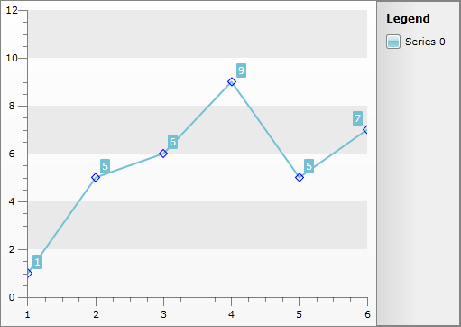
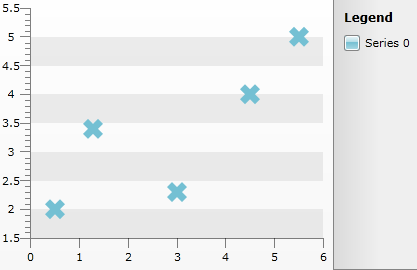

# Styling the Point Marks

## 

The easiest approach that you can use in order to style the point marks is to use the complex __Appearance__ property of the __ISeriesDefinition__ interface. This interface is implemented by all of the series definitions available in the __RadChart__ control. The __Appearance__ property exposes another complex property - __PointMark__. It exposes the following shortcut visual properties:

* __Fill__ - gets or sets the brush that describes the fill of the point mark. 

* __Stroke__ - gets or sets the brush that describes the stroke of the point mark. 

* __StrokeThickness__ - gets or sets the stroke thickness of the point mark.

* __Shape__- gets or sets the shape of the point mark, which corresponds to a value of the __Telerik.Windows.Controls.Charting.MarkerShape__ enumerator. 

>Currently, changing the point marks appearance could be done only via the provided API. Declarative customizations are not supported.

For example, you can change the appearance of the point marks for a __LineSeries__ in the following way.

#### __C#__

{{region cs-radchart-styling-and-appearance-styling-point-marks_0}}
	LineSeriesDefinition l = new LineSeriesDefinition();
	l.Appearance.PointMark.Stroke = new SolidColorBrush(Colors.Blue);
	l.Appearance.PointMark.StrokeThickness = 1;
	l.Appearance.PointMark.Fill = new SolidColorBrush(Colors.Transparent);
	l.Appearance.PointMark.Shape = MarkerShape.Diamond;
	this.radChart.DefaultSeriesDefinition = l;
{{endregion}}

#### __VB.NET__

{{region vb-radchart-styling-and-appearance-styling-point-marks_1}}
	Dim l As New LineSeriesDefinition()
	l.Appearance.PointMark.Stroke = New SolidColorBrush(Colors.White)
	l.Appearance.PointMark.StrokeThickness = 1
	l.Appearance.PointMark.Fill = New SolidColorBrush(Colors.Transparent)
	l.Appearance.PointMark.Shape = MarkerShape.Diamond
	Me.radChart.DefaultSeriesDefinition = l
{{endregion}}

Here is the result.

## 

__Customize Scatter/Bubble Series__

Changing the shape of the pointmark can be done by retemplating the Scatter/Point control (the class that represents 1 point on the screen). You can create a custom style for your scatter points as shown below and apply it to the series via __ItemStyle__ property:

#### __XAML__

{{region xaml-radchart-styling-and-appearance-styling-point-marks_2}}
	
	
{{endregion}}

The result is shown below:

## See Also

 * [Styling the Chart Series]()

 * [Styling the Chart Area]()

 * [Styling the Chart Legend]()
