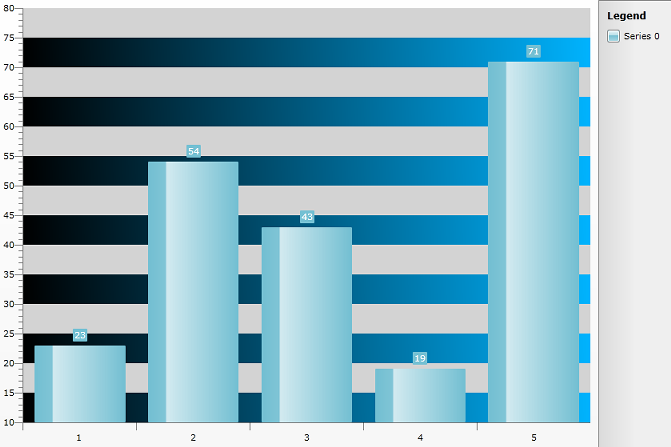

# Styling the Strip Lines

The strip lines are part of the axes items and are represented by the __StripLine and AlternateStripLine__ controls. There are two types of strip lines - Horizontal and Vertical. Each of them contains alternating Lines - one with Gray color by default (called __AlternateStripLine__) and the other is Transparent (called just __StripLine__). 

To be able to modify the colors of these lines you should use the following Styles:

#### __XAML__

{{region radchart-styling-and-appearance-styling-strip-lines_0}}
	
	{{endregion}}

#### __XAML__

{{region radchart-styling-and-appearance-styling-strip-lines_1}}
	
	{{endregion}}

>Set the created Styles to the __AxisY.AxisStyles__ (for modifying the color of the __Horizontal__ striplines) or __AxisX.AxisStyles__ (for __Vertical__ striplines) property of your RadChart like this:

#### __C#__

{{region radchart-styling-and-appearance-styling-strip-lines_2}}
	RadChart1.DefaultView.ChartArea.AxisY.AxisStyles.AlternateStripLineStyle = this.Resources["HorizontalAlternateStripLineStyle"] as Style;
	RadChart1.DefaultView.ChartArea.AxisY.AxisStyles.StripLineStyle = this.Resources["HorizontalStripLineStyle"] as Style;
	{{endregion}}

#### __VB.NET__

{{region radchart-styling-and-appearance-styling-strip-lines_3}}
	RadChart1.DefaultView.ChartArea.AxisY.AxisStyles.AlternateStripLineStyle = TryCast(Me.Resources("HorizontalAlternateStripLineStyle"), Style)
	RadChart1.DefaultView.ChartArea.AxisY.AxisStyles.StripLineStyle = TryCast(Me.Resources("HorizontalStripLineStyle"), Style)
	{{endregion}}

>tipYou should turn StripLines visibility on so that you will be able to see them.

#### __C#__

{{region radchart-styling-and-appearance-styling-strip-lines_4}}
	RadChart1.DefaultView.ChartArea.AxisY.StripLinesVisibility = System.Windows.Visibility.Visible;
	{{endregion}}

#### __VB.NET__

{{region radchart-styling-and-appearance-styling-strip-lines_5}}
	RadChart1.DefaultView.ChartArea.AxisY.StripLinesVisibility = System.Windows.Visibility.Visible
	{{endregion}}

Here is a snapshot of the result:

