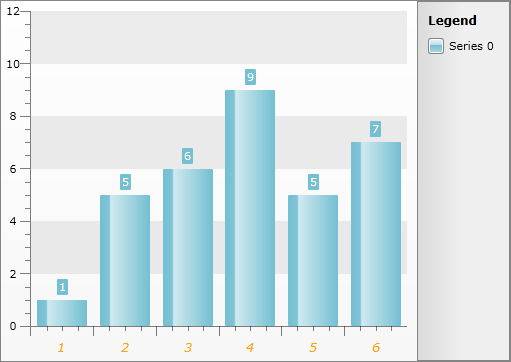

# Styling the Axis Item Label

## 

>tipThe approach below allow you more completely to change the appearance of the axis item label, but if you want to change only the foreground of it, you can use the __AxisForeground__ property of the __RadChart.Note__ that the value of this property will get applied to all of the axis item labels and all of the axis titles.

The axis item labels are part of the chart axis and are represented by the __TextBlock__ control. To create a style for them in Expression Blend use a dummy control and after modifying it, set it to the __AxisStyles__ complex property of the __Axis__.

Open your __RadChart__ project in Expression Blend. To add the dummy __TextBlock__ control you have to go to the XAML view. To do that select *View -> Active Document View -> XAML View* from the menu. Declare a __TextBlock__ control in your XAML.

#### __XAML__

{{region radchart-styling-and-appearance-styling-axis-item-label_0}}
	<Grid x:Name="LayoutRoot"
	      Background="White">
	    ...
	    <TextBlock/>
	</Grid>
	{{endregion}}

To go back to the design view select *View -> Active Document View -> Design View* from the menu. In the 'Objects and Timeline' pane select the newly created __TextBlock__ control. And select *Object -> Edit Style -> Create Empty* from the menu*. *You will be prompted for the name of the style and where to be placed within your application.

>tipIf you choose to define the style in Application, it would be available for the entire application. This allows you to define a style only once and then reuse it where needed.

After clicking the OK button, a style with target type __TextBlock__ will be created and the properties for this type will be loaded in the 'Properties' pane. Modify them until you get the desired appearance.

After finishing with the changes it is time to set the style. It can be set only through the procedural code, which means that you have to go to the Visual Studio and modify the code-behind file of your UserControl.

#### __C#__

{{region radchart-styling-and-appearance-styling-axis-item-label_1}}
	this.radChart.DefaultView.ChartArea.AxisX.AxisStyles.ItemLabelStyle = this.Resources[ "ItemLabelStyle" ] as Style;
	this.radChart.DefaultView.ChartArea.AxisY.AxisStyles.ItemLabelStyle= this.Resources[ "ItemLabelStyle" ] as Style;
	{{endregion}}

#### __VB.NET__

{{region radchart-styling-and-appearance-styling-axis-item-label_2}}
	Me.radChart.DefaultView.ChartArea.AxisX.AxisStyles.ItemLabelStyle = TryCast(Me.Resources("ItemLabelStyle"), Style)
	Me.radChart.DefaultView.ChartArea.AxisY.AxisStyles.ItemLabelStyle = TryCast(Me.Resources("ItemLabelStyle"), Style)
	{{endregion}}

Here is a snapshot of the sample result.

Here is the final XAML for the __Style__:

#### __XAML__

{{region radchart-styling-and-appearance-styling-axis-item-label_3}}
	
	{{endregion}}

# See Also

 * [Axes - Overview]()

 * [Styling the Axes - Overview]()

 * [Styling and Appearance - Overview]()
