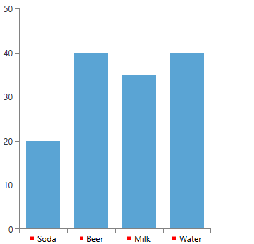

# Categorical Axis

The categorical axis displays a range of categories and the values that determine each category do not define an order. Here is an example of a categorical axis with a few data points.

#### __[XAML] Example 1: Chart with categorical axis__
{{region xaml-radchart-axes-categoricalaxis_0}}
	<telerik:RadCartesianChart>
		<telerik:RadCartesianChart.HorizontalAxis>
			<telerik:CategoricalAxis/>
		</telerik:RadCartesianChart.HorizontalAxis>

		<telerik:RadCartesianChart.VerticalAxis>
			<telerik:LinearAxis/>
		</telerik:RadCartesianChart.VerticalAxis>

		<telerik:RadCartesianChart.Series>
			<telerik:BarSeries>
				<telerik:BarSeries.DataPoints>
					<telerik:CategoricalDataPoint Category="Soda" Value="20"/>
					<telerik:CategoricalDataPoint Category="Beer" Value="40"/>
					<telerik:CategoricalDataPoint Category="Milk" Value="35"/>
					<telerik:CategoricalDataPoint Category="Water" Value="40"/>
				</telerik:BarSeries.DataPoints>
			</telerik:BarSeries>
		</telerik:RadCartesianChart.Series>
	</telerik:RadCartesianChart>
{{endregion}}

#### __Figure 1: Result from Example 1__

If a category binding is not specified for the categorical axis, each data point will be in its own category with the category being determined by the position of the data point in the data source. Notice how each data point is its own category on the X axis

#### __[XAML] Example 2: Chart with no category defined for datapoints__
{{region xaml-radchart-axes-categoricalaxis_1}}
	<telerik:RadCartesianChart x:Name="chart">
	   <telerik:RadCartesianChart.HorizontalAxis>
	      <telerik:CategoricalAxis/>
	   </telerik:RadCartesianChart.HorizontalAxis>
	
	   <telerik:RadCartesianChart.VerticalAxis>
	      <telerik:LinearAxis/>
	   </telerik:RadCartesianChart.VerticalAxis>
	
	   <telerik:RadCartesianChart.Series>
	      <telerik:LineSeries Stroke="Orange"
	                        StrokeThickness="2">
	      <telerik:LineSeries.DataPoints>
	         <telerik:CategoricalDataPoint Value="20"/>
	         <telerik:CategoricalDataPoint Value="40"/>
	         <telerik:CategoricalDataPoint Value="35"/>
	         <telerik:CategoricalDataPoint Value="40"/>
	         <telerik:CategoricalDataPoint Value="30"/>
	         <telerik:CategoricalDataPoint Value="50"/>
	      </telerik:LineSeries.DataPoints>
	   </telerik:LineSeries>
	</telerik:RadCartesianChart.Series>
{{endregion}}

#### __Figure 2: Result from Example 2__

You can customize the categoricalAxis by utilizing its **LabelTemplate** property. Here is a simple implementation of a rectangle added in the LabelTemplate

#### __[XAML] Example 3: CategoricalAxis with LabelTemplate__
{{region xaml-radchart-axes-categoricalaxis_2}}
	<Grid>
        <Grid.Resources>
            <DataTemplate x:Key="LabelTemplate" DataType="{x:Type telerik:CategoricalAxis}">
                <StackPanel Orientation="Horizontal">
                    <Rectangle Fill="Red" Width="5" Height="5" />
                    <TextBlock Text="{Binding}" Margin="5 0 0 0" />
                </StackPanel>
            </DataTemplate>
        </Grid.Resources>

        <telerik:RadCartesianChart x:Name="RadChart">
            <telerik:RadCartesianChart.HorizontalAxis>
                <telerik:CategoricalAxis LabelTemplate="{StaticResource LabelTemplate}" />
            </telerik:RadCartesianChart.HorizontalAxis>

            <telerik:RadCartesianChart.VerticalAxis>
                <telerik:LinearAxis/>
            </telerik:RadCartesianChart.VerticalAxis>

            <telerik:RadCartesianChart.Series>
                <telerik:BarSeries>

                    <telerik:BarSeries.DataPoints>
                        <telerik:CategoricalDataPoint Category="Soda" Value="20"/>
                        <telerik:CategoricalDataPoint Category="Beer" Value="40"/>
                        <telerik:CategoricalDataPoint Category="Milk" Value="35"/>
                        <telerik:CategoricalDataPoint Category="Water" Value="40"/>
                    </telerik:BarSeries.DataPoints>

                </telerik:BarSeries>
            </telerik:RadCartesianChart.Series>
        </telerik:RadCartesianChart>
    </Grid>
{{endregion}}

#### __Figure 3: Result from Example 3__

## See Also
* [Getting Started]()
* [Axes]()
