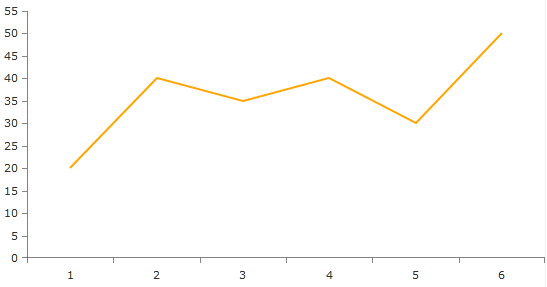

# Categorical Axis

## 

The categorical axis displays a range of categories and the values that determine each category do not define an order. If a category binding is not specified for the categorical axis, each data point will be in its own category with the category being determined by the position of the data point in the data source. Here is an example of a categorical axis with a few data points. Notice how each data point is its own category on the X axis:
        

#### __XAML__

{{region radchart-axes-categoricalaxis_0}}
	<telerik:RadCartesianChart x:Name="chart">
	   <telerik:RadCartesianChart.HorizontalAxis>
	      <telerik:CategoricalAxis/>
	   </telerik:RadCartesianChart.HorizontalAxis>
	
	   <telerik:RadCartesianChart.VerticalAxis>
	      <telerik:LinearAxis/>
	   </telerik:RadCartesianChart.VerticalAxis>
	
	   <telerik:RadCartesianChart.Series>
	      <telerik:LineSeries Stroke="Orange"
	                        StrokeThickness="2">
	      <telerik:LineSeries.DataPoints>
	         <telerik:CategoricalDataPoint Value="20"/>
	         <telerik:CategoricalDataPoint Value="40"/>
	         <telerik:CategoricalDataPoint Value="35"/>
	         <telerik:CategoricalDataPoint Value="40"/>
	         <telerik:CategoricalDataPoint Value="30"/>
	         <telerik:CategoricalDataPoint Value="50"/>
	      </telerik:LineSeries.DataPoints>
	   </telerik:LineSeries>
	</telerik:RadCartesianChart.Series>
	{{endregion}}

