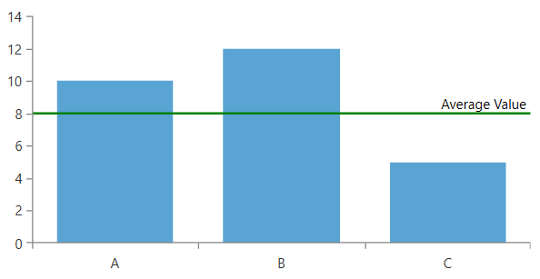
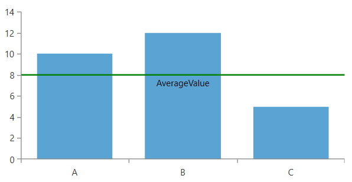
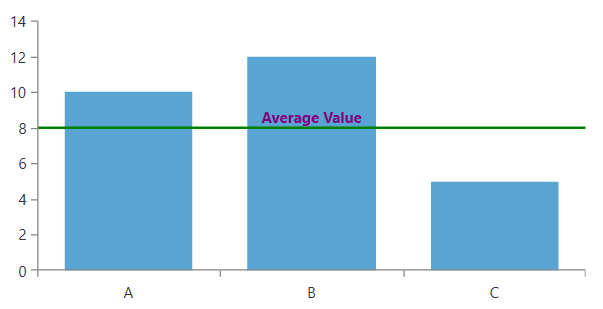

# Annotation Labels

The CartesianStrokedAnnotation class provides infrastructure for annotation labels.

>  Only the annotations deriving from CartesianStrokedAnnotation ( [CartesianGridLine]() and [CartesianPlotBand]() ) have out-of-the-box support for this feature.

## Setting a Label

To show the annotation's label, set its __Label__ property.

#### __[XAML] Example 1: Setting annotation label__
{{region radchartview-annotations-labels-0}}
	<telerik:RadCartesianChart>          
		<telerik:RadCartesianChart.VerticalAxis>
			<telerik:LinearAxis x:Name="verticalAxis"/>
		</telerik:RadCartesianChart.VerticalAxis>
		<telerik:RadCartesianChart.HorizontalAxis>
			<telerik:CategoricalAxis/>
		</telerik:RadCartesianChart.HorizontalAxis>
		<telerik:RadCartesianChart.Series>
			<telerik:BarSeries>
				<telerik:BarSeries.DataPoints>
					<telerik:CategoricalDataPoint Category="A" Value="10"/>
					<telerik:CategoricalDataPoint Category="B" Value="12"/>
					<telerik:CategoricalDataPoint Category="C" Value="5"/>
				</telerik:BarSeries.DataPoints>                
			</telerik:BarSeries>
		</telerik:RadCartesianChart.Series>
		<telerik:RadCartesianChart.Annotations>
			<telerik:CartesianGridLineAnnotation Axis="{Binding ElementName=verticalAxis}" Value="8" Stroke="Green" StrokeThickness="2"
												 Label="Average Value" />
		</telerik:RadCartesianChart.Annotations>
	</telerik:RadCartesianChart>
{{endregion}}

#### Figure 1: Annotation Label

## Using Label Definition

The chart annotation labels are adjusted using the __LabelDefinition__ property. The property accepts a value of type __ChartAnnotationLabelDefinition__ that allows you to style and position the label.

#### __[XAML] Example 2: Setting LabelDefinition__
{{region radchartview-annotations-labels-1}}
	<telerik:RadCartesianChart>          
		<telerik:RadCartesianChart.VerticalAxis>
			<telerik:LinearAxis x:Name="verticalAxis"/>
		</telerik:RadCartesianChart.VerticalAxis>
		<telerik:RadCartesianChart.HorizontalAxis>
			<telerik:CategoricalAxis/>
		</telerik:RadCartesianChart.HorizontalAxis>
		<telerik:RadCartesianChart.Series>
			<telerik:BarSeries>
				<telerik:BarSeries.DataPoints>
					<telerik:CategoricalDataPoint Category="A" Value="10"/>
					<telerik:CategoricalDataPoint Category="B" Value="12"/>
					<telerik:CategoricalDataPoint Category="C" Value="5"/>
				</telerik:BarSeries.DataPoints>                
			</telerik:BarSeries>
		</telerik:RadCartesianChart.Series>
		<telerik:RadCartesianChart.Annotations>
			<telerik:CartesianGridLineAnnotation Axis="{Binding ElementName=verticalAxis}" 
												 Value="8"
												 Stroke="Green" 
												 StrokeThickness="2"
												 Label="AverageValue">                    
				<telerik:CartesianGridLineAnnotation.LabelDefinition>
					<telerik:ChartAnnotationLabelDefinition Location="Inside" HorizontalAlignment="Center"/>
				</telerik:CartesianGridLineAnnotation.LabelDefinition>
			</telerik:CartesianGridLineAnnotation>
		</telerik:RadCartesianChart.Annotations>
	</telerik:RadCartesianChart>
{{endregion}}

#### Figure 2: Centered Label

## Label Positioning

Annotations provide a mechanism for label positioning that consists of three layers - primary (via the __Location__ property), secondary (via the __HorizontalAlignment/VerticalAlignment__ property), and tertiary (via the __HorizontalOffset/ VerticalOffset__ property).

* __Location__ property: It defines the primary location of the annotation label visual. It allows you to position the label in 5 different positions, as illustrated below.
	
	#### Figure 3: Locations relative to the annotation's visual
	
	
* __Horizontal / Vertical Alignment__ property: In conjunction with Location property, you can use the __HorizontalAlignment__ and __VerticalAlignment__ properties to further specify the position of the label. Refer to the table below for possible combinations of these properties:
	
	#### Figure 4: Possible alignment-location combinations
	

* __Horizontal / Vertical Offset__ property: Besides the Location, HorizontalAlignment and Vertical Alignment, you can use the __HorizontalOffset__ and __VerticalOffset__ properties to specify an offset in pixels. This offset is applied after the aforementioned properties.

#### __[XAML] Example 3: Custom positioned label__
{{region radchartview-annotations-labels-2}}
	<telerik:RadCartesianChart>          
		<telerik:RadCartesianChart.VerticalAxis>
			<telerik:LinearAxis x:Name="verticalAxis"/>
		</telerik:RadCartesianChart.VerticalAxis>
		<telerik:RadCartesianChart.HorizontalAxis>
			<telerik:CategoricalAxis/>
		</telerik:RadCartesianChart.HorizontalAxis>
		<telerik:RadCartesianChart.Series>
			<telerik:BarSeries>
				<telerik:BarSeries.DataPoints>
					<telerik:CategoricalDataPoint Category="A" Value="10"/>
					<telerik:CategoricalDataPoint Category="B" Value="12"/>
					<telerik:CategoricalDataPoint Category="C" Value="5"/>
				</telerik:BarSeries.DataPoints>                
			</telerik:BarSeries>
		</telerik:RadCartesianChart.Series>
		<telerik:RadCartesianChart.Annotations>
			<telerik:CartesianGridLineAnnotation Axis="{Binding ElementName=verticalAxis}" 
												 Value="8"
												 Stroke="Green" 
												 StrokeThickness="2"
												 Label="AverageValue">                    
				<telerik:CartesianGridLineAnnotation.LabelDefinition>
					<telerik:ChartAnnotationLabelDefinition Location="Top"
															HorizontalAlignment="Center" 
															VerticalOffset="-30"
															HorizontalOffset="100"/>
				</telerik:CartesianGridLineAnnotation.LabelDefinition>
			</telerik:CartesianGridLineAnnotation>
		</telerik:RadCartesianChart.Annotations>
	</telerik:RadCartesianChart>
{{endregion}}

#### Figure 5: Custom positioned label

## Default Visual Style

The default visual element of the label is a native TextBlock. To customize it you can use the __DefaultVisualStyle__ property of the ChartAnnotationLabelDefinition.

#### __[XAML] Example 4: Setting DefaultVisualStyle__
{{region radchartview-annotations-labels-3}}
	<telerik:RadCartesianChart>          
		<telerik:RadCartesianChart.VerticalAxis>
			<telerik:LinearAxis x:Name="verticalAxis"/>
		</telerik:RadCartesianChart.VerticalAxis>
		<telerik:RadCartesianChart.HorizontalAxis>
			<telerik:CategoricalAxis/>
		</telerik:RadCartesianChart.HorizontalAxis>
		<telerik:RadCartesianChart.Series>
			<telerik:BarSeries>
				<telerik:BarSeries.DataPoints>
					<telerik:CategoricalDataPoint Category="A" Value="10"/>
					<telerik:CategoricalDataPoint Category="B" Value="12"/>
					<telerik:CategoricalDataPoint Category="C" Value="5"/>
				</telerik:BarSeries.DataPoints>                
			</telerik:BarSeries>
		</telerik:RadCartesianChart.Series>
		<telerik:RadCartesianChart.Annotations>
			<telerik:CartesianGridLineAnnotation Axis="{Binding ElementName=verticalAxis}" 
												 Value="8"
												 Stroke="Green" 
												 StrokeThickness="2"
												 Label="Average Value">                    
				<telerik:CartesianGridLineAnnotation.LabelDefinition>
					<telerik:ChartAnnotationLabelDefinition Location="Top" HorizontalAlignment="Center">
						<telerik:ChartAnnotationLabelDefinition.DefaultVisualStyle>
							
						</telerik:ChartAnnotationLabelDefinition.DefaultVisualStyle>
					</telerik:ChartAnnotationLabelDefinition>
				</telerik:CartesianGridLineAnnotation.LabelDefinition>
			</telerik:CartesianGridLineAnnotation>
		</telerik:RadCartesianChart.Annotations>
	</telerik:RadCartesianChart>
{{endregion}}

#### Figure 6: Customized Label Style

## Defining a Custom Label Template

To replace the default label visual element with an entirely custom UI you can use the __Template__ property of the ChartAnnotationLabelDefinition.

#### __[XAML] Example 5: Setting custom label template__
{{region radchartview-annotations-labels-4}}
	<telerik:RadCartesianChart>          
		 <telerik:RadCartesianChart.VerticalAxis>
                <telerik:LinearAxis x:Name="verticalAxis"/>
            </telerik:RadCartesianChart.VerticalAxis>
            <telerik:RadCartesianChart.HorizontalAxis>
                <telerik:CategoricalAxis/>
            </telerik:RadCartesianChart.HorizontalAxis>
            <telerik:RadCartesianChart.Series>
                <telerik:BarSeries>
                    <telerik:BarSeries.DataPoints>
                        <telerik:CategoricalDataPoint Category="A" Value="10"/>
                        <telerik:CategoricalDataPoint Category="B" Value="12"/>
                        <telerik:CategoricalDataPoint Category="C" Value="5"/>
                    </telerik:BarSeries.DataPoints>                
                </telerik:BarSeries>
            </telerik:RadCartesianChart.Series>
            <telerik:RadCartesianChart.Annotations>
                <telerik:CartesianGridLineAnnotation Axis="{Binding ElementName=verticalAxis}" 
                                                     Value="8"
                                                     Stroke="Green" 
                                                     StrokeThickness="2"
                                                     Label="Average Value">
                    <telerik:CartesianGridLineAnnotation.LabelDefinition>
                        <telerik:ChartAnnotationLabelDefinition Location="Top" HorizontalOffset="5">
                            <telerik:ChartAnnotationLabelDefinition.Template>
                                <DataTemplate>
                                    <StackPanel Orientation="Horizontal">
                                        <Rectangle Fill="#FFA03B" Width="10" Height="10" />
                                        <TextBlock Text="{Binding}" Margin="5 0 0 0" FontStyle="Italic"/>
                                    </StackPanel>
                                </DataTemplate>
                            </telerik:ChartAnnotationLabelDefinition.Template>
                        </telerik:ChartAnnotationLabelDefinition>
                    </telerik:CartesianGridLineAnnotation.LabelDefinition>
                </telerik:CartesianGridLineAnnotation>
            </telerik:RadCartesianChart.Annotations>
		</telerik:RadCartesianChart.Annotations>
	</telerik:RadCartesianChart>
{{endregion}}

#### Figure 7: Customized Label Template

## See Also
* [Getting Started]()
* [Annotations Provider]()
* [Series Labels]()

