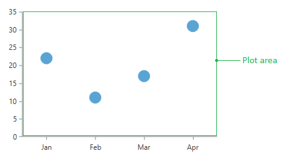

# Plot Area

The chart's plot area is the zone where all data points are drawn (see Figure 1). The API of the chart allows you to get information about the area or apply a custom style for the visual element that represents it.

#### __Figure 1: Chart's plot area__

The chart's axes are not included in the plot area.

## Get Plot Area Boundaries

You can get information about the plot area's boundaries via the __PlotAreaClip__ property of the chart. The property is of type __RadRect__ which contains the position and size of the plot area. The chart fires the [PlotAreaClipChanged](#chart-controls-events) event when the boundaries change.

> The provided information doesn't include the currently applied zoom factor.

## Clip to Plot Area

By default the elements presented by the chart (series and annotations) are clipped into the plot area. Anything that leaves the boundaries won't be rendered. To alter this you can use the __ClipToPlotArea__ property that is exposed by the elements. Its __default value__ is __True__.

#### __[XAML] Example 1: Setting ClipToPlotArea of a chart series__
{{region xaml-radchartview-features-plot-area-0}}
	 <telerik:PointSeries ClipToPlotArea="False" />
{{endregion}}

#### __Figure 2: ClipToPlotArea example__

## Customize the plot area visual

You can customize the plot area visual via the __PlotAreaStyle__ property of the chart. It is of type __Style__ and the expected __TargetType__ is __Border__ - the area's visual element.

#### __[XAML] Example 2: Setting PlotAreaStyle__
{{region xaml-radchartview-features-plot-area-1}}
	<telerik:RadCartesianChart.PlotAreaStyle>
		
	</telerik:RadCartesianChart.PlotAreaStyle>
{{endregion}}

#### __Figure 3: PlotAreaStyle example__

## Controlling the stack order of the elements

The stack order of the elements in the chart is determined by their positions in the items collection that holds them. You can additionally control which element is displayed on top by setting the elements' **ZIndex** property. RadChartView elements which have this property are [Series](), [Annotations]() and [Axes]().

#### __[XAML] Example 3: Setting the ZIndex property__
{{region xaml-radchartview-features-plot-area-2}}
	<telerik:RadCartesianChart x:Name="chart" Palette="Windows8">
            <telerik:RadCartesianChart.HorizontalAxis>
                <telerik:CategoricalAxis/>
            </telerik:RadCartesianChart.HorizontalAxis>

            <telerik:RadCartesianChart.VerticalAxis >
                <telerik:LinearAxis />
            </telerik:RadCartesianChart.VerticalAxis>

            <telerik:RadCartesianChart.Series>
                <telerik:LineSeries ZIndex="100">
                    <telerik:LineSeries.DataPoints >
                        <telerik:CategoricalDataPoint Category="January" Value="1" />
                        <telerik:CategoricalDataPoint Category="February" Value="5" />
                    </telerik:LineSeries.DataPoints>
                </telerik:LineSeries>

                <telerik:BarSeries>
                    <telerik:BarSeries.DataPoints>
                        <telerik:CategoricalDataPoint Category="January" Value="3" />
                        <telerik:CategoricalDataPoint Category="February" Value="5" />
                    </telerik:BarSeries.DataPoints>
                </telerik:BarSeries>
            </telerik:RadCartesianChart.Series>
        </telerik:RadCartesianChart>
{{endregion}}

#### __Figure 4: ZIndex example__

 
## See Also  
* [Getting Started]()
* [Create Data-Bound Chart]()
* [Events]()
