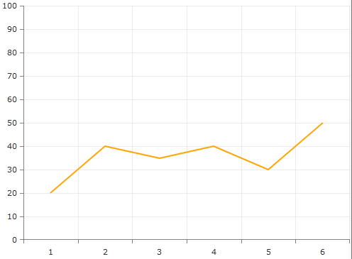

# CartesianChartGrid and PolarChartGrid

## 

In order to improve the readiness of the chart you may want to add a grid-like visuals which support horizontal and vertical lines, associated with axis ticks and horizontal and vertical stripes for better readability. Depending on the chart that you use (RadCartesianChart or RadPolarChart) there are two types CartesianChartGrid and PolarChartGrid that you can play with to add a decoration over the plot area.

* [CartesianChartGrid](#CartesianChartGrid)

* [PolarChartGrid](#PolarChartGrid)CartesianChartGrid__CartesianChartGrid__ supports __MajorLinesVisibility__ and __StripLinesVisibility__ properties.
      Both properties can be set to XY, X , Y or None (the default one). For example the following code snippet demonstrates how the line chart will look like with its MajorLinesVisibility set to XY:
      

#### __XAML__

{{region radchart-cartesianchartgrid-and-polarchartgrid_0}}
	  <telerik:RadCartesianChart.Grid>
	    <telerik:CartesianChartGrid MajorLinesVisibility="XY" />
	  </telerik:RadCartesianChart.Grid>
	{{endregion}}

>For the sake of shortness and simplicity this article won't show you how to create chart series and populate them with data. You may find this information in RadChartView's *Populating With Data* and *Series* sections.

To enable striplines you should set some brushes. There is no limitation for the number or type of brushes you may use. The plot area will be colored alternatively with the colors you have set.
      

#### __XAML__

{{region radchart-cartesianchartgrid-and-polarchartgrid_1}}
	  <telerik:CartesianChartGrid MajorLinesVisibility="XY" StripLinesVisibility="XY" IsTabStop="False">
	    <telerik:CartesianChartGrid.YStripeBrushes>
	    <SolidColorBrush Color="#FFD7D7D7" Opacity="0.3" />
	    <SolidColorBrush Color="Transparent" />
	    </telerik:CartesianChartGrid.YStripeBrushes>
	    <telerik:CartesianChartGrid.XStripeBrushes>
	    <SolidColorBrush Color="#FFD7D7D7" Opacity="0.3" />
	    <SolidColorBrush Color="Transparent" />
	    </telerik:CartesianChartGrid.XStripeBrushes>
	  </telerik:CartesianChartGrid>
	{{endregion}}

PolarChartGrid

__PolarChartGrid__ supports __GridLineVisibility__ and __StripesVisibility.__
                Both properties can be set to Radial and/or Polar axis and to None of them.
                The GridLines have default color and you may see them by simply choose one of the GridLineVisibility values.
                Stripes on the other side need color to be displayed i.e. you should set some brushes.
                Similar to the Striplines of RadCartesianGrid, there is no limitation for the number or type of brushes you may use. Here's an example:
              

#### __XAML__

{{region radchart-cartesianchartgrid-and-polarchartgrid_2}}
	<telerik:RadPolarChart>
	    <telerik:RadPolarChart.Grid>
	        <telerik:PolarChartGrid GridLineVisibility="Both" StripesVisibility="Radial">
	            <telerik:PolarChartGrid.RadialStripeBrushes>
	                <SolidColorBrush Color="#FFD7D7D7" Opacity="0.3" />
	                <SolidColorBrush Color="Transparent" />
	            </telerik:PolarChartGrid.RadialStripeBrushes>
	        </telerik:PolarChartGrid>
	    </telerik:RadPolarChart.Grid>
	    <telerik:RadPolarChart.RadialAxis>
	        <telerik:CategoricalRadialAxis />
	    </telerik:RadPolarChart.RadialAxis>
	    <telerik:RadPolarChart.PolarAxis>
	        <telerik:PolarAxis Minimum="0" Maximum="5" />
	    </telerik:RadPolarChart.PolarAxis>
	    <telerik:RadarLineSeries Stroke="#EB7A2A">
	        <telerik:RadarLineSeries.DataPoints>
	            <telerik:CategoricalDataPoint Category="Price" Value="3.2" />
	            <telerik:CategoricalDataPoint Category="Accommodation" Value="3.6" />
	            <telerik:CategoricalDataPoint Category="Cleanness" Value="3.8" />
	            <telerik:CategoricalDataPoint Category="Bar / Cafe" Value="4.5" />
	            <telerik:CategoricalDataPoint Category="Restaurant" Value="3.5" />
	            <telerik:CategoricalDataPoint Category="Spa center" Value="3.6" />
	            <telerik:CategoricalDataPoint Category="Kids facilities" Value="3.0" />
	            <telerik:CategoricalDataPoint Category="Overall" Value="3.3" />
	        </telerik:RadarLineSeries.DataPoints>
	        <telerik:RadarLineSeries.PointTemplate>
	            <DataTemplate>
	                <Ellipse Fill="#EB7A2A" Height="7" Width="7" />
	            </DataTemplate>
	        </telerik:RadarLineSeries.PointTemplate>
	    </telerik:RadarLineSeries>
	    <telerik:RadarLineSeries Stroke="#9CD60F">
	        <telerik:RadarLineSeries.DataPoints>
	            <telerik:CategoricalDataPoint Category="Price" Value="3.8" />
	            <telerik:CategoricalDataPoint Category="Accommodation" Value="4.5" />
	            <telerik:CategoricalDataPoint Category="Cleanness" Value="4.3" />
	            <telerik:CategoricalDataPoint Category="Bar / Cafe" Value="3.8" />
	            <telerik:CategoricalDataPoint Category="Restaurant" Value="4.6" />
	            <telerik:CategoricalDataPoint Category="Spa center" Value="3.9" />
	            <telerik:CategoricalDataPoint Category="Kids facilities" Value="3.8" />
	            <telerik:CategoricalDataPoint Category="Overall" Value="4.1" />
	        </telerik:RadarLineSeries.DataPoints>
	        <telerik:RadarLineSeries.PointTemplate>
	            <DataTemplate>
	                <Ellipse Fill="#9CD60F" Height="7" Width="7" />
	            </DataTemplate>
	        </telerik:RadarLineSeries.PointTemplate>
	    </telerik:RadarLineSeries>
	</telerik:RadPolarChart>
	{{endregion}}

