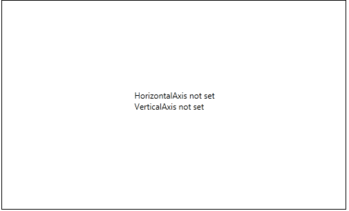
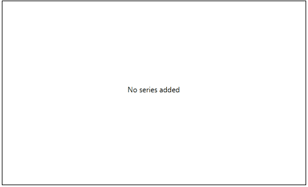

# Introduction

## 

Telerik __RadChartView__ is essentially a tool set of charting components designed to help you create a variety of rich data-visualization applications. It provides 3 different chart types:

1. __RadCartesianChart__

1. __RadPieChart__

1. __RadPolarChart__

Each of these charting components is designed to best fit specific use cases.
        

The task of this help article is to guide you on your way of creating a chart from scratch using the __RadChartView__ components. The first thing you need to do is to add a reference to the needed assemblies
        

>In order to use __RadChartView__ in your projects you have to add references to the following assemblies:
            

* __Telerik.Windows.Controls__

* __Telerik.Windows.Controls.Chart__

* __Telerik.Windows.DataVisualization__ You can find more info [here](http://www.telerik.com/help/silverlight/installation-installing-controls-dependencies.html).

>In order to use __RadChartView__ in your projects you have to add references to the following assemblies: * __Telerik.Windows.Controls__ * __Telerik.Windows.Controls.Chart__ * __Telerik.Windows.DataVisualization__ You can find more info [here](http://www.telerik.com/help/wpf/installation-installing-controls-dependencies-wpf.html).

The next step is to add Telerik’s namespace in XAML:
        

#### __XAML__

{{region radchart-introduction_0}}
	        xmlns:telerik=http://schemas.telerik.com/2008/xaml/presentation
	{{endregion}}

Once this is done, you need to decide which of the available charting components fits your needs. For demonstration purposes we will use the __RadCartesianChart__ component. It uses Cartesian coordinate system to display different series and it is the most commonly used charting component. You can define it like this:
        

#### __XAML__

{{region radchart-introduction_1}}
	        <telerik:RadCartesianChart></telerik:RadCartesianChart>
	{{endregion}}

If you run the project at this stage the __RadCartesianChart__ will inform you that there are no axes defined. The result will look like this:
        

The Cartesian coordinate system should be constructed by horizontal and vertical axes. Telerik __ChartView__ exposes different types of both horizontal and vertical axes that can be used in different scenarios. You can find more information about them in our Axes Overview article.
        

For demonstration purposes, in this tutorial we will use a linear axis for the vertical and a categorical axis for the horizontal direction. You can define them like this:
        

#### __XAML__

{{region radchart-introduction_2}}
	        <telerik:RadCartesianChart>
	            <telerik:RadCartesianChart.HorizontalAxis>
	                <telerik:CategoricalAxis />
	            </telerik:RadCartesianChart.HorizontalAxis>
	            <telerik:RadCartesianChart.VerticalAxis>
	                <telerik:LinearAxis/>
	            </telerik:RadCartesianChart.VerticalAxis>
	        </telerik:RadCartesianChart>
	{{endregion}}

In the cases where no series are defined in the definition of the charting components, a note will be displayed to prompt you to enter series:
        

__RadChartView__ exposes large variety of series that can be used in different scenarios. Please take a look at our Series Overview article to find out more about the available types.
        

To complete the task of this tutorial, you need to define series with data points that will be rendered inside the charting component. You can do this by declaratively populating the __Series__ collection of the __RadCartesianChart__ control in XAML.
        

#### __XAML__

{{region radchart-introduction_3}}
	        <telerik:RadCartesianChart.Series>
	            <telerik:BarSeries>
	                <telerik:BarSeries.DataPoints>
	                    <telerik:CategoricalDataPoint Category="Apples" Value="20"/>
	                    <telerik:CategoricalDataPoint Category="Bananas" Value="28"/>
	                    <telerik:CategoricalDataPoint Category="Oranges" Value="17"/>
	                    <telerik:CategoricalDataPoint Category="Strawberries" Value="30"/>
	                </telerik:BarSeries.DataPoints>
	            </telerik:BarSeries>
	        </telerik:RadCartesianChart.Series>
	{{endregion}}

This chart definition will be rendered on the screen as follows:
        

If you feel more confident working with code than working with markup, you can achieve the same layout with the following snippet:
        

#### __C#__

{{region radchart-introduction_4}}
					RadCartesianChart chart = new RadCartesianChart();
					CategoricalAxis catAxis = new CategoricalAxis();
					LinearAxis lineAxis = new LinearAxis();
					chart.HorizontalAxis = catAxis;
					chart.VerticalAxis = lineAxis;
	
					BarSeries barSeries = new BarSeries();
					barSeries.DataPoints.Add(new CategoricalDataPoint() { Category = "Apples", Value = 20 });
					barSeries.DataPoints.Add(new CategoricalDataPoint() { Category = "Bananas", Value = 28 });
					barSeries.DataPoints.Add(new CategoricalDataPoint() { Category = "Oranges", Value = 17 });
					barSeries.DataPoints.Add(new CategoricalDataPoint() { Category = "Strawberries", Value = 30 });
					chart.Series.Add(barSeries);
	
					this.LayoutRoot.Children.Add(chart);
	{{endregion}}

#### __VB.NET__

{{region radchart-introduction_4vb}}
	    Dim chart As New RadCartesianChart()
	    Dim catAxis As New CategoricalAxis()
	    Dim lineAxis As New LinearAxis()
	    chart.HorizontalAxis = catAxis
	    chart.VerticalAxis = lineAxis
	
	    Dim barSeries As New BarSeries()
	    barSeries.DataPoints.Add(New CategoricalDataPoint() With { Key .Category = "Apples", Key .Value = 20 })
	    barSeries.DataPoints.Add(New CategoricalDataPoint() With { Key .Category = "Bananas", Key .Value = 28 })
	    barSeries.DataPoints.Add(New CategoricalDataPoint() With { Key .Category = "Oranges", Key .Value = 17 })
	    barSeries.DataPoints.Add(New CategoricalDataPoint() With { Key .Category = "Strawberries", Key .Value = 30 })
	    chart.Series.Add(barSeries)
	
	    Me.LayoutRoot.Children.Add(chart)
	{{endregion}}

In order to produce the same result you need to add using statements for the required Telerik assemblies:
        

#### __C#__

{{region radchart-introduction_5}}
		using Telerik.Charting;
		using Telerik.Windows.Controls;
		using Telerik.Windows.Controls.ChartView;
	{{endregion}}

#### __VB.NET__

{{region radchart-introduction_5vb}}
	    Imports Telerik.Charting
	    Imports Telerik.Windows.Controls
	    Imports Telerik.Windows.Controls.ChartView
	{{endregion}}

Although you can easily declaratively populate the __RadCartesianChart Series__, in most real-life applications, you would rather populate the Series with business data. This is why all Series types expose an __ItemsSource__ property. You can easily bind that property to a business collection of items. And if you use a data collection that implements the __INotifyCollectionChanged__ interface, then any changes implemented within the business data will be immediately reflected in the appropriate __RadChartView__ components and vice versa. You can find more information in our Populating with Data section of the documentation.
        
