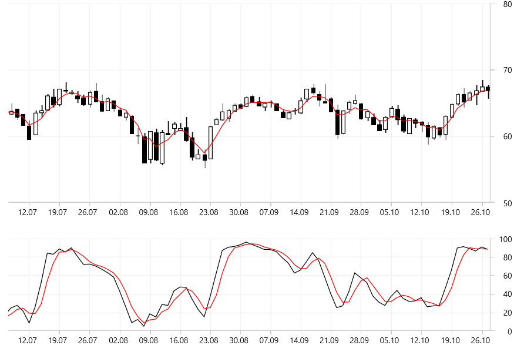

# Indicators Overview

RadChartView provides a rich set of __financial indicators__ which can be used to display a certain overlay on the data. The indicators are used to measure and visualize summarised information or a trend based on the provided data.

> The financial indicators are applicable only in the context of __RadCartesianChart__.

#### __Figure 1: __

## Setting Up an Indicator

The indicator itself is a [chart series]() but with some additional sampling applied over the data before it gets plotted on the chart. The indicators are added in the __Indicators__ collection of RadCartesianChart.

#### __[XAML] Example 1: Defining MovingAverageIndicator__
{{region radchartview-indicators-overview-0}}
	
{{endregion}}

The indicator is populate using the same approach as shown in the [Data Bind to Data-Object]() article. You can set the corresponding value binding properties - for example, ValueBinding, CategoryBinding, OpenBinding, CloseBinding, etc. Additionally, you might need to apply different options based on the concrete indicator's implementation. 

## List of Indicators 

This section provides a full list with the chart's indicators.

* [AverageTrueRangeIndicator](#averagetruerangeindicator)

* AdaptiveMovingAverageKaufmanIndicator
* BollingerBandsIndicator
* CommodityChannelIndexIndicator
* ExponentialMovingAverageIndicator 
* MacdhIndicator
* MacdIndicator
* ModifiedExponentialMovingAverageIndicator
* ModifiedMovingAverageIndicator
* MomentumIndicator
* MovingAverageIndicator
* OscillatorIndicator
* RateOfChangeIndicator
* RaviIndicator
* RelativeMomentumIndexIndicator
* RelativeStrengthIndexIndicator
* StochasticFastIndicator
* StochasticSlowIndicator
* TrixIndicator
* TrueRangeIndicator
* UltimateOscillatorIndicator
* WeightedMovingAverageIndicator

## See Also
* [Getting Started]()
* [ChartSelectionBehaviors]()
* [AnnotationsProvider]()
* [Dynamic Number Of Series]()
