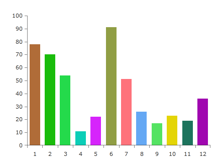
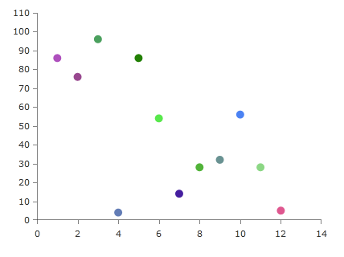
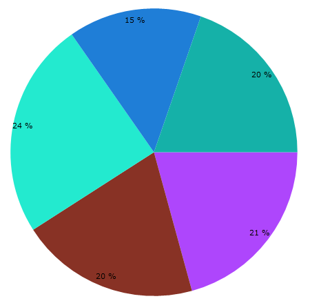

# Binding the Color of Series Items

In this topic we will demonstrate how to create charts, where each individual item, has its color bound to a property of the underlying DataObject.
      

The following chart series will be used for this article:
      

* [Bar Series](#Bar_Series)

* [Scatter Point Series](#ScatterPoint_Series)

* [Pie Series](#Pie_Series)

## 
        Bar Series
      

Here is our sample Bar Chart XAML declaration:
        

#### __XAML__

{{region radchartview-populating-with-data-binding-the-color-of-series-items_0}}
	<telerik:RadCartesianChart x:Name="chart" Width="400" Height="300">
	    <telerik:RadCartesianChart.VerticalAxis>
	        <telerik:LinearAxis/>
	    </telerik:RadCartesianChart.VerticalAxis>
	    <telerik:RadCartesianChart.HorizontalAxis>
	        <telerik:CategoricalAxis/>
	    </telerik:RadCartesianChart.HorizontalAxis>
	    <telerik:RadCartesianChart.Series>
	        <telerik:BarSeries CategoryBinding="Category" ValueBinding="Value" ItemsSource="{Binding}">            
	        </telerik:BarSeries>
	    </telerik:RadCartesianChart.Series>
	</telerik:RadCartesianChart>	
	{{endregion}}

And here is our example data object:
        

#### __C#__

{{region radchartview-populating-with-data-binding-the-color-of-series-items_0}}
	public class ChartData : INotifyPropertyChanged
	{
	    private int _category;
	    public int Category
	    {
	        get { return this._category; }
	        set { this._category = value; this.OnPropertyChanged("Category"); }
	    }
	
	    private double _value;
	    public double Value
	    {
	        get { return this._value; }
	        set { this._value = value; this.OnPropertyChanged("Value"); }
	    }
	
	    private Brush _color;
	    public Brush Color
	    {
	        get { return this._color; }
	        set { this._color = value; this.OnPropertyChanged("Color"); }
	    }
	
	    public event PropertyChangedEventHandler PropertyChanged;
	    private void OnPropertyChanged(string propertyName)
	    {
	        if (this.PropertyChanged != null)
	        {
	            this.PropertyChanged(this, new PropertyChangedEventArgs(propertyName));
	        }
	    }
	}
	{{endregion}}

#### __VB.NET__

{{region radchartview-populating-with-data-binding-the-color-of-series-items_0}}
	Public Class ChartData
		Implements INotifyPropertyChanged
		Private _category As String
		Public Property Category() As String
			Get
				Return Me._category
			End Get
			Set
				Me._category = value
				Me.OnPropertyChanged("Category")
			End Set
		End Property
	
		Private _value As Double
		Public Property Value() As Double
			Get
				Return Me._value
			End Get
			Set
				Me._value = value
				Me.OnPropertyChanged("Value")
			End Set
		End Property
	
		Private _color As Brush
		Public Property Color() As Brush
			Get
				Return Me._color
			End Get
			Set
				Me._color = value
				Me.OnPropertyChanged("Color")
			End Set
		End Property
	
		Public Event PropertyChanged As PropertyChangedEventHandler
		Private Sub OnPropertyChanged(propertyName As String)
			RaiseEvent PropertyChanged(Me, New PropertyChangedEventArgs(propertyName))
		End Sub
	End Class
	{{endregion}}

In order to create a binding between the bar series items and a property of the ItemSource items we have to create a PointTemplate.
          In this point template we need to create a binding between the Fill of the Bar and the fore mentioned property, which in our
          case is named Color. This is done like this:
        

#### __XAML__

{{region radchartview-populating-with-data-binding-the-color-of-series-items_1}}
	<telerik:BarSeries CategoryBinding="Category" ValueBinding="Value" ItemsSource="{Binding}">
	    <telerik:BarSeries.PointTemplate>
	        <DataTemplate>
	            <Rectangle Fill="{Binding DataItem.Color}"/>
	        </DataTemplate>
	    </telerik:BarSeries.PointTemplate>
	</telerik:BarSeries>
	{{endregion}}

Let's create some data so we can test the result:
        

#### __C#__

{{region radchartview-populating-with-data-binding-the-color-of-series-items_1}}
	public MainWindow()
	{
		InitializeComponent();
		DataContext = GetData(12);
	}
	
	public static List<ChartData> GetData(int dataSize)
	{
	    Random rnd = new Random();
	    var result = new List<ChartData>();
	         
	    for (int i = 0; i < dataSize; i++)
	    {
	        result.Add(new ChartData()
	        {
	            Category = i,
	            Value = rnd.Next(1, 100),
	            Color = new SolidColorBrush(
	                Color.FromArgb(255, (byte)rnd.Next(0, 256), (byte)rnd.Next(0, 256), (byte)rnd.Next(0, 256)))
	        });
	    }
	
	    return result;
	}
	{{endregion}}

#### __VB.NET__

{{region radchartview-populating-with-data-binding-the-color-of-series-items_1}}
	Public Sub New()
		InitializeComponent()
		DataContext = GetData(12)
	End Sub
	
	Public Shared Function GetData(dataSize As Integer) As List(Of ChartData)
		Dim rnd As New Random()
		Dim result = New List(Of ChartData)()
	
		For i As Integer = 0 To dataSize - 1
			result.Add(New ChartData() With { _
				.Category = i, _
				.Value = rnd.[Next](1, 100), _
				.Color = New SolidColorBrush(Color.FromArgb(255, CByte(rnd.[Next](0, 256)), CByte(rnd.[Next](0, 256)), CByte(rnd.[Next](0, 256)))) _
			})
		Next
	
		Return result
	End Function
	{{endregion}}

And here is the final result:
        

## 
        Scatter Point Series
      

The only difference between color binding the series items of Bar series and Scatter Point series is the PointTemplate.
        

In the case Scatter Point series we will use an ellipse:
        

#### __XAML__

{{region radchartview-populating-with-data-binding-the-color-of-series-items_2}}
	<telerik:ScatterPointSeries XValueBinding="Category" YValueBinding="Value" ItemsSource="{Binding}">
	    <telerik:ScatterPointSeries.PointTemplate>
	        <DataTemplate>
	            <Ellipse Width="10" Height="10" Fill="{Binding DataItem.Color}"/>
	        </DataTemplate>
	    </telerik:ScatterPointSeries.PointTemplate>
	</telerik:ScatterPointSeries>
	{{endregion}}

The result:
        

## 
        Pie Series
      

The approach with Pie Series is slighly different because you have to create a Style that targets the Path
          of which the different pie slices are made.
        

#### __XAML__

{{region radchartview-populating-with-data-binding-the-color-of-series-items_3}}
	<Style x:Key="PieSliceStyle" TargetType="Path">
	    <Setter Property="Fill" Value="{Binding DataItem.Brush}" />
	</Style
	{{endregion}}

In order to apply the Style you can use the __DefaultSliceStyle__ property of the series.
        

#### __XAML__

{{region radchartview-populating-with-data-binding-the-color-of-series-items_4}}
	<telerik:RadPieChart x:Name="chart">
	    <telerik:PieSeries DefaultSliceStyle="{StaticResource PieSliceStyle}" 
	                        ValueBinding="Value"
	                        ItemsSource="{Binding}"/>
	</telerik:RadPieChart>
	{{endregion}}

The result:
        

# See Also

 * [Create Data-Bound Chart]()
