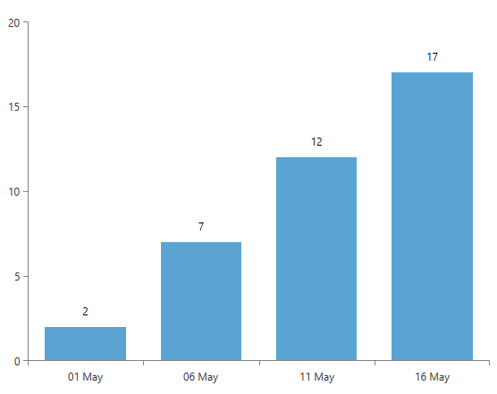

# ChartDataSource

__Binding with the external ChartDataSource control__

## 

Aside from binding to a collection of business objects as shown in the [Create Data-Bound Chart topic]() the __RadChartView__ component supports a more complex way of binding which allows you to combine the datapoints (known as sampling) before plotting them. When the chart is populated with thousands of items, the visual representation might not be that clear. It is possible that there are two or more DataPoints shown with very close Y and X values. This is when sampling comes in handy.
			  

You can either have an index-based or DateTime sampling.
                

__Index-based Sampling__

The sampling engine does not detect/determine whether the datapoints will be on similar pixel coordinates. Instead, it visualizes a subset of the original data. Determining the number of DataPoints to be displayed is done by setting the __SamplingThreshold__ property of the ChartDataSource. For example, if you have 1000 points, 95% of which are clustered together, and you choose a sampling threshold of 300 points, 95% of these 300 points will be clustered as well.
                

#### __XAML__

{{region radchart-chartdatasource_0}}
	<telerik:ChartDataSource x:Name="ChartDataSource1" ItemsSource="{Binding Data}" SamplingThreshold="300"/>
	{{endregion}}

__DateTime sampling__

There are special scenarios where you have a DateTime axes with many datapoints. The ChartDataSource exposes two properties to combine the datapoints for such cases: __SamplingUnit__ and __SamplingUnitInterval (its default value is 1 and your intervals should be greater than 1).__ The SamplingUnit property is an enumeration, which you may choose from, to specify whether you would like your data to be combined by Day, Hour, Minute, Month, NONE (the default one), Quarter, Second, Week, Year. The SamplingInterval property as its name implies, allows you to provide an interval for the chosen SamplingUnit. You may find an example below, demonstrating both properties in action:
                

We'll create BarSeries with DateTimeCategorical Horizontal Axis, bound via the ChartDataSource control:

#### __XAML__

{{region radchart-chartdatasource_1}}
	<telerik:ChartDataSource x:Name="ChartDataSource1"
								ItemsSource="{Binding Data}"
								SamplingUnit="Day" 
								SamplingUnitInterval="5"/>
	
	<telerik:RadCartesianChart x:Name="RadChart1">
		<telerik:RadCartesianChart.HorizontalAxis>
			<telerik:DateTimeCategoricalAxis LabelFormat="dd/MMM"
												DateTimeComponent="Ticks"/>
		</telerik:RadCartesianChart.HorizontalAxis>
		<telerik:RadCartesianChart.VerticalAxis>
			<telerik:LinearAxis/>
		</telerik:RadCartesianChart.VerticalAxis>
		<telerik:BarSeries ShowLabels="True"
							CategoryBinding="Time"
							ValueBinding="Value"
							ItemsSource="{Binding ElementName=ChartDataSource1}">
		</telerik:BarSeries>
	</telerik:RadCartesianChart>
	{{endregion}}

Note how the ItemsSource property of the Chart is bound to the ChartDataSource and not to the collection of business objects so called Data directly. Then in code-behind create the collection of business objects and register it as DependencyProperty by inheriting the DependencyObject class:
                

#### __C#__

{{region radchart-chartdatasource_2}}
		 public class SimpleViewModel : DependencyObject
	    {
	        public static readonly DependencyProperty DataProperty = DependencyProperty.Register("Data",
	            typeof(ObservableCollection<SalesInfo>),
	            typeof(SimpleViewModel),
	            new PropertyMetadata(null));
	
	        public RadObservableCollection<SalesInfo> Data
	        {
	            get
	            {
	                return (RadObservableCollection<SalesInfo>)this.GetValue(DataProperty);
	            }
	            set
	            {
	                this.SetValue(DataProperty, value);
	            }
	        }
	
	        public SimpleViewModel()
	        {
	            var data = new RadObservableCollection<SalesInfo>();
	
	            DateTime startDate = new DateTime(2013, 5, 1);
				
				for (int i = 0; i < 20; i += 1)
				{
					data.Add(new SalesInfo() { Time = startDate.AddDays(i), Value = i });
				}
	
	            this.Data = data;
	        }
	    }
	
	    public class SalesInfo
	    {
	        public DateTime Time { get; set; }
	        public int Value { get; set; }
	    }
	{{endregion}}

#### __VB.NET__

{{region radchart-chartdatasource_3}}
		Public Class SimpleViewModel
		 Inherits DependencyObject
			   Private r As New Random()
			Public Shared ReadOnly DataProperty As DependencyProperty = DependencyProperty.Register("Data", GetType(ObservableCollection(Of SalesInfo)), GetType(SimpleViewModel), New PropertyMetadata(Nothing))
	
			Public Property Data() As RadObservableCollection(Of SalesInfo)
				Get
					Return CType(Me.GetValue(DataProperty), RadObservableCollection(Of SalesInfo))
				End Get
				Set(ByVal value As RadObservableCollection(Of SalesInfo))
					Me.SetValue(DataProperty, value)
				End Set
			End Property
	
			Public Sub New()
				Dim data = New RadObservableCollection(Of SalesInfo)()
	
				Dim startDate As New DateTime(2013, 5, 1)
	
				For i As Integer = 0 To 19
					data.Add(New SalesInfo() With {.Time = startDate.AddDays(i), .Value = i })
				Next
	
				Me.Data = data
			End Sub
	 End Class
		
		Public Class SalesInfo
	    Dim _time As Date
	    Dim _value As Int
	
	    Public Property [Time]() As DateTime
	        Get
	            Return Me._time
	        End Get
	        Set(value As DateTime)
	            Me._time = value
	        End Set
	    End Property
	
	    Public Property Value() As Int
	        Get
	            Return Me._value
	        End Get
	        Set(value As Double)
	            Me._value = value
	        End Set
	    End Property
	End Class
	{{endregion}}

By setting the SamplingUnit to Day and the SamplingUnitInterval to 5 you'll see 4 bars, where each bar repesents a period of 5 days. The result is shown on the image below:

## Use custom aggregate function

By default *RadChartView* calculates an Average of the given values when Sampling is used. You can however use different aggregate functions like Sum, Min, Max and etc.
                

For the purpose you should inherit from the specific ChartSeries class that you are using and override the following protected methods to use different aggregate functions:
                
|Series|Methods to override|
|------|-------------------|
|Categorical Series (BarSeries, PointSeries, LineSeries, SplineSeries, AreaSeries and SplineAreaSeries)|GetCategoryAggregateFunction GetValueAggregateFunction
|Range Series (RangeSeries and RangeBarSeries)|GetCategoryAggregateFunction GetHighAggregateFunction GetLowAggregateFunction
|Financial Series (OhlcSeries and CandlestickSeries)|GetCategoryAggregateFunction GetOpenAggregateFunction GetHighAggregateFunction GetLowAggregateFunction GetCloseAggregateFunction
|Scatter* Series (ScatterPointSeries, ScatterLineSeries, ScatterSplineSeries, ScatterAreaSeries and ScatterSplineAreaSeries)|GetXValueAggregateFunction GetYValueAggregateFunction
|Polar* Series (PolarPointSeries, PolarLineSeries and PolarAreaSeries)|GetAngleAggregateFunction GetValueAggregateFunction
|Radar* Series (RadarPointSeries, RadarLineSeries and RadarAreaSeries)|GetCategoryAggregateFunction GetValueAggregateFunction
|PieChart Series (PieSeries and DoughnutSeries|GetValueAggregateFunction

Below you'll find a sample where this is demonstrated (the datasource is the same as the one used in the above example):
                

#### __XAML__

{{region radchart-chartdatasource_4}}
	<telerik:ChartDataSource x:Name="ChartDataSource1"
								ItemsSource="{Binding Data}"
								SamplingUnit="Day" 
								SamplingUnitInterval="5"/>
	
	<telerik:RadCartesianChart x:Name="RadChart1">
		<telerik:RadCartesianChart.HorizontalAxis>
			<telerik:DateTimeCategoricalAxis LabelFormat="dd/MMM"
												DateTimeComponent="Ticks"/>
		</telerik:RadCartesianChart.HorizontalAxis>
		<telerik:RadCartesianChart.VerticalAxis>
			<telerik:LinearAxis/>
		</telerik:RadCartesianChart.VerticalAxis>
	    <local:MyBarSeries ShowLabels="True"
							CategoryBinding="Time"
							ValueBinding="Value"
							ItemsSource="{Binding ElementName=ChartDataSource1}">
	    </local:MyBarSeries>
	</telerik:RadCartesianChart>
	{{endregion}}

#### __C#__

{{region radchart-chartdatasource_5}}
	public class MyBarSeries : BarSeries
	{
	    protected override ChartAggregateFunction GetValueAggregateFunction()
	    {
	        return new ChartMinFunction();
	    }
	}
	{{endregion}}

#### __VB.NET__

{{region radchart-chartdatasource_6}}
	Public Class MyBarSeries
		Inherits BarSeries
		Protected Overrides Function GetValueAggregateFunction() As ChartAggregateFunction
			Return New ChartMinFunction()
		End Function
	End Class
	{{endregion}}

The result is below:

