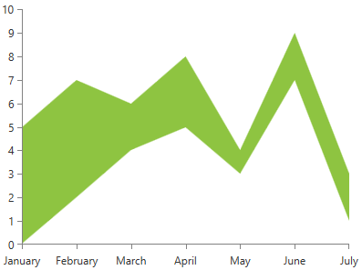

# RangeSeries

The __RangeSeries__ behave like an [AreaSeries]() but you can specify a minimum and maximum for each data point. Basically, the series displays a range of data by plotting two numeric values per data point.

* [Declaratively Defined Series](#declaratively-defined-series)
* [Properties](#properties)
* [Data Binding](#data-binding)
* [Styling the Series](#styling-the-series)

## Declaratively defined series

You can use the definition from __Example 1__ to display a RangeSeries:  

#### __[XAML] Example 1: Declaring RangeSeries in XAML__
{{region radchartview_rangeseries_0}}
	<telerik:RadCartesianChart Palette="Windows8">
		<telerik:RadCartesianChart.HorizontalAxis>
			<telerik:CategoricalAxis />
		</telerik:RadCartesianChart.HorizontalAxis>
		<telerik:RadCartesianChart.VerticalAxis>
			<telerik:LinearAxis />
		</telerik:RadCartesianChart.VerticalAxis>
		<telerik:RadCartesianChart.Series>
			<telerik:RangeSeries>
				<telerik:RangeSeries.DataPoints>
					<telerik:RangeDataPoint Category="January" High="5" Low="0"/>
					<telerik:RangeDataPoint Category="February" High="7" Low="2"/>
					<telerik:RangeDataPoint Category="March" High="6" Low="4"/>
					<telerik:RangeDataPoint Category="April" High="8" Low="5"/>
					<telerik:RangeDataPoint Category="May" High="4" Low="3"/>
					<telerik:RangeDataPoint Category="June" High="9" Low="7"/>
					<telerik:RangeDataPoint Category="July" High="3" Low="1"/>
				</telerik:RangeSeries.DataPoints>
			</telerik:RangeSeries>
		</telerik:RadCartesianChart.Series>
	</telerik:RadCartesianChart>
{{endregion}}

#### __Figure 1: RangeSeries visual appearance__  

 
## Properties

The following list represents the most important properties of the RangeSeries

* __CategoryBinding__ : A property of type __DataPointBinding__ that gets or sets the property path that determines the category value of the data point.
* __HighBinding__ : A property of type __DataPointBinding__ that gets or sets the property path that determines the high value of the data point.
* __LowBinding__ : A property of type __DataPointBinding__ that gets or sets the property path that determines the low value of the data point.
* __Fill__ : A property of type __Brush__ that gets or sets the color of the RangeSeries area.
* __DashArray__ : A property of type __DoubleCollection__ that gets or sets the dash pattern applied to the stroke of the area.
* __Stroke__ : A property of type __Brush__ that gets or sets the outline stroke of the RangeSeries area.
* __AreaShapeStyle__ : A property of type __Style__ that gets or sets the appearance of the area shape. The property excepts a style that targets an object of type Path.
* __StrokeShapeStyle__ : A property of type __Style__ that gets or sets the style of the stroke of the area shape. The property excepts a style that targets an object of type Path.
* __StrokeMode__ : A property of type __RangeSeriesStrokeMode__ that gets or sets the mode that determines what part of the series will be stroked. The stroke mode is an enumeration and it allows the following values:  
	* __None__ : No outlining.
	* __LowPoints__ : The stroke will be applied on the Low value of the data points.
	* __HighPoints__ : The stroke will be applied on the High value of the data points.
	* __LowAndHighPoints__ : The stroke will be applied on the Low and High values of the data points.

## Data Binding

You can use the __HighBinding__ ,__LowBinding__ and __CategoryBinding__ properties of the RangeSeries to bind the DataPoints’ properties to the properties from your view models.

#### __[C#] Example 2: Defining the view model__

{{region radchartview-series-areaseries_1}}
	public class PlotInfo
    {
        public string Category { get; set; }
        public double HighValue { get; set; }
        public double LowValue { get; set; }
    }

	//.......
	this.DataContext = new ObservableCollection<PlotInfo>
	{
		new PlotInfo() { Category = "January", HighValue = 5, LowValue = 0},
		//....
	};
{{endregion}}	

#### __[XAML] Example 3: Specify RangeSeries in XAML__
{{region radchartview-series-areaseries_2}}
	<telerik:RangeSeries ItemsSource="{Binding}" HighBinding="HighValue" LowBinding="LowValue" CategoryBinding="Category"/>
{{endregion}}

>See the [Create Data-Bound Chart]() for more information on data binding in the RadChartView suite

## Styling the Series

You can see how to style range series using different properties in the [RangeSeries section]() of the Customizing CartesianChart Series help article.

Additionally, you can use the Palette property of the chart to change the colors of the RangeSeries on a global scale. You can find more information about this feature in the [Palettes]() section in our help documentation.

# See Also
 * [Getting Started]()
 * [Chart Series Overview]()
 * [Area Series Overview]()
 * [Create Data-Bound Chart]()