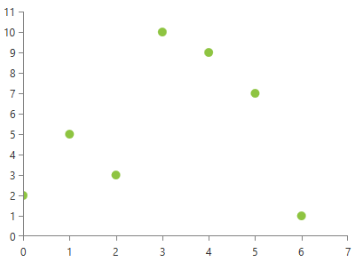

# ScatterPointSeries

This series is visualized on the screen as separate points representing each of the __DataPoints__. As all scatter series, this one also requires the RadCartesianChart to define two LinearAxis.
      

## Declaratively defined series

You can use the following definition to display a simple ScatterPointSeries
#### XAML
	{{region radchartview-scatterpointseries}}
            <telerik:RadCartesianChart Palette="Windows8">
            <telerik:RadCartesianChart.HorizontalAxis>
                <telerik:LinearAxis/>
            </telerik:RadCartesianChart.HorizontalAxis>
            <telerik:RadCartesianChart.VerticalAxis>
                <telerik:LinearAxis />
            </telerik:RadCartesianChart.VerticalAxis>
            <telerik:RadCartesianChart.Series>
                <telerik:ScatterPointSeries>
                    <telerik:ScatterPointSeries.DataPoints>
                        <telerik:ScatterDataPoint XValue="0" YValue="2" />
                        <telerik:ScatterDataPoint XValue="1" YValue="5" />
                        <telerik:ScatterDataPoint XValue="2" YValue="3" />
                        <telerik:ScatterDataPoint XValue="3" YValue="10" />
                        <telerik:ScatterDataPoint XValue="4" YValue="9" />
                        <telerik:ScatterDataPoint XValue="5" YValue="7" />
                        <telerik:ScatterDataPoint XValue="6" YValue="1" />
                    </telerik:ScatterPointSeries.DataPoints>
                </telerik:ScatterPointSeries>
            </telerik:RadCartesianChart.Series>
            </telerik:RadCartesianChart>
{{endregion}}

# See Also

 * [Chart Series Overview]()
