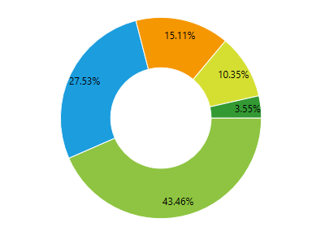
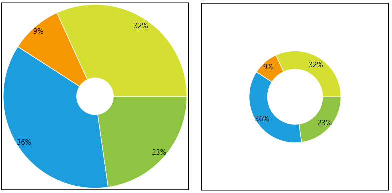
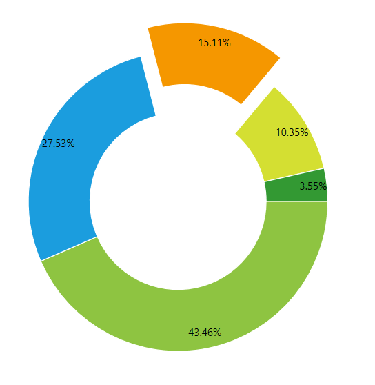
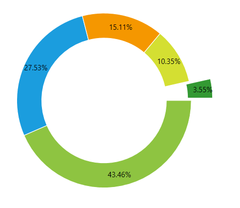

# DoughtnutSeries

This series is visualized on the screen as separate slices representing each of the data points. The only difference from the PieSeries is that each slices is drawn with an offset from the center of the control.

* [Declaratively Defined Series](#declaratively-defined-series)
* [Properties](#properties)
* [Data Binding](#data-binding)
* [Setting the Doughnut Radius](#setting-the-doughnut-radius)
* [Offset Doughnut Slice from Center](#offset-doughnut-slice-from-center)
* [Styling the Series](#styling-the-series)      

## Declaratively defined series

You can use the following definition to display a simple DoughnutSeries

#### __[XAML] Example 1: Declaring an DoughtnutSeries in XAML__
{{region  radchartview-series-doughnutseries_0}}
	<telerik:RadPieChart Palette="Windows8">
		<telerik:RadPieChart.Series>
			<telerik:DoughnutSeries>
				<telerik:DoughnutSeries.DataPoints>
					<telerik:PieDataPoint Label="43.46%" Value="43.46"/>
					<telerik:PieDataPoint Label="27.53%" Value="27.53"/>
					<telerik:PieDataPoint Label="15.11%" Value="15.11"/>
					<telerik:PieDataPoint Label="10.35%" Value="10.35"/>
					<telerik:PieDataPoint Label="3.55%" Value="3.55"/>
				</telerik:DoughnutSeries.DataPoints>
			</telerik:DoughnutSeries>
		</telerik:RadPieChart.Series>
	</telerik:RadPieChart>
{{endregion}}

#### __Figure 1: DoughtnutSeries visual appearance__	

## Properties

* __ValueBinding__: A property of type __DataPointBinding__ that gets or sets the property path that determines the value of the data point.
* __AngleRange__: A property of type __DataPointBinding__ that gets or sets the property path that determines the category value of the data point.
* __RadiusFactor__: A property of type __double__ that gets or sets the radius factor used to calculate the radius of the visual series.
* __SelectedPointOffset__: A property of type __double__ that gets or sets the offset applied to a __Telerik.Charting.PieDataPoint__ which is currently selected. This value is applied only if the point's OffsetFromCenter property is 0.
* __InnerRadiusFactor__: A property of type __double__ that gets or sets the inner radius factor (that is the space that remains empty) of the series. The value is in logical units, in the range of [0, 1].
* __DefaultSliceStyle__: A property of type __Style__ that gets the style applied to every segment in the series.

## Data Binding

You can use the __ValueBinding__ property of the DoughtnutSeries to bind the DataPoints’ properties to the properties from your view models.

#### __[C#] Example 2: Defining the view model__

{{region radchartview-series-doughnutseries_1}}
	public class PlotInfo
    {
        public double Value { get; set; }
    }

	//.......
	this.DataContext = new ObservableCollection<PlotInfo>
	{
		new PlotInfo() { Value = 43.46},
		//....
	};
{{endregion}}		

#### __[XAML] Example 3: Specify a DoughtnutSeries in XAML__
{{region radchartview-series-doughnutseries_2}}
	<telerik:DoughtnutSeries ItemsSource="{Binding}" ValueBinding="Value" />
{{endregion}}	

>See the [Create Data-Bound Chart]() for more information on data binding in the RadChartView suite.

## Setting the Doughnut Radius

The API of the series allows you to define the radius of the doughnut visual (the circle) and also the radius of the space that remains empty (the hole).

The radiuses can be set via the  __RadiusFactor__  and __InnerRadiusFactor__ properties of the series. The property works in relative units between 0 and 1.

### RadiusFactor

__RadiusFactor__ sets the radius of the doughnut visual. Value of 0.3 means that the pie visual will take 30% of the chart's available space.

Setting __RadiusFactor__ to 1 means that the doughnut visual will take all the available space given from the chart control. 

Setting  __RadiusFactor__ to 0.5 means that the circle (pie) will take half of the available space given from the chart control. 

Setting __RadiusFactor__ to a value bigger than 1 (ex: 1.4) will make the pie bigger than the available size.

The default value of __RadiusFactor__ is 0.85

### InnerRadiusFactor

__InnerRadiusFactor__ sets the radius of the space that remains empty. Value of 0.3 means that the empty space will take 30% of the chart's available space. 

Setting __InnerRadiusFactor__ to 1 means that the empty space will take all available space given from the chart control. 

> If the InnerRadiusFactor gets bigger than the RadiusFactor, the doughnut visual will be drawn in the intersection area between the radius ranges.

Setting  __InnerRadiusFactor__ to 0.5 means that the empty space will take half of the available space given from the chart control. 

Setting __InnerRadiusFactor__ to a value bigger than 1 (ex: 1.4) will make the empty space bigger than the available size.

The default value of __InnerRadiusFactor__ is 0.5

#### __[XAML] Example 4: Setting RadiusFactor and InnerRadiusFactor__
{{region radchartview-series-doughnutseries_3}}
	<telerik:DoughnutSeries RadiusFactor="1" InnerRadiusFactor="0.3">
{{endregion}}	

#### __Figure 2: RadiusFactor of 1 (left) and 0.5 (right), and InnerRadiusFactor of 0.2 (left) and 0.3 (right)__

## Offset Doughnut Slice from Center

The DoughnutSeries allows you to offset each doughnut slice from the center of the doughnut. To do this set the __OffsetFromCenter__ property of the corresponding PieDataPoint.

#### __[XAML] Example 5: Offsetting pie slices__
{{region radchartview-series-doughnutseries_4}}
	<telerik:RadPieChart Palette="Windows8">
		<telerik:RadPieChart.Series>
			<telerik:DoughnutSeries>
				<telerik:DoughnutSeries.DataPoints>
					<telerik:PieDataPoint Label="43.46%" Value="43.46"/>
					<telerik:PieDataPoint Label="27.53%" Value="27.53"/>
					<telerik:PieDataPoint Label="15.11%" Value="15.11" OffsetFromCenter="0.2"/>
					<telerik:PieDataPoint Label="10.35%" Value="10.35" />
					<telerik:PieDataPoint Label="3.55%" Value="3.55"/>
				</telerik:DoughnutSeries.DataPoints>
			</telerik:DoughnutSeries>
		</telerik:RadPieChart.Series>
	</telerik:RadPieChart>
{{endregion}}	

#### __Figure 3: Exploding pie slices__

Additionally, you can define the offset for the selected PieDataPoint objects, via the __SelectedPointOffset__ property of DoughnutSeries. In this case when you select a data point, the corresponding doughnut slice will *explode* from the center of the doughnut.

#### __[XAML] Example 6: Setting SelectedPointOffset__
{{region radchartview-series-doughnutseries_5}}
	<telerik:RadPieChart Palette="Windows8">
		<telerik:RadPieChart.Series>
			<telerik:DoughnutSeries SelectedPointOffset="0.25" RadiusFactor="0.7">
				<telerik:DoughnutSeries.DataPoints>
					<telerik:PieDataPoint Label="43.46%" Value="43.46"/>
					<telerik:PieDataPoint Label="27.53%" Value="27.53"/>
					<telerik:PieDataPoint Label="15.11%" Value="15.11" />
					<telerik:PieDataPoint Label="10.35%" Value="10.35" />
					<telerik:PieDataPoint Label="3.55%" Value="3.55" />
				</telerik:DoughnutSeries.DataPoints>
			</telerik:DoughnutSeries>                
		</telerik:RadPieChart.Series>
		<telerik:RadPieChart.Behaviors>
			<telerik:ChartSelectionBehavior />
		</telerik:RadPieChart.Behaviors>
	</telerik:RadPieChart>
{{endregion}}

#### __Figure 4: Selected exploding pie slices__

> The OffsetFromCenter and SelectedPointOffset works in relative units between 0 and 1. 

## Styling the Series

You can see how to style the series using different properties in the [DoughtnutSeries section]() of the Customizing PieChart Series help article.

Additionally, you can use the Palette property of the chart to change the colors of the DoughtnutSeries on a global scale. You can find more information about this feature in the [Palettes]() section in our help documentation.

## See Also
 * [Chart Series Overview]()
 * [Create Data-Bound Chart]()
