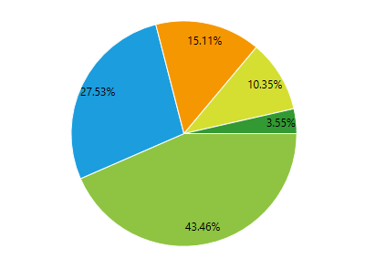

# PieSeries

This series is visualized on the screen as separate pie slices representing each of the data points.

* [Declaratively Defined Series](#declaratively-defined-series)
* [Properties](#properties)
* [Data Binding](#data-binding)
* [Styling the Series](#styling-the-series)

## Declaratively defined series

You can use the following definition to display a simple PieSeries:

#### __[XAML] Example 1: Declaring an PieSeries in XAML__
{{region  radchartview-series-pieseries_0}}
	<telerik:RadPieChart Palette="Windows8">
		<telerik:RadPieChart.Series>
			<telerik:PieSeries>
				<telerik:PieSeries.DataPoints>
					<telerik:PieDataPoint Label="43.46%" Value="43.46"/>
					<telerik:PieDataPoint Label="27.53%" Value="27.53"/>
					<telerik:PieDataPoint Label="15.11%" Value="15.11"/>
					<telerik:PieDataPoint Label="10.35%" Value="10.35"/>
					<telerik:PieDataPoint Label="3.55%" Value="3.55"/>
				</telerik:PieSeries.DataPoints>
			</telerik:PieSeries>
		</telerik:RadPieChart.Series>
	</telerik:RadPieChart>
{{endregion}}

#### __Figure 1: PieSeries visual appearance__

## Properties

* __ValueBinding__: A property of type __DataPointBinding__ that gets or sets the property path that determines the value of the data point.
* __AngleRange__: A property of type __DataPointBinding__ that gets or sets the property path that determines the category value of the data point.
* __RadiusFactor__: A property of type __double__ that gets or sets the radius factor used to calculate the radius of the visual series.
* __SelectedPointOffset__: A property of type __double__ that gets or sets the offset applied to a __Telerik.Charting.PieDataPoint__ which is currently selected. This value is applied only if the point's OffsetFromCenter property is 0.
* __DefaultSliceStyle__: A property of type __Style__ that gets the style applied to every segment in the series.

## Data Binding

You can use the __ValueBinding__ property of the PieSeries to bind the DataPoints’ properties to the properties from your view models.

#### __[C#] Example 2: Defining the view model__

{{region radchartview-series-pieseries_1}}
	public class PlotInfo
    {
        public double Value { get; set; }
    }

	//.......
	this.DataContext = new ObservableCollection<PlotInfo>
	{
		new PlotInfo() { Value = 43.46},
		//....
	};
{{endregion}}		

#### __[XAML] Example 3: Specify a PieSeries in XAML__
{{region radchartview-series-pieseries_2}}
	<telerik:PieSeries ItemsSource="{Binding}" ValueBinding="PieValue" />
{{endregion}}	

>See the [Create Data-Bound Chart]() for more information on data binding in the RadChartView suite.

## Styling the Series

You can see how to style area series using different properties in the [PieSeries section]() of the Customizing PieChart Series help article.

Additionally, you can use the Palette property of the chart to change the colors of the PieSeries on a global scale. You can find more information about this feature in the [Palettes]() section in our help documentation.

## See Also
 * [Chart Series Overview]()
 * [Create Data-Bound Chart]()