# Customizing CartesianChart Series

This article demonstrates how you can change the default look of the __RadCartesianChart__ series.
      

## Customizing Point Series

### PointSeries

This series expose the __DefaultVisualStyle__ property. It is of type __Style__ and determines the appearance of the [Path](http://msdn.microsoft.com/en-us/library/system.windows.shapes.path(v=vs.110).aspx) element used to visualize the __PointSeries__. Your custom style should target the native __Path__ component. You can set the property like this:
            

	
              <telerik:PointSeries.DefaultVisualStyle>
                
              </telerik:PointSeries.DefaultVisualStyle>

>tipSince __Q1 2014__ all series exposing the __DefaultVisualStyle__ property, also expose the __DefaultVisualStyleSelector__ property. It is of type [StyleSelector](http://msdn.microsoft.com/en-us/library/system.windows.controls.styleselector(v=vs.110).aspx) and gets or sets custom style-selection logic for a style that can be applied to each generated element.
              

### ScatterPointSeries

This series expose the __DefaultVisualStyle__ property. It is of type __Style__ and determines the appearance of the [Path](http://msdn.microsoft.com/en-us/library/system.windows.shapes.path(v=vs.110).aspx) element used to visualize the __ScatterPointSeries__. Your custom style should target the native __Path__ component. You can set the property like this:
            

	
              <telerik:ScatterPointSeries.DefaultVisualStyle>
                  
              </telerik:ScatterPointSeries.DefaultVisualStyle>

>tipSince __Q1 2014__ all series exposing the __DefaultVisualStyle__ property, also expose the __DefaultVisualStyleSelector__ property. It is of type [StyleSelector](http://msdn.microsoft.com/en-us/library/system.windows.controls.styleselector(v=vs.110).aspx) and gets or sets custom style-selection logic for a style that can be applied to each generated element.
              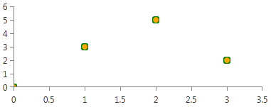

## Customizing Line Series

### LineSeries

This series expose the __StrokeShapeStyle__ property. It is of type __Style__ and determines the appearance of the [Path](http://msdn.microsoft.com/en-us/library/system.windows.shapes.path(v=vs.110).aspx) element used to visualize the __LineSeries__. Your custom style should target the native __Path__ component. You can set the property like this:
            

	
              <telerik:LineSeries.StrokeShapeStyle>
                  
              </telerik:LineSeries.StrokeShapeStyle>

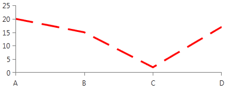

### SplineSeries

This series expose the __StrokeShapeStyle__ property. It is of type __Style__ and determines the appearance of the [Path](http://msdn.microsoft.com/en-us/library/system.windows.shapes.path(v=vs.110).aspx) element used to visualize the __SplineSeries__. Your custom style should target the native __Path__ component. You can set the property like this:
            

	
                    <telerik:SplineSeries.StrokeShapeStyle>
                        
                    </telerik:SplineSeries.StrokeShapeStyle>		  
				          

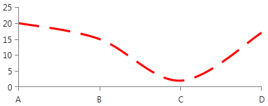

### StepLineSeries

This series expose the __StrokeShapeStyle__ property. It is of type __Style__ and determines the appearance of the [Path](http://msdn.microsoft.com/en-us/library/system.windows.shapes.path(v=vs.110).aspx) element used to visualize the __StepLineSeries__. Your custom style should target the native __Path__ component. You can set the property like this:
            

	
                    <telerik:StepLineSeries.StrokeShapeStyle>
                        
                    </telerik:StepLineSeries.StrokeShapeStyle>		  
				          

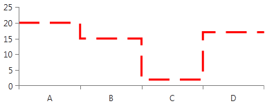

### ScatterLineSeries

This series expose the __StrokeShapeStyle__ property. It is of type __Style__ and determines the appearance of the [Path](http://msdn.microsoft.com/en-us/library/system.windows.shapes.path(v=vs.110).aspx) element used to visualize the __ScatterLineSeries__. Your custom style should target the native __Path__ component. You can set the property like this:
            

	
              <telerik:ScatterLineSeries.StrokeShapeStyle>
                  
              </telerik:ScatterLineSeries.StrokeShapeStyle>

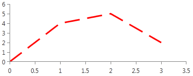

### ScatterSplineSeries

This series expose the __StrokeShapeStyle__ property. It is of type __Style__ and determines the appearance of the [Path](http://msdn.microsoft.com/en-us/library/system.windows.shapes.path(v=vs.110).aspx) element used to visualize the __ScatterSplineSeries__. Your custom style should target the native __Path__ component. You can set the property like this:
            

	
              <telerik:ScatterSplineSeries.StrokeShapeStyle>
                  
              </telerik:ScatterSplineSeries.StrokeShapeStyle>

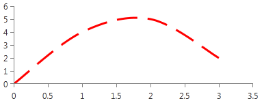

## Customizing Area Series

### AreaSeries

This series expose the following styling properties:
            

* __StrokeShapeStyle__ - it is of type __Style__ and determines the appearance of the series. Your custom style should target the native [Path](http://msdn.microsoft.com/en-us/library/system.windows.shapes.path(v=vs.110).aspx) component.
                

	
                    <telerik:AreaSeries.StrokeShapeStyle>
                        
                    </telerik:AreaSeries.StrokeShapeStyle>		  
				          

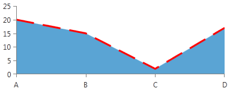

* __AreaShapeStyle__ - it is of type __Style__ and determines the appearance of the area, locked between the axis and the line. Your custom style should target the native [Path](http://msdn.microsoft.com/en-us/library/system.windows.shapes.path(v=vs.110).aspx) component.
                

	
                    <telerik:AreaSeries.AreaShapeStyle>
                        
                    </telerik:AreaSeries.AreaShapeStyle>		  
				          

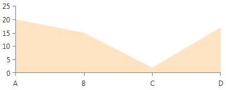

### StepAreaSeries

This series expose the following styling properties:
            

* __StrokeShapeStyle__ - it is of type __Style__ and determines the appearance of the series. Your custom style should target the native [Path](http://msdn.microsoft.com/en-us/library/system.windows.shapes.path(v=vs.110).aspx) component.
                

	
                    <telerik:StepAreaSeries.StrokeShapeStyle>
                        
                    </telerik:StepAreaSeries.StrokeShapeStyle>		  
				          

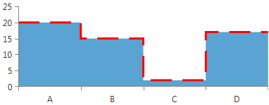

* __AreaShapeStyle__ - it is of type __Style__ and determines the appearance of the area, locked between the axis and the line. Your custom style should target the native [Path](http://msdn.microsoft.com/en-us/library/system.windows.shapes.path(v=vs.110).aspx) component.
                

	
                    <telerik:StepAreaSeries.AreaShapeStyle>
                        
                    </telerik:StepAreaSeries.AreaShapeStyle>		  
				          

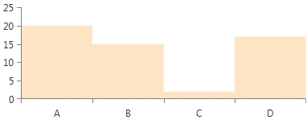

### SplineAreaSeries

This series expose the following styling properties:
            

* __StrokeShapeStyle__ - it is of type __Style__ and determines the appearance of the series. Your custom style should target the native [Path](http://msdn.microsoft.com/en-us/library/system.windows.shapes.path(v=vs.110).aspx) component.
                

	
                    <telerik:SplineAreaSeries.StrokeShapeStyle>
                        
                    </telerik:SplineAreaSeries.StrokeShapeStyle>		  
				          

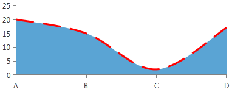

* __AreaShapeStyle__ - it is of type __Style__ and determines the appearance of the area, locked between the axis and the line. Your custom style should target the native [Path](http://msdn.microsoft.com/en-us/library/system.windows.shapes.path(v=vs.110).aspx) component.
                

	
                    <telerik:SplineAreaSeries.AreaShapeStyle>
                        
                    </telerik:SplineAreaSeries.AreaShapeStyle>		  
				          

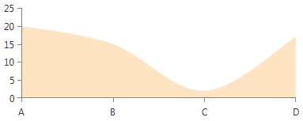

### ScatterAreaSeries

This series expose the following styling properties:
            

* __StrokeShapeStyle__ - it is of type __Style__ and determines the appearance of the series. Your custom style should target the native [Path](http://msdn.microsoft.com/en-us/library/system.windows.shapes.path(v=vs.110).aspx) component. You can set the property in XAML like this:
                

	
                    <telerik:ScatterAreaSeries.StrokeShapeStyle>
                        
                    </telerik:ScatterAreaSeries.StrokeShapeStyle>

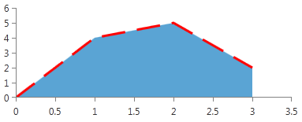

* __AreaShapeStyle__ - it is of type __Style__ and determines the appearance of the area, locked between the axis and the line. Your custom style should target the native [Path](http://msdn.microsoft.com/en-us/library/system.windows.shapes.path(v=vs.110).aspx) component. You can set the property in XAML like this:
                

	
                    <telerik:ScatterAreaSeries.AreaShapeStyle>
                        
                    </telerik:ScatterAreaSeries.AreaShapeStyle>

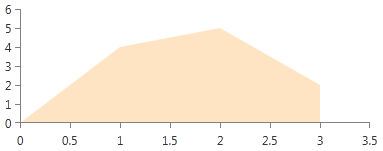

### ScatterSplineAreaSeries

This series expose the following styling properties:
            

* __StrokeShapeStyle__ - it is of type __Style__ and determines the appearance of the series. Your custom style should target the native [Path](http://msdn.microsoft.com/en-us/library/system.windows.shapes.path(v=vs.110).aspx) component. You can set the property in XAML like this:
                

	
                    <telerik:ScatterSplineAreaSeries.StrokeShapeStyle>
                        
                    </telerik:ScatterSplineAreaSeries.StrokeShapeStyle>

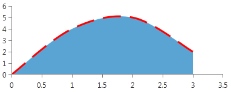

* __AreaShapeStyle__ - it is of type __Style__ and determines the appearance of the area, locked between the axis and the line. Your custom style should target the native [Path](http://msdn.microsoft.com/en-us/library/system.windows.shapes.path(v=vs.110).aspx) component. You can set the property in XAML like this:
                

	
                    <telerik:ScatterSplineAreaSeries.AreaShapeStyle>
                        
                    </telerik:ScatterSplineAreaSeries.AreaShapeStyle>

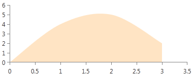

## Customizing Bar Series

### BarSeries

This series expose the __DefaultVisualStyle__ property. It is of type __Style__ and determines the appearance of the series. Your custom style should target the native [Border](http://msdn.microsoft.com/en-us/library/system.windows.controls.border(v=vs.110).aspx) component. You can set the property in XAML like this:
            

	
              <telerik:BarSeries.DefaultVisualStyle>
                  
              </telerik:BarSeries.DefaultVisualStyle>

>tipSince __Q1 2014__ all series exposing the __DefaultVisualStyle__ property, also expose the __DefaultVisualStyleSelector__ property. It is of type [StyleSelector](http://msdn.microsoft.com/en-us/library/system.windows.controls.styleselector(v=vs.110).aspx) and gets or sets custom style-selection logic for a style that can be applied to each generated element.
              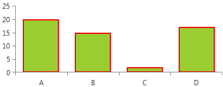

### RangeBarSeries

This series expose the __DefaultVisualStyle__ property. It is of type __Style__ and determines the appearance of the series. Your custom style should target the native [Border](http://msdn.microsoft.com/en-us/library/system.windows.controls.border(v=vs.110).aspx) component. You can set the property in XAML like this:
            

	
              <telerik:RangeBarSeries.DefaultVisualStyle>
                  
              </telerik:RangeBarSeries.DefaultVisualStyle>

>tipSince __Q1 2014__ all series exposing the __DefaultVisualStyle__ property, also expose the __DefaultVisualStyleSelector__ property. It is of type [StyleSelector](http://msdn.microsoft.com/en-us/library/system.windows.controls.styleselector(v=vs.110).aspx) and gets or sets custom style-selection logic for a style that can be applied to each generated element.
              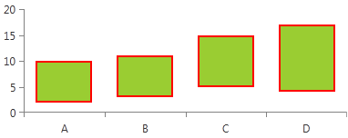

## Customizing Financial Series

### OhlcSeries

This series expose the __DefaultVisualStyle__ property. It is of type __Style__ and determines the appearance of the series. Your custom style should target the native [OhlcStick](http://www.telerik.com/help/wpf/t_telerik_windows_controls_chartview_ohlcstick.html)[OhlcStick](http://www.telerik.com/help/silverlight/t_telerik_windows_controls_chartview_ohlcstick.html) component. You can set the property in XAML like this:
            

	
              <telerik:OhlcSeries.DefaultVisualStyle>
                  
              </telerik:OhlcSeries.DefaultVisualStyle>

>tipSince __Q1 2014__ all series exposing the __DefaultVisualStyle__ property, also expose the __DefaultVisualStyleSelector__ property. It is of type [StyleSelector](http://msdn.microsoft.com/en-us/library/system.windows.controls.styleselector(v=vs.110).aspx) and gets or sets custom style-selection logic for a style that can be applied to each generated element.
              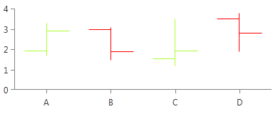

### CandlestickSeries

This series expose the __DefaultVisualStyle__ property. It is of type __Style__ and determines the appearance of the series. Your custom style should target the native [Candlestick](http://www.telerik.com/help/wpf/t_telerik_windows_controls_charting_candlestick.html)[Candlestick](http://www.telerik.com/help/silverlight/t_telerik_windows_controls_charting_candlestick.html) component. You can set the property in XAML like this:
            

	
              <telerik:CandlestickSeries.DefaultVisualStyle>
                
            </telerik:CandlestickSeries.DefaultVisualStyle>

>tipSince __Q1 2014__ all series exposing the __DefaultVisualStyle__ property, also expose the __DefaultVisualStyleSelector__ property. It is of type [StyleSelector](http://msdn.microsoft.com/en-us/library/system.windows.controls.styleselector(v=vs.110).aspx) and gets or sets custom style-selection logic for a style that can be applied to each generated element.
              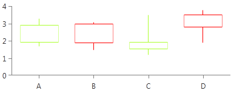

## Customizing  DataPoints DataTemplate

All series supported by the __RadCartesianChart__ expose a __PointTemplate__ property.
        

>tipThis property should be used only when the __DefaultVisualStyle__ cannot be used.
          

It is of type __DataTemplate__ and gets or sets the template that describes the visual representation of the __DataPoints__ in a series. You can set the property in XAML like this:
        

	
            <telerik:PointSeries>
              <telerik:PointSeries.PointTemplate>
                  <DataTemplate>
                      <Ellipse Height="5" Width="11" Fill="Blue"/>
                  </DataTemplate>
              </telerik:PointSeries.PointTemplate>
            </telerik:PointSeries>
				  

The above definition will change the default visualization of the DataPoint visuals like this: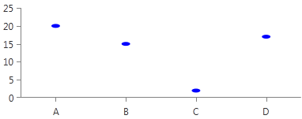

# See Also

 * [Customizing PolarChart Series]()

 * [Customizing PieChart Series]()
