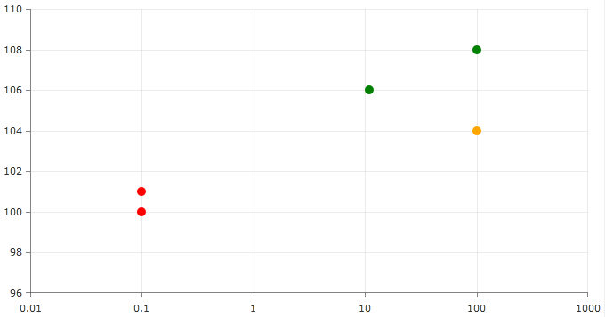
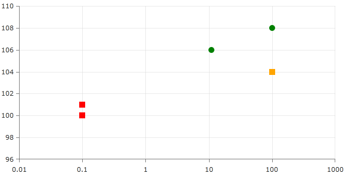

# Customizing Scatter Points

## 

RadChart allows that you set custom shape for the Scatter points (items of the [ScatterPoint]() series) via DataTemplate. However there are cases where we would like each point in our scatter series to have different shape or color. This is where you should use the *PointTemplateSelector* property.
        

The following example demonstrates how you can add a custom Framework Element (Rectangle, Ellipse and etc.) to present the scatter points and set different color per each point based on condition defined by PointTemplateSelector.
        

We'll get started with a class with two properties - X and Y. They will be used to represent the coordinates of each point on the Chart. We'll also need a method that will return Brush with color based on the YValue of our business objects.
        

#### __C#__

{{region radchartview-styles-and-templates-customizing-scatter-points_1}}

	public class ChartData
	{
		private readonly Brush Red = new SolidColorBrush(Colors.Red);
		private readonly Brush Orange = new SolidColorBrush(Colors.Orange);
		private readonly Brush Green = new SolidColorBrush(Colors.Green);
	
		public ChartData(double x, double y)
		{
			this.XValue = x;
			this.YValue = y;
		}
	
		public double XValue { get; set; }
		public double YValue { get; set; }
	
		public Brush Brush
		{
			get
			{
				if (this.YValue < 102)
				{
					return Red;
				}
				else if (this.YValue < 105)
				{
					return Orange;
				}
				else
				{
					return Green;
				}
			}
		}
	}
	{{endregion}}

#### __VB.NET__

{{region radchartview-styles-and-templates-customizing-scatter-points_2}}

	 Public Class ChartData
		Private ReadOnly Red As Brush = New SolidColorBrush(Colors.Red)
		Private ReadOnly Orange As Brush = New SolidColorBrush(Colors.Orange)
		Private ReadOnly Green As Brush = New SolidColorBrush(Colors.Green)
	
		Public Sub New(ByVal x As Double, ByVal y As Double)
			Me.XValue = x
			Me.YValue = y
		End Sub
	
		Public Property XValue() As Double
		Public Property YValue() As Double
	
		Public ReadOnly Property Brush() As Brush
			Get
				If Me.YValue < 102 Then
					Return Red
				ElseIf Me.YValue < 105 Then
					Return Orange
				Else
					Return Green
				End If
			End Get
		End Property
	 End Class
	{{endregion}}

Our next task is to create a ViewModel. For the purpose - create new class that inherits the ViewModelBase abstract class.
        

>ViewModelBase class is part of the Telerik.Windows.Controls.dll

What we'll need to add in it - a property of type List of ChartData. It will be used as data source for our scatterpoint series. We'll populate the newly created collection with some data in a method that is called GetData. In the constructor of the ViewModel class call the GetData method we created in our ChartData class.
        

#### __C#__

{{region radchartview-styles-and-templates-customizing-scatter-points_3}}

	public class ViewModel : ViewModelBase
	{
		private List<ChartData> data;
	
		public ViewModel()
		{
			this.Data = this.GetData();
		}
	
		public List<ChartData> Data
		{
			get
			{
				return this.data;
			}
			set
			{
				if (this.data != value)
				{
					this.data = value;
					this.OnPropertyChanged("Data");
				}
			}
		}
	
		private List<ChartData> GetData()
		{
			List<ChartData> data = new List<ChartData>();
			data.Add(new ChartData(0.1, 100));
			data.Add(new ChartData(0.1, 101));
			data.Add(new ChartData(11, 106));
			data.Add(new ChartData(101, 104));
			data.Add(new ChartData(101, 108));
	
			return data;
		}
	}
	{{endregion}}

#### __VB.NET__

{{region radchartview-styles-and-templates-customizing-scatter-points_4}}

	Public Class ViewModel
		Inherits ViewModelBase
			Private data As List(Of ChartData)
	
			Public Sub New()
				Me.Data = Me.GetData()
			End Sub
	
			Public Property Data() As List(Of ChartData)
				Get
					Return Me.data
				End Get
				Set(ByVal value As List(Of ChartData))
					If Me.data IsNot value Then
						Me.data = value
						Me.OnPropertyChanged("Data")
					End If
				End Set
			End Property
	
			Private Function GetData() As List(Of ChartData)
				Dim data As New List(Of ChartData)()
				data.Add(New ChartData(0.1, 100))
				data.Add(New ChartData(0.1, 101))
				data.Add(New ChartData(11, 106))
				data.Add(New ChartData(101, 104))
				data.Add(New ChartData(101, 108))
				Return data
			End Function
	End Class
	{{endregion}}

It's time to create our ScatterPoint series in XAML and populate it with data. It is beyond the scope of this topic to describe how you can populate the series. Please refer to our [Create Data-Bound Chart]() topic for details.
        

#### __XAML__

{{region radchartview-styles-and-templates-customizing-scatter-points_0}}

	<UserControl.DataContext>
		<local:ViewModel />
	</UserControl.DataContext>
	
	 <Grid>
		<telerik:RadCartesianChart x:Name="RadChart1">
	
			<telerik:ScatterPointSeries XValueBinding="XValue" 
										YValueBinding="YValue" 
										ItemsSource="{Binding Data}" >
				<telerik:ScatterPointSeries.PointTemplate>
					<DataTemplate>
						<Ellipse Width="10"
						 Height="10"
						 Fill="{Binding DataItem.Brush}"/>
					</DataTemplate>
				</telerik:ScatterPointSeries.PointTemplate>
			</telerik:ScatterPointSeries>
	
			<telerik:RadCartesianChart.HorizontalAxis>
				<telerik:LogarithmicAxis Minimum="0.01" />
			</telerik:RadCartesianChart.HorizontalAxis>
			<telerik:RadCartesianChart.VerticalAxis>
				<telerik:LinearAxis />
			</telerik:RadCartesianChart.VerticalAxis>
	
			<telerik:RadCartesianChart.Grid>
				<telerik:CartesianChartGrid MajorLinesVisibility="XY" />
			</telerik:RadCartesianChart.Grid>
	
		</telerik:RadCartesianChart>
	</Grid>
	{{endregion}}

Up to now you should have a ScatterPoint series with elliptical shape where the color of each point comes from a propery of the underlying Business object.

For our scenario where we would like different shape for the pointmarks, this means that we should create different DataTemplates. We need to create a selector class which will dictate an ellipse or rectangle template to be set per condition. It should inherit the DataTemplateSelector class and define the condition by overriding its SelectTemplate method. The source code is below:
        

#### __XAML__

{{region radchartview-styles-and-templates-customizing-scatter-points_7}}

	<UserControl.Resources>
		<local:ScatterPointTemplateSelector x:Key="templateSelector" />
	</UserControl.Resources>
	
	<UserControl.DataContext>
		<local:ViewModel />
	</UserControl.DataContext>
	
	<Grid>
		<telerik:RadCartesianChart x:Name="RadChart1">
			<telerik:RadCartesianChart.Resources>
				<DataTemplate x:Key="ellipseTemplate">
					<Ellipse Height="10" Width="10" Fill="{Binding DataItem.Brush}" />
				</DataTemplate>
				<DataTemplate x:Key="rectangleTemplate">
					<Rectangle Height="10" Width="10" Fill="{Binding DataItem.Brush}" />
				</DataTemplate>
			</telerik:RadCartesianChart.Resources>
	
			<telerik:ScatterPointSeries XValueBinding="XValue" 
										YValueBinding="YValue" 
										ItemsSource="{Binding Data}" 
										PointTemplateSelector="{StaticResource templateSelector}" />
	
			<telerik:RadCartesianChart.HorizontalAxis>
				<telerik:LogarithmicAxis Minimum="0.01" />
			</telerik:RadCartesianChart.HorizontalAxis>
			<telerik:RadCartesianChart.VerticalAxis>
				<telerik:LinearAxis />
			</telerik:RadCartesianChart.VerticalAxis>
	
			<telerik:RadCartesianChart.Grid>
				<telerik:CartesianChartGrid MajorLinesVisibility="XY" />
			</telerik:RadCartesianChart.Grid>
	
		</telerik:RadCartesianChart>
	</Grid>
	{{endregion}}

#### __C#__

{{region radchartview-styles-and-templates-customizing-scatter-points_5}}

	  public class ScatterPointTemplateSelector : DataTemplateSelector
	    {
	        public override DataTemplate SelectTemplate(object item, DependencyObject container)
	        {
	            var scatterPoint = (ScatterDataPoint)item;
	            var itemIndex = scatterPoint.Index;
	            var series = container as ScatterPointSeries;
	            var dataPoint = series.DataPoints[itemIndex];
	            var chart = series.GetVisualParent<RadCartesianChart>();
	            if (dataPoint.YValue > 105)
	            {
	                return chart.Resources["ellipseTemplate"] as DataTemplate;
	            }
	            else
	            {
	                return chart.Resources["rectangleTemplate"] as DataTemplate;
	            }
	        }
	    }
	{{endregion}}

#### __VB.NET__

{{region radchartview-styles-and-templates-customizing-scatter-points_6}}

	'NOTE: This code snippet uses implicit typing. You will need to set 'Option Infer On' in the VB file or set 'Option Infer' at the project level:
	
	  Public Class ScatterPointTemplateSelector
		  Inherits DataTemplateSelector
			Public Overrides Function SelectTemplate(ByVal item As Object, ByVal container As DependencyObject) As DataTemplate
	            Dim scatterPoint = DirectCast(item, ScatterDataPoint)
	            Dim itemIndex = scatterPoint.Index
				Dim series = TryCast(container, ScatterPointSeries)
				Dim dataPoint = series.DataPoints(itemIndex)
				Dim chart = series.GetVisualParent(Of RadCartesianChart)()
				If dataPoint.YValue > 105 Then
					Return TryCast(chart.Resources("ellipseTemplate"), DataTemplate)
				Else
					Return TryCast(chart.Resources("rectangleTemplate"), DataTemplate)
				End If
			End Function
	  End Class
	{{endregion}}

