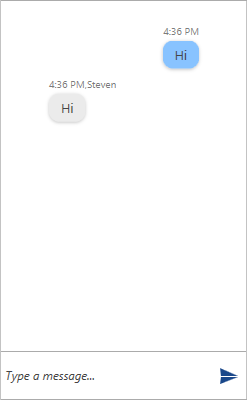

# Getting Started

This topic will guide you through the process of creating a sample application containing __RadChat__. For the purpose of the example a simple echo bot will be defined.

* [Assembly References](#assembly-references)
* [Adding RadChat to the Project](#adding-radchat-to-the-project)
* [Defining a simple Echo Bot](#defining-a-simple-echo-bot)
* [Adding Authors to RadChat](#adding-authors-to-radchat)

## Assembly References

* __Telerik.Windows.Controls__
* __Telerik.Windows.Controls.Input__
* __Telerik.Windows.Controls.ConversationalUI__

## Adding RadChat to the Project

Before proceeding with adding __RadChat__ to your project, make sure the required assembly references are added to the project. 

You can add __RadChat__ manually by writing the XAML code in __Example 1__. You can also add the control by dragging it from the Visual Studio Toolbox and dropping it over the XAML view.

#### __[XAML] Example 1: Adding RadChat in XAML__

{{region xaml-chat-getting-started_0}}
	<telerik:RadChat />
{{endregion}}

Running the application at this state will result in an empty chat.

#### __Figure 1: The Empty Chat Generated by the Code in Example 1__

## Defining a simple Echo Bot

So, for a simple demonstration purpose a sample echo bot will be defined.

#### __[C#] Example 2: Defining the Echo Bot__

{{region c#-chat-getting-started_1}}
	 public class EchoBot
     {
        public EchoBot(string id, string name)
        {
            this.Id = id;
            this.Name = name;
        }

        public string Name { get; set; }
        public string Id { get; set; }

        public string RecieveMessage(MessageBase message)
        {
            return (message as TextMessage).Text;
        }
     }
{{endregion}}

## Adding Authors to RadChat

#### __[C#] Example 3: Adding Authors to RadChat__

Two authors will be defined for this example. Note, that the __CurrentAuthor__ property of __RadChat__  must be set. In this case it would be the user entering the input, whereas the other Author would be the EchoBot. 

{{region c#-chat-getting-started_2}}
	public partial class MainWindow : Window
    {
        private EchoBot echoBot;
        private Author currentAuthor;
        private Author botAuthor;

        public MainWindow()
        {
            InitializeComponent();

            currentAuthor = new Author("1") { Name = "Peter" };
            echoBot = new EchoBot("2", "EchoBot");
            botAuthor = new Author(echoBot.Id) { Name = echoBot.Name };

            this.chat.CurrentAuthor = currentAuthor;
        }
    }
{{endregion}}

## Handling the Sent Message

The user's input can be handled by hooking up to the __SendMessage__ event of __RadChat__. The event arguments are of type __RoutedEventArgs__ which are extended by the __Message__ property.

#### __[C#] Example 4: Subscribing to the SendMessage event__

{{region c#-chat-getting-started_3}}
	private void Chat_SendMessage_(object sender, SendMessageEventArgs e)
        {
            var author = e.Message.Author;
            if (author == this.chat.CurrentAuthor)
            {
                this.chat.AddMessage(e.Message); 
                this.chat.AddMessage(this.echoBot.RecieveMessage(e.Message), this.botAuthor);

                e.Handled = true;
            }
        } 
{{endregion}}

This setup will have the following result.

#### __Figure 2: RadChat with a simple Echo Bot__

## See Also

* [Overview]()
* [Messages Overview]()

