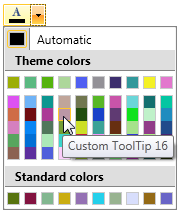

# Customize the PaletteViewItem's ToolTip

This article will show you a way to customize the ToolTip of the PaletteView items.

## 

>importantKeep in mind that this approach is available in data binding scenarios, only.
			  

For the purpose of this article we will use:
			

* a custom class __ColorModel__ that exposes two properties of type Color and string
				

#### __C#__

{{region radcolorpicker-howto-custom-tooltip_1}}
	public class ColorModel : ViewModelBase
	{
		private Color currColor;
		public Color CustomColor
		{
			get { return this.currColor; }
			set
			{
				if (this.currColor != value)
				{
					this.currColor = value;
					this.OnPropertyChanged("CustomColor");
				}
			}
		}
	
		public string ToolTipString { get; set; }
	}
	{{endregion}}

#### __VB__

{{region radcolorpicker-howto-custom-tooltip_2}}
		Public Class ColorModel
			Inherits ViewModelBase
			Private currColor As Color
			Public Property CustomColor() As Color
				Get
					Return Me.currColor
				End Get
				Set(value As Color)
					If Me.currColor <> value Then
						Me.currColor = value
						Me.OnPropertyChanged("CustomColor")
					End If
				End Set
			End Property
	
			Public Property ToolTipString() As String
				Get
					Return m_ToolTipString
				End Get
				Set(value As String)
					m_ToolTipString = Value
				End Set
			End Property
			Private m_ToolTipString As String
		End Class
	#End Region
	#Region "radcolorpicker-howto-custom-tooltip_4"
		Public Class MainViewModel
			Inherits ViewModelBase
	#Region "PrivateFilds"
			Private m_mainPaletteColors As ObservableCollection(Of ColorModel)
			Private m_headerPaletteColors As ObservableCollection(Of ColorModel)
			Private m_standardPaletteColors As ObservableCollection(Of ColorModel)
	#End Region
	
	#Region "Constructor"
			Public Sub New()
				m_mainPaletteColors = New ObservableCollection(Of ColorModel)()
				m_headerPaletteColors = New ObservableCollection(Of ColorModel)()
				m_standardPaletteColors = New ObservableCollection(Of ColorModel)()
	
				GenerateSampleData()
			End Sub
	#End Region
	
	#Region "GenerateSampleData"
			Private Sub GenerateSampleData()
				Dim rand As New Random()
				For i As Integer = 0 To 49
					Dim color__1 As New ColorModel() With {
				  .CustomColor = Color.FromArgb(255, CByte(rand.[Next](0, 255)), CByte(rand.[Next](0, 255)), CByte(rand.[Next](0, 255))), _
				  .ToolTipString = "Custom ToolTip " + i
				 }
					Me.m_mainPaletteColors.Add(color_1)
				Next
	
				For i As Integer = 0 To 9
					Dim color__1 As New ColorModel() With {
				  .CustomColor = Color.FromArgb(255, CByte(rand.[Next](0, 255)), CByte(rand.[Next](0, 255)), CByte(rand.[Next](0, 255))), _
				  .ToolTipString = "Custom ToolTip " + i
				 }
					Me.m_headerPaletteColors.Add(color_1)
				Next
	
				For i As Integer = 0 To 9
					Dim color__1 As New ColorModel() With {
				  .CustomColor = Color.FromArgb(255, CByte(rand.[Next](0, 255)), CByte(rand.[Next](0, 255)), CByte(rand.[Next](0, 255))), _
				  .ToolTipString = "Custom ToolTip " + i
				 }
					Me.m_standardPaletteColors.Add(color_1)
				Next
			End Sub
	#End Region
	
	#Region "Properties"
			Public Property MainPaletteColors() As ObservableCollection(Of ColorModel)
				Get
					Return Me.m_mainPaletteColors
				End Get
				Set(value As ObservableCollection(Of ColorModel))
					If Me.m_mainPaletteColors <> value Then
						Me.m_mainPaletteColors = value
						Me.OnPropertyChanged("MainPaletteColors")
					End If
				End Set
			End Property
	
			Public Property StandardPaletteColors() As ObservableCollection(Of ColorModel)
				Get
					Return Me.m_standardPaletteColors
				End Get
				Set(value As ObservableCollection(Of ColorModel))
					If Me.m_standardPaletteColors <> value Then
						Me.m_standardPaletteColors = value
						Me.OnPropertyChanged("StandardPaletteColors")
					End If
				End Set
			End Property
	
			Public Property HeaderPaletteColors() As ObservableCollection(Of ColorModel)
				Get
					Return Me.m_headerPaletteColors
				End Get
				Set(value As ObservableCollection(Of ColorModel))
					If Me.m_headerPaletteColors <> value Then
						Me.m_headerPaletteColors = value
						Me.OnPropertyChanged("HeaderPaletteColors")
					End If
				End Set
			End Property
	#End Region
		End Class
	#End Region
	End Class

* three different collections of ColorModel which will be used for the [HeaderPalette](), [MainPalette]() and [StandardPalette]()

* a ViewModel that wraps these collections and creates some sample data
				

#### __C#__

{{region radcolorpicker-howto-custom-tooltip_3}}
	public class MainViewModel : ViewModelBase
	{
		#region PrivateFilds
		private ObservableCollection<ColorModel> mainPaletteColors;
		private ObservableCollection<ColorModel> headerPaletteColors;
		private ObservableCollection<ColorModel> standardPaletteColors;
	{{endregion}}

#### __VB__

{{region radcolorpicker-howto-custom-tooltip_4}}
		Public Class MainViewModel
			Inherits ViewModelBase
	#Region "PrivateFilds"
			Private m_mainPaletteColors As ObservableCollection(Of ColorModel)
			Private m_headerPaletteColors As ObservableCollection(Of ColorModel)
			Private m_standardPaletteColors As ObservableCollection(Of ColorModel)
	#End Region
	
	#Region "Constructor"
			Public Sub New()
				m_mainPaletteColors = New ObservableCollection(Of ColorModel)()
				m_headerPaletteColors = New ObservableCollection(Of ColorModel)()
				m_standardPaletteColors = New ObservableCollection(Of ColorModel)()
	
				GenerateSampleData()
			End Sub
	#End Region
	
	#Region "GenerateSampleData"
			Private Sub GenerateSampleData()
				Dim rand As New Random()
				For i As Integer = 0 To 49
					Dim color__1 As New ColorModel() With {
				  .CustomColor = Color.FromArgb(255, CByte(rand.[Next](0, 255)), CByte(rand.[Next](0, 255)), CByte(rand.[Next](0, 255))), _
				  .ToolTipString = "Custom ToolTip " + i
				 }
					Me.m_mainPaletteColors.Add(color_1)
				Next
	
				For i As Integer = 0 To 9
					Dim color__1 As New ColorModel() With {
				  .CustomColor = Color.FromArgb(255, CByte(rand.[Next](0, 255)), CByte(rand.[Next](0, 255)), CByte(rand.[Next](0, 255))), _
				  .ToolTipString = "Custom ToolTip " + i
				 }
					Me.m_headerPaletteColors.Add(color_1)
				Next
	
				For i As Integer = 0 To 9
					Dim color__1 As New ColorModel() With {
				  .CustomColor = Color.FromArgb(255, CByte(rand.[Next](0, 255)), CByte(rand.[Next](0, 255)), CByte(rand.[Next](0, 255))), _
				  .ToolTipString = "Custom ToolTip " + i
				 }
					Me.m_standardPaletteColors.Add(color_1)
				Next
			End Sub
	#End Region
	
	#Region "Properties"
			Public Property MainPaletteColors() As ObservableCollection(Of ColorModel)
				Get
					Return Me.m_mainPaletteColors
				End Get
				Set(value As ObservableCollection(Of ColorModel))
					If Me.m_mainPaletteColors <> value Then
						Me.m_mainPaletteColors = value
						Me.OnPropertyChanged("MainPaletteColors")
					End If
				End Set
			End Property
	
			Public Property StandardPaletteColors() As ObservableCollection(Of ColorModel)
				Get
					Return Me.m_standardPaletteColors
				End Get
				Set(value As ObservableCollection(Of ColorModel))
					If Me.m_standardPaletteColors <> value Then
						Me.m_standardPaletteColors = value
						Me.OnPropertyChanged("StandardPaletteColors")
					End If
				End Set
			End Property
	
			Public Property HeaderPaletteColors() As ObservableCollection(Of ColorModel)
				Get
					Return Me.m_headerPaletteColors
				End Get
				Set(value As ObservableCollection(Of ColorModel))
					If Me.m_headerPaletteColors <> value Then
						Me.m_headerPaletteColors = value
						Me.OnPropertyChanged("HeaderPaletteColors")
					End If
				End Set
			End Property
	#End Region
		End Class
	#End Region
	End Class

Then you have to set the MainViewModel as __DataContext__ of the RadColorPicker control. In order to set the customized string as a tool tip you can use the __PaletteItemsTemplate__ property to set a customized DataTemplate. In this template you can use the __ToolTipService__ and bind the __ToolTip__ property to your customized string.
			

#### __XAML__

{{region radcolorpicker-howto-custom-tooltip_0}}
	        <Grid>
			<Grid.Resources>
				<DataTemplate x:Key="PaletteTemplate">
					<Rectangle ToolTipService.ToolTip="{Binding ToolTipString}">
						<Rectangle.Fill>
							<SolidColorBrush Color="{Binding CustomColor}" />
						</Rectangle.Fill>
					</Rectangle>
				</DataTemplate>
			</Grid.Resources>
			<telerik:RadColorPicker HeaderPaletteItemsSource="{Binding HeaderPaletteColors}"
									ColorPropertyPath="CustomColor"
			                        MainPaletteItemsSource="{Binding MainPaletteColors}"
			                        PaletteItemsTemplate="{StaticResource PaletteTemplate}"
			                        StandardPaletteItemsSource="{Binding StandartPaletteColors}" />
			</Grid>
	{{endregion}}

The result will be similar to the picture below:
			

You can download a sample runnable project here.
			

# See Also
