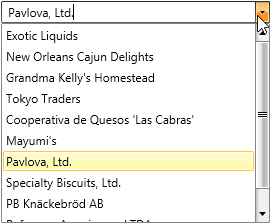
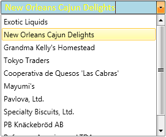

# TextBoxStyle
The new __TextBoxStyle__ property, introduced with the Q2 2014 release version of UI for WPFSilverlight, makes it really easy to customize the TextBox part of __RadComboBox__ when it is in editable mode. The purpose of this article is to show you how to apply a custom __TextBoxStyle__.

## Applying custom TextBoxStyle

Let's start with the following editable __RadComboBox__ definition with an ItemsSource bound to a collection of custom business objects:

#### __XAML__

{{region radcombobox-features-textboxstyle_1}}
	<telerik:RadComboBox ItemsSource="{Binding Agencies}" DisplayMemberPath="Name" IsEditable="True" />
{{endregion}}

__RadComboBox__ will look as shown on __Figure 1__.

Figure 1: RadComboBox without custom TextBoxStyle applied.

Now you will have to create a custom Style with TargetType TextBox which customizes the desired properties of the TextBox part of __RadComboBox__:

#### __XAML__

{{region radcombobox-features-textboxstyle_2}}
	<UserControl.Resources>
		
	</UserControl.Resources>
{{endregion}}

If you are using [Implicit Styles]() to style the controls, you would need to base that Style to the default __TextBoxStyle__ of __RadComboBox__ named _ComboBoxTextBoxStyle_.

#### __XAML__

{{region radcombobox-features-textboxstyle_4}}
	
{{endregion}}

The last step would be to simply set the custom style as __TextBoxStyle__ of __RadComboBox__:

#### __XAML__

{{region radcombobox-features-textboxstyle_3}}
	<telerik:RadComboBox ItemsSource="{Binding Agencies}" DisplayMemberPath="Name" IsEditable="True"
	                     TextBoxStyle="{StaticResource CustomComboTextBoxStyle}" />
{{endregion}}

You can see the final result on __Figure 2__.

Figure 2: RadComboBox with custom TextBoxStyle applied.

## See Also

 * [Implicit Styles]()

 * [SelectionBoxTemplate]()

 * [Binding to Object]()
