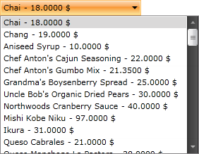

# Binding to ADO.NET Data Service

The purpose of this tutorial is to show you how to populate a __RadComboBox__ with data from an ADO.NET Data Service in two ways:[Using plain methods call in the code-behind](#Using_Plain_Methods_Call_in_the_Code-Behind)[Using MVVM approach](#using-mvvm-approach)

>This tutorial will use the __Northwind__ database, which can be downloaded from [here](http://www.microsoft.com/downloads/details.aspx?FamilyID=06616212-0356-46A0-8DA2-EEBC53A68034&displaylang=en).

Before proceeding further with this tutorial you need to create a new application and a __RadComboBox__ declaration in your XAML.

#### __XAML__

{{region radcombobox-populating-with-data-binding-adonet_0}}
	<telerik:RadComboBox x:Name="radComboBox"/>
{{endregion}}

## Using Plain Methods Call in the Code-Behind

* Add a reference to your ADO.NET Data Service. 

* Switch to the code-behind and add a reference to the __NorthwindEntities__ object.

#### __C#__

{{region radcombobox-populating-with-data-binding-adonet_1}}
	NorthwindEntities dbContext = new NorthwindEntities( new Uri( "Enter your service address here") );
{{endregion}}

#### __VB.NET__

{{region radcombobox-populating-with-data-binding-adonet_2}}
	Dim dbContext As New NorthwindEntities(New Uri("Enter your service address here"))
{{endregion}}

>tipFor more information about how to add a reference to an ADO.NET Data Service and how to create a new instance of the exposed entity, take a look at the [Consuming ADO.NET Data Service]() topic.

* The __ComboBox__ control will be populated with all __Products__ from the __Northwind__ database. In the drop-down list the __ProductName__ and the __UnitPrice__ properties will be displayed. Add the following code which will make the initial load of the objects.

#### __C#__

{{region radcombobox-populating-with-data-binding-adonet_3}}
	private void BeginRequest()
	{
	    DataServiceQuery<Products> query = dbContext.CreateQuery<Products>( "Products" );
	    query.BeginExecute( RequestCompleted, query );
	}
	
	private void RequestCompleted( IAsyncResult asyncResult )
	{
	    DataServiceQuery<Products> query = asyncResult.AsyncState as DataServiceQuery<Products>;
	    var products = query.EndExecute( asyncResult ).ToList();
	    this.radComboBox.ItemsSource = products;
	}
{{endregion}}

#### __VB.NET__

{{region radcombobox-populating-with-data-binding-adonet_4}}
	Private Sub BeginRequest()
	    Dim query As DataServiceQuery(Of Products) = dbContext.CreateQuery(Of Products)("Products")
	    query.BeginExecute(RequestCompleted, query)
	End Sub
	
	Private Sub RequestCompleted(ByVal asyncResult As IAsyncResult)
	    Dim query As DataServiceQuery(Of Products) = TryCast(asyncResult.AsyncState, DataServiceQuery(Of Products))
	    Dim products = query.EndExecute(asyncResult).ToList()
	    Me.radComboBox.ItemsSource = products
	End Sub
{{endregion}}

#### __C#__

{{region radcombobox-populating-with-data-binding-adonet_5}}
	this.radComboBox.ItemsSource = dbContext.Products.Execute();
{{endregion}}

#### __VB.NET__

{{region radcombobox-populating-with-data-binding-adonet_6}}
	Me.radComboBox.ItemsSource = dbContext.Products.Execute()
{{endregion}}

* You need to declare a custom __DataTemplate__ to determine how the items in the drop-down will look like. Add the following __DataTemplate__ declaration in your XAML resources.

#### __XAML__

{{region radcombobox-populating-with-data-binding-adonet_7}}
	<UserControl.Resources>
	    <DataTemplate x:Key="CustomItemTemplate">
	        <StackPanel Orientation="Horizontal">
	            <TextBlock Text="{Binding ProductName}"/>
	            <TextBlock Text=" - "/>
	            <TextBlock Text="{Binding UnitPrice}"/>
	            <TextBlock Text=" $"/>
	        </StackPanel>
	    </DataTemplate>
	</UserControl.Resources>
{{endregion}}

Find your __RadComboBox__ declaration and set the just declared __DataTemplate__ to its __ItemTemplate__ property.

#### __XAML__

{{region radcombobox-populating-with-data-binding-adonet_8}}
	<telerik:RadComboBox x:Name="radComboBox" ItemTemplate="{StaticResource CustomItemTemplate}"/>
{{endregion}}

Run your demo, the result can be seen on the next image:

## Using MVVM Approach

This section will show you how to populate your __RadComboBox__ control in a MVVM manner. The __RadComboBox__ will be bound to a data source object, that has a property __Products__. When the control is loaded all products from the __Products__ table in the Northwind database are loaded asynchronously.

* Create a new class named __NorthwindDataSource__.

#### __C#__

{{region radcombobox-populating-with-data-binding-adonet_9}}
	public class NorthwindDataSource
	{
	}
{{endregion}}

#### __VB.NET__

{{region radcombobox-populating-with-data-binding-adonet_10}}
	Public Class NorthwindDataSource
	End Class
{{endregion}}

* Add a reference to your ADO.NET Data Service.

* In the __NorthwindDataSource__ class add a reference to an __ObservableCollection__ of __Products__.

* In the __NorthwindDataSource__ class add a reference to the __NorthwindEntities__ object:

#### __C#__

{{region radcombobox-populating-with-data-binding-adonet_11}}
	public class NorthwindDataSource
	{
	    private static NorthwindEntities northwindEntity;
	
	    public NorthwindDataSource()
	    {
	        northwindEntity = new NorthwindEntities( new Uri( "Enter your service address here") );
	        this.Products = new ObservableCollection<Products>();
	    }
	
	    public ObservableCollection<Products> Products
	    {
	        get;
	        set;
	    }
	}
{{endregion}}

#### __VB.NET__

{{region radcombobox-populating-with-data-binding-adonet_12}}
	Public Class NorthwindDataSource
	    Private Shared northwindEntity As NorthwindEntities
	
	    Public Sub New()
	        northwindEntity = New NorthwindEntities(New Uri("Enter your service address here"))
	        Me.Products = New ObservableCollection(Of Products)()
	    End Sub
	
	Private _Products As ObservableCollection(Of Products)
	    Public Property Products() As ObservableCollection(Of Products)
	        Get
	            Return _Products
	        End Get
	        Set(ByVal value As ObservableCollection(Of Products))
	            _Products = value
	        End Set
	    End Property
	End Class
{{endregion}}

* Add the following code in the constructor of the __NorthwindDataSource__. It will make the initial load of all __Products__ from the database:

#### __C#__

{{region radcombobox-populating-with-data-binding-adonet_13}}
	northwindEntity.Products.BeginExecute(
	   ( IAsyncResult result ) => EntitiesLoaded<Products>( result, this.Products ),
	   northwindEntity.Products );
{{endregion}}

#### __VB.NET__

{{region radcombobox-populating-with-data-binding-adonet_14}}
	northwindEntity.Products.BeginExecute(Function(ByVal result As IAsyncResult) EntitiesLoaded(Of Products)(result, Me.Products), northwindEntity.Products)
{{endregion}}


And here is the code for the __EntitiesLoaded__ method:


#### __C#__

{{region radcombobox-populating-with-data-binding-adonet_15}}
	private static void EntitiesLoaded<T>( IAsyncResult result, Collection<T> entities )
	{
	   DataServiceQuery<T> query = result.AsyncState as DataServiceQuery<T>;
	   foreach ( T entity in query.EndExecute( result ) )
	   {
	       entities.Add( entity );
	   }
	}
{{endregion}}

#### __VB.NET__

{{region radcombobox-populating-with-data-binding-adonet_16}}
	Private Shared Sub EntitiesLoaded(Of T)(ByVal result As IAsyncResult, ByVal entities As Collection(Of T))
	    Dim query As DataServiceQuery(Of T) = TryCast(result.AsyncState, DataServiceQuery(Of T))
	    For Each entity As T In query.EndExecute(result)
	        entities.Add(entity)
	    Next
	End Sub
{{endregion}}

#### __C#__

{{region radcombobox-populating-with-data-binding-adonet_17}}
	foreach ( Products p in northwindEntity.Products.Execute() )
	{
	    this.Products.Add( p );
	}
{{endregion}}

#### __VB.NET__

{{region radcombobox-populating-with-data-binding-adonet_18}}
	For Each p As Products In northwindEntity.Products.Execute()
	    Me.Products.Add(p)
	Next
{{endregion}}

* Declare the __NorthwindDataSource__ object as a resource in your application.

#### __XAML__

{{region radcombobox-populating-with-data-binding-adonet_19}}
	<UserControl.Resources>
	    <example:NorthwindDataSource x:Key="DataSource"/>   
	</UserControl.Resources>
{{endregion}}

* Declare a custom __DataTemplate__ to determine how the items in the drop-down will look like. Add the following __DataTemplate__ declaration in your XAML resources.

#### __XAML__

{{region radcombobox-populating-with-data-binding-adonet_20}}
	<UserControl.Resources>
	    <DataTemplate x:Key="CustomItemTemplate">
	        <StackPanel Orientation="Horizontal">
	            <TextBlock Text="{Binding ProductName}"/>
	            <TextBlock Text=" - "/>
	            <TextBlock Text="{Binding UnitPrice}"/>
	            <TextBlock Text=" $"/>
	        </StackPanel>
	    </DataTemplate>
	
	    <example:NorthwindDataSource x:Key="DataSource"/>
	</UserControl.Resources>
{{endregion}}

* Update your __RadComboBox__ declaration - set the __ItemsSource__ and __ItemTemplate__ properties.

#### __XAML__

{{region radcombobox-populating-with-data-binding-adonet_21}}
	<telerik:RadComboBox x:Name="radComboBox"
	    ItemsSource="{Binding Source={StaticResource DataSource}, Path=Products}"
	    ItemTemplate="{StaticResource CustomItemTemplate}"/>
{{endregion}}

Run your demo, the result can be seen on the snapshot below:

## See Also

 * [DataBinding Support Overview]()

 * [Binding to Object]()

 * [Binding to WCF Service]()
