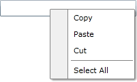

# Using Static Items

This tutorial will walk you through the common task of populating the __RadContextMenu__ with __RadMenuItems__ declaratively. 

Here is a regular __RadContextMenu__ declaration without items attached to a __TextBox__:


#### __XAML__

{{region xaml-radcontextmenu-populating-with-data-using-static-items_0}}
	<TextBox Width="200" VerticalAlignment="Top">
	    <telerik:RadContextMenu.ContextMenu>
	        <telerik:RadContextMenu>
	
	        </telerik:RadContextMenu>
	    </telerik:RadContextMenu.ContextMenu>
	</TextBox>
{{endregion}}



#### __XAML__

{{region xaml-radcontextmenu-populating-with-data-using-static-items_3}}
	<TextBox Width="200" VerticalAlignment="Top"
	         ContextMenu="{x:Null}">
	    <telerik:RadContextMenu.ContextMenu>
	        <telerik:RadContextMenu>
	
	        </telerik:RadContextMenu>
	    </telerik:RadContextMenu.ContextMenu>
	</TextBox>
{{endregion}}


In order to add items you need to use the __RadContextMenu's Items__ property. The __Items__ property is an __ItemCollection__ which contains your __RadMenuItems__. For example, take a look at the following lines.


#### __XAML__

{{region xaml-radcontextmenu-populating-with-data-using-static-items_1}}
	<TextBox Width="200" VerticalAlignment="Top">
	    <telerik:RadContextMenu.ContextMenu>
	        <telerik:RadContextMenu>
	            <telerik:RadMenuItem Header="Copy" />
	            <telerik:RadMenuItem Header="Paste" />
	            <telerik:RadMenuItem Header="Cut" />
	            <telerik:RadMenuItem IsSeparator="True" />
	            <telerik:RadMenuItem Header="Select All" />
	        </telerik:RadContextMenu>
	    </telerik:RadContextMenu.ContextMenu>
	</TextBox>
{{endregion}}


#### __XAML__

{{region xaml-radcontextmenu-populating-with-data-using-static-items_4}}
	<TextBox Width="200" VerticalAlignment="Top" ContextMenu="{x:Null}">
	    <telerik:RadContextMenu.ContextMenu>
	        <telerik:RadContextMenu>
	            <telerik:RadMenuItem Header="Copy" />
	            <telerik:RadMenuItem Header="Paste" />
	            <telerik:RadMenuItem Header="Cut" />
	            <telerik:RadMenuItem IsSeparator="True" />
	            <telerik:RadMenuItem Header="Select All" />
	        </telerik:RadContextMenu>
	    </telerik:RadContextMenu.ContextMenu>
	</TextBox>
{{endregion}}


Here is a snapshot of the current result.

>tipEach of the __RadMenuItems__ can have child items, that are defined in the same way.

The __RadMenuItem__ exposes an __Icon__ property, which allows you to specify an icon for it. Here is an example.


#### __XAML__

{{region xaml-radcontextmenu-populating-with-data-using-static-items_2}}
	<TextBox Width="200" VerticalAlignment="Top">
	    <telerik:RadContextMenu.ContextMenu>
	        <telerik:RadContextMenu>
	            <telerik:RadMenuItem Header="Copy">
	                <telerik:RadMenuItem.Icon>
	                    <Image Source="/Images/copy.png"
	                   Stretch="None" />
	                </telerik:RadMenuItem.Icon>
	            </telerik:RadMenuItem>
	            <telerik:RadMenuItem Header="Paste">
	                <telerik:RadMenuItem.Icon>
	                    <Image Source="/Images/paste.png"
	                   Stretch="None" />
	                </telerik:RadMenuItem.Icon>
	            </telerik:RadMenuItem>
	            <telerik:RadMenuItem Header="Cut">
	                <telerik:RadMenuItem.Icon>
	                    <Image Source="/Images/cut.png"
	                   Stretch="None" />
	                </telerik:RadMenuItem.Icon>
	            </telerik:RadMenuItem>
	            <telerik:RadMenuItem IsSeparator="True" />
	            <telerik:RadMenuItem Header="Select All" />
	        </telerik:RadContextMenu>
	    </telerik:RadContextMenu.ContextMenu>
	</TextBox>
{{endregion}}



#### __XAML__

{{region xaml-radcontextmenu-populating-with-data-using-static-items_5}}
	<TextBox Width="200" VerticalAlignment="Top" ContextMenu="{x:Null}">
	    <telerik:RadContextMenu.ContextMenu>
	        <telerik:RadContextMenu>
	            <telerik:RadMenuItem Header="Copy">
	                <telerik:RadMenuItem.Icon>
	                    <Image Source="/Images/copy.png"
	                   Stretch="None" />
	                </telerik:RadMenuItem.Icon>
	            </telerik:RadMenuItem>
	            <telerik:RadMenuItem Header="Paste">
	                <telerik:RadMenuItem.Icon>
	                    <Image Source="/Images/paste.png"
	                   Stretch="None" />
	                </telerik:RadMenuItem.Icon>
	            </telerik:RadMenuItem>
	            <telerik:RadMenuItem Header="Cut">
	                <telerik:RadMenuItem.Icon>
	                    <Image Source="/Images/cut.png"
	                   Stretch="None" />
	                </telerik:RadMenuItem.Icon>
	            </telerik:RadMenuItem>
	            <telerik:RadMenuItem IsSeparator="True" />
	            <telerik:RadMenuItem Header="Select All" />
	        </telerik:RadContextMenu>
	    </telerik:RadContextMenu.ContextMenu>
	</TextBox>
{{endregion}}


>tipConsider declaring menu items in XAML instead of adding them by code whenever it's possible. This includes situations when you know what items you need at design time.

# See Also

 * [Populating with Data - Overview]()

 * [Data Binding Support Overview]()

 * [Working with the RadContextMenu]()

 * [Binding to Dynamic Data]()

 * [Template and Style Selectors]()

 * [Handle Item Clicks]()
