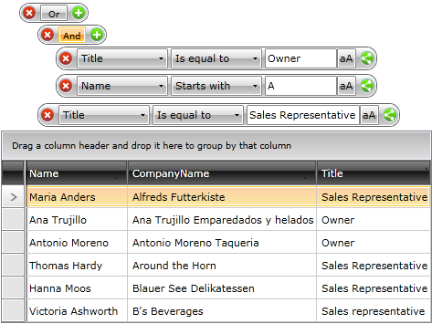

# Getting Started

__RadDataFilter__ is a control that allows you to filter your data. It allows you to create complex filter criteria within unlimited number of filter conditions combined by logical operators. You can easily add nested filter criteria by clicking on the button for adding nested operators. This topic will help you to quickly get started using this control. It will focus on the following:

* [Adding RadDataFilter](#adding-raddatafilter)

* [Configuring the RadDataFilter](#configuring-the-raddatafilter)

* [Filtering a Collection](#filtering-a-collection)

* [Filtering a RadGridView](#filter-radgridview)

* [Exposing the Filtered Collection](#exposing-the-filtered-collection)

## Adding RadDataFilter

In order to use __RadDataFilter__ in your project, you need to add references to the following assemblies:

* __Telerik.Windows.Controls.Data.dll__

* __Telerik.Windows.Controls.dll__

* __Telerik.Windows.Data.dll__

After adding references to the aforementioned dlls, you can declare a new __RadDataFilter__ as any normal Silverlight/WPF control.

>

To use the __RadDataFilter__ in the XAML you have to add the following namespace declaration:

#### __XAML__

{{region datafilter-getting-started_0}}

	xmlns:telerik="http://schemas.telerik.com/2008/xaml/presentation"
	{{endregion}}

#### __XAML__

{{region datafilter-getting-started_1}}

	<telerik:RadDataFilter x:Name="radDataFilter" />
	{{endregion}}

## Configuring the RadDataFilter

You can configure __RadDataFilter__ via the properties that it exposes. You can do the following:

* Use __DataAnotations__ to mark the members of your business objects. [Read more]()

* Use the __RadDataFilter__ in __Unbound Mode__. [Read more]()

* Access the __FilterDescriptors__ collection. [Read more]()

## Filtering a Collection

>

To learn more about the usage of the __Source__ and the __FilteredSource__ properties, please read [this topic]().

__RadDataFilter__ can filter any collection that implements the __IEnumerable__ interface. The only thing that you have to do is to pass the collection to its __Source__ property.

The collection in this example will hold business objects of type __Employee__. Here is the code for the __Employee__ class:

#### __C#__

{{region datafilter-getting-started_2}}

	public class Employee
	{
	    public Employee( string name, string companyName, string title )
	    {
	        this.Name = name;
	        this.CompanyName = companyName;
	        this.Title = title;
	    }
	    public string Name
	    {
	        get;
	        set;
	    }
	    public string CompanyName
	    {
	        get;
	        set;
	    }
	    public string Title
	    {
	        get;
	        set;
	    }
	}
	{{endregion}}

#### __VB.NET__

{{region datafilter-getting-started_3}}

	Public Class Employee
	 Public Sub New(name As String, companyName As String, title As String)
	  Me.Name = name
	  Me.CompanyName = companyName
	  Me.Title = title
	 End Sub
	 Public Property Name() As String
	  Get
	   Return m_Name
	  End Get
	  Set
	   m_Name = Value
	  End Set
	 End Property
	 Private m_Name As String
	 Public Property CompanyName() As String
	  Get
	   Return m_CompanyName
	  End Get
	  Set
	   m_CompanyName = Value
	  End Set
	 End Property
	 Private m_CompanyName As String
	 Public Property Title() As String
	  Get
	   Return m_Title
	  End Get
	  Set
	   m_Title = Value
	  End Set
	 End Property
	 Private m_Title As String
	End Class
	{{endregion}}

After that, you create your __RadDataFilter__.

#### __XAML__

{{region datafilter-getting-started_4}}

	<telerik:RadDataFilter x:Name="radDataFilter" />
	{{endregion}}

Prepare a simple collection of employees and pass it to the __Source__ property of the __RadDataFilter__.

#### __C#__

{{region datafilter-getting-started_5}}

	ObservableCollection<Employee> employees = new ObservableCollection<Employee>();
	employees.Add( new Employee( "Maria Anders", "Alfreds Futterkiste", "Sales Representative" ) );
	employees.Add( new Employee( "Ana Trujillo", "Ana Trujillo Emparedados y helados", "Owner" ) );
	employees.Add( new Employee( "Antonio Moreno", "Antonio Moreno Taqueria", "Owner" ) );
	employees.Add( new Employee( "Thomas Hardy", "Around the Horn", "Sales Representative" ) );
	employees.Add( new Employee( "Hanna Moos", "Blauer See Delikatessen", "Sales Representative" ) );
	employees.Add( new Employee( "Frederique Citeaux", "Blondesddsl pere et fils", "Marketing Manager" ) );
	employees.Add( new Employee( "Martin Sommer", "Bolido Comidas preparadas", "Owner" ) );
	employees.Add( new Employee( "Laurence Lebihan", "Bon app'", "Owner" ) );
	employees.Add( new Employee( "Elizabeth Lincoln", "Bottom-Dollar Markets", "Accounting manager" ) );
	employees.Add( new Employee( "Victoria Ashworth", "B's Beverages", "Sales representative" ) );
	this.radDataFilter.Source = employees;
	{{endregion}}

#### __VB.NET__

{{region datafilter-getting-started_6}}

	Dim employees As New ObservableCollection(Of Employee)()
	employees.Add(New Employee("Maria Anders", "Alfreds Futterkiste", "Sales Representative"))
	employees.Add(New Employee("Ana Trujillo", "Ana Trujillo Emparedados y helados", "Owner"))
	employees.Add(New Employee("Antonio Moreno", "Antonio Moreno Taqueria", "Owner"))
	employees.Add(New Employee("Thomas Hardy", "Around the Horn", "Sales Representative"))
	employees.Add(New Employee("Hanna Moos", "Blauer See Delikatessen", "Sales Representative"))
	employees.Add(New Employee("Frederique Citeaux", "Blondesddsl pere et fils", "Marketing Manager"))
	employees.Add(New Employee("Martin Sommer", "Bolido Comidas preparadas", "Owner"))
	employees.Add(New Employee("Laurence Lebihan", "Bon app'", "Owner"))
	employees.Add(New Employee("Elizabeth Lincoln", "Bottom-Dollar Markets", "Accounting manager"))
	employees.Add(New Employee("Victoria Ashworth", "B's Beverages", "Sales representative"))
	Me.radDataFilter.Source = employees
	{{endregion}}

After the collection has been passed to the __Source__ property, the user will be able to filter it via the __RadDataFilter__'s UI. In order to learn how to access the filtered collection, please read the next section.

## Filter RadGridView

__RadGridView__ can be filtered through its __RadGridView.Items__ collection. The collection in this example holds business objects of type Employee. You should pass it to the __ItemsSource__ property of __RadGridView__. After that, you can create your __RadDataFilter__ and bind its __RadDataFilter.Source__ property to the RadGridView.Items collection using ElementName Binding.
        

#### __XAML__

{{region datafilter-getting-started_7}}

	<Grid x:Name="LayoutRoot"
	        Background="White">
	    <Grid.RowDefinitions>
	        <RowDefinition Height="Auto" />
	        <RowDefinition />
	    </Grid.RowDefinitions>
	    <telerik:RadDataFilter x:Name="radDataFilter"
	                           Source="{Binding Items, ElementName=radGridView}"/>
	    <telerik:RadGridView x:Name="radGridView"
	                         ItemsSource="{Binding Employees}"
	                         AutoGenerateColumns="False"
	                         IsFilteringAllowed="False"
	                         Grid.Row="1">
	        <telerik:RadGridView.Columns>
	            <telerik:GridViewDataColumn DataMemberBinding="{Binding Name}" />
	            <telerik:GridViewDataColumn DataMemberBinding="{Binding CompanyName}" />
	            <telerik:GridViewDataColumn DataMemberBinding="{Binding Title}" />
	        </telerik:RadGridView.Columns>
	    </telerik:RadGridView>
	</Grid>
	{{endregion}}

>You __can't use__ both RadDataFilter and RadGridView's __built in filtering__  because they are automatically synchronized with each other.
          

## Exposing the Filtered Collection

The filtered collection inside the __RadDataFilter__ can be accessed via the __FilteredSource__ property. It exposes this set of data matching to the current filter criteria. Here is an example of a __ListBox__ that displays the data filtered by the __RadDataFilter__.

#### __XAML__

{{region datafilter-getting-started_8}}

	<Grid x:Name="LayoutRoot"
	        Background="White">
	    <Grid.RowDefinitions>
	        <RowDefinition Height="Auto" />
	        <RowDefinition />
	    </Grid.RowDefinitions>
	    <telerik:RadDataFilter x:Name="radDataFilter"/>
	    <ListBox ItemsSource="{Binding FilteredSource,ElementName=radDataFilter}"
	             Grid.Row="1"/>
	</Grid>
	{{endregion}}

## See Also

 * [Visual Structure]()

 * [End User Manual]()

 * [Styles and Templates - Overview]()
