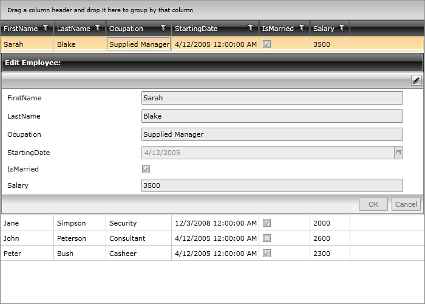

# Integrate RadDataForm with RadGridView

The __RadDataForm__ is may be fully integrated with the __RadGridView__ control. A great implementation would be to benefit from it in the RowDetails representation. 

For the purpose of this tutorial we will first create a class - Employee. In order to update the items of the grid once the corresponding field in the RadDataForm has been changed, we will implement the **INotifyPropertyChanged** Interface.

#### __[C#] Example 1: Creating an Employee class that implements INotifyPropertyChanged__

	{{region raddataform-integrate-with-radgridview_0}}
	public class Employee : INotifyPropertyChanged
	 {  
	  public event PropertyChangedEventHandler PropertyChanged;
	  private string firstName;
	  private string lastName;
	  private string ocupation;
	  private DateTime startingDate;
	  private bool isMarried;
	  public string FirstName
	  {
	   get { return this.firstName; }
	   set
	   {
	    if (value != this.firstName)
	    {
	     this.firstName = value;
	     this.OnPropertyChanged("FirstName");
	    }
	   }
	  }
	  public string LastName
	  {
	   get { return this.lastName; }
	   set
	   {
	    if (value != this.lastName)
	    {
	     this.lastName = value;
	     this.OnPropertyChanged("LastName");
	    }
	   }
	  }
	  public string Ocupation
	  {
	   get { return this.ocupation; }
	   set
	   {
	    if (value != this.ocupation)
	    {
	     this.ocupation = value;
	     this.OnPropertyChanged("Ocupation");
	    }
	   }
	  }
	  public DateTime StartingDate
	  {
	   get { return this.startingDate; }
	   set
	   {
	    if (value != this.startingDate)
	    {
	     this.startingDate = value;
	     this.OnPropertyChanged("StartingDate");
	    }
	   }
	  }
	  public bool IsMarried
	  {
	   get
	   {
	    return this.isMarried;
	   }
	   set
	   {
	    if (this.isMarried != value)
	    {
	     this.isMarried = value;
	     this.OnPropertyChanged("IsMarried");
	    }
	   }
	  }
	  private int salary;
	  public int Salary
	  {
	   get
	   {
	    return this.salary;
	   }
	   set
	   {
	    if (this.salary != value)
	    {
	     this.salary = value;
	     this.OnPropertyChanged("Salary");
	    }
	   }
	  }
	  public Employee()
	  { }
	
	  protected virtual void OnPropertyChanged(PropertyChangedEventArgs args)
	  {
	   PropertyChangedEventHandler handler = this.PropertyChanged;
	   if (handler != null)
	   {
	    handler(this, args);
	   }
	  }
	  private void OnPropertyChanged(string propertyName)
	  {
	   this.OnPropertyChanged(new PropertyChangedEventArgs(propertyName));
	  }
	
	  public static ObservableCollection<Employee> GetEmployees()
	  {
	   ObservableCollection<Employee> employees = new ObservableCollection<Employee>();
	   employees.Add(new Employee() { FirstName = "Sarah", LastName = "Blake", Ocupation = "Supplied Manager", StartingDate = new DateTime(2005, 04, 12), IsMarried = true, Salary = 3500 });
	   employees.Add(new Employee() { FirstName = "Jane", LastName = "Simpson", Ocupation = "Security", StartingDate = new DateTime(2008, 12, 03), IsMarried = true, Salary = 2000 });
	   employees.Add(new Employee() { FirstName = "John", LastName = "Peterson", Ocupation = "Consultant", StartingDate = new DateTime(2005, 04, 12), IsMarried = false, Salary = 2600 });
	   employees.Add(new Employee() { FirstName = "Peter", LastName = "Bush", Ocupation = "Casheer", StartingDate = new DateTime(2005, 04, 12), IsMarried = true, Salary = 2300 });
	   return employees;
	  }
	 }
	{{endregion}}

#### __[VB.NET] Example 1: Creating an Employee class that implements INotifyPropertyChanged__

	{{region raddataform-integrate-with-radgridview_0}}
	Public Class Employee
        Implements INotifyPropertyChanged
        Public Event PropertyChanged As PropertyChangedEventHandler
        Private m_firstName As String
        Private m_lastName As String
        Private m_ocupation As String
        Private m_startingDate As DateTime
        Private m_isMarried As Boolean
        Public Property FirstName() As String
            Get
                Return Me.m_firstName
            End Get
            Set(value As String)
                If value <> Me.m_firstName Then
                    Me.m_firstName = value
                    Me.OnPropertyChanged("FirstName")
                End If
            End Set
        End Property
        Public Property LastName() As String
            Get
                Return Me.m_lastName
            End Get
            Set(value As String)
                If value <> Me.m_lastName Then
                    Me.m_lastName = value
                    Me.OnPropertyChanged("LastName")
                End If
            End Set
        End Property
        Public Property Ocupation() As String
            Get
                Return Me.m_ocupation
            End Get
            Set(value As String)
                If value <> Me.m_ocupation Then
                    Me.m_ocupation = value
                    Me.OnPropertyChanged("Ocupation")
                End If
            End Set
        End Property
        Public Property StartingDate() As DateTime
            Get
                Return Me.m_startingDate
            End Get
            Set(value As DateTime)
                If value <> Me.m_startingDate Then
                    Me.m_startingDate = value
                    Me.OnPropertyChanged("StartingDate")
                End If
            End Set
        End Property
        Public Property IsMarried() As Boolean
            Get
                Return Me.m_isMarried
            End Get
            Set(value As Boolean)
                If Me.m_isMarried <> value Then
                    Me.m_isMarried = value
                    Me.OnPropertyChanged("IsMarried")
                End If
            End Set
        End Property
        Private m_salary As Integer
        Public Property Salary() As Integer
            Get
                Return Me.m_salary
            End Get
            Set(value As Integer)
                If Me.m_salary <> value Then
                    Me.m_salary = value
                    Me.OnPropertyChanged("Salary")
                End If
            End Set
        End Property
        Public Sub New()
        End Sub

        Protected Overridable Sub OnPropertyChanged(args As PropertyChangedEventArgs)
            Dim handler As PropertyChangedEventHandler = Me.PropertyChanged
            RaiseEvent handler(Me, args)
        End Sub
        Private Sub OnPropertyChanged(propertyName As String)
            Me.OnPropertyChanged(New PropertyChangedEventArgs(propertyName))
        End Sub

        Public Shared Function GetEmployees() As ObservableCollection(Of Employee)
            Dim employees As New ObservableCollection(Of Employee)()
            employees.Add(New Employee() With { _
             .FirstName = "Sarah", _
             .LastName = "Blake", _
             .Ocupation = "Supplied Manager", _
             .StartingDate = New DateTime(2005, 4, 12), _
             .IsMarried = True, _
             .Salary = 3500 _
            })
            employees.Add(New Employee() With { _
              .FirstName = "Jane", _
              .LastName = "Simpson", _
              .Ocupation = "Security", _
              .StartingDate = New DateTime(2008, 12, 3), _
              .IsMarried = True, _
              .Salary = 2000 _
            })
            employees.Add(New Employee() With { _
             .FirstName = "John", _
             .LastName = "Peterson", _
             .Ocupation = "Consultant", _
             .StartingDate = New DateTime(2005, 4, 12), _
             .IsMarried = False, _
             .Salary = 2600 _
            })
            employees.Add(New Employee() With { _
             .FirstName = "Peter", _
             .LastName = "Bush", _
             .Ocupation = "Casheer", _
             .StartingDate = New DateTime(2005, 4, 12), _
             .IsMarried = True, _
             .Salary = 2300 _
            })
            Return employees
        End Function
    End Class
	{{endregion}}

The definition of the of the RadGridView may be as follows:

#### __[XAML] Example 2: Defining the RadGridView__

	{{region raddataform-integrate-with-radgridview_1}}
	<telerik:RadGridView x:Name="RadGridView1" IsReadOnly="True" ItemsSource="{Binding Employees}" 
	                             CanUserFreezeColumns="False" RowIndicatorVisibility="Collapsed" 
	                             Height="500"  Width="700"
	                             RowDetailsVisibilityMode="VisibleWhenSelected">
	 <telerik:RadGridView.RowDetailsTemplate>
	  <DataTemplate>
	   <telerik:RadDataForm x:Name="myRadDataForm" CurrentItem="{Binding}" Header="Edit Employee:" />
	  </DataTemplate>
	 </telerik:RadGridView.RowDetailsTemplate>
	</telerik:RadGridView>
	{{endregion}}

Afterwards, all you have to do is to set the ItemsSource of the grid:

#### __[C#] Example 3: Setting the RadGridView's ItemsSource__

	{{region raddataform-integrate-with-radgridview_2}}
	this.RadGridView1.ItemsSource = Employee.GetEmployees();
	{{endregion}}

#### __[VB.NET] Example 3: Setting the RadGridView's ItemsSource__

	{{region raddataform-integrate-with-radgridview_2}}
	Me.RadGridView1.ItemsSource = Employee.GetEmployees()
	{{endregion}}

Once you define all the required parts, you will see the following:

#### __Figure 1: RadDataForm integrated with RadGridView__

As mentioned previously, the implementation of the INotifyPropertyChanged Interface ensures that the changes made while editing with the RadDataForm will be immediately reflected in the corresponding item. 

