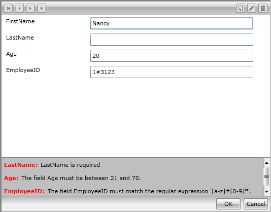

# Item level attribute-based validation

By validating the data, you can control what data is entered in the fields of the data form.
    
Aside from the __property level__ validation, RadDataForm performs __item level__ validation process, based on property __attributes__. This logic is executed in any occasions when changes are committed (including the execution of navigation or AddNew commands, when AutoCommit is True). This feature is available for both auto-generated and customized fields and all of the **System.ComponentModel.DataAnnotations** validation attributes are supported on equal scale.

#### __Figure 1: 

>As seen on the picture, item level validation errors are not respected by separate editor’s validation features (i.e. __no validation tooltip__ on TextBox). Such behavior is expected, as respective bindings never get notified about these errors. 

First we need to include the System.ComponentModel.DataAnnotations namespace:

#### __[C#] Example 1: Including System.ComponentModel.DataAnnotations__

	{{region cs-raddataform-validation-item-level_0}}
	    using System.ComponentModel.DataAnnotations;
	{{endregion}}

#### __[VB.NET] Example 1: Including System.ComponentModel.DataAnnotations__

	{{region vb-raddataform-validation-item-level_0}}
	    Imports System.ComponentModel.DataAnnotations
	{{endregion}}

Now we can define a simple Employee class with validation attributes.

#### __[C#] Example 2: Creating an Employee class with validation attributes__

	{{region cs-raddataform-validation-item-level_1}}
	    public class Employee
	    {
	        [Required]
	        public string FirstName { get; set; }
	
	        [Required(ErrorMessage = "LastName is required")]
	        public string LastName { get; set; }
	
	        [Range(21, 70)]
	        public int Age { get; set; }
	
	        [RegularExpression("[a-z]#[0-9]*")]
	        public string EmployeeID { get; set; }
	    }
	{{endregion}}

#### __[VB.NET] Example 2: Creating an Employee class with validation attributes__

	{{region vb-raddataform-validation-item-level_1}}
	    Public Class Employee
	        <Required()> _
	        Public Property FirstName() As String
	            Get
	                Return m_FirstName
	            End Get
	            Set(value As String)
	                m_FirstName = Value
	            End Set
	        End Property
	        Private m_FirstName As String
	
	        <Required(ErrorMessage:="LastName is required")> _
	        Public Property LastName() As String
	            Get
	                Return m_LastName
	            End Get
	            Set(value As String)
	                m_LastName = Value
	            End Set
	        End Property
	        Private m_LastName As String
	
	        <Range(21, 70)> _
	        Public Property Age() As Integer
	            Get
	                Return m_Age
	            End Get
	            Set(value As Integer)
	                m_Age = Value
	            End Set
	        End Property
	        Private m_Age As Integer
	
	        <RegularExpression("[a-z]#[0-9]*")> _
	        Public Property EmployeeID() As String
	            Get
	                Return m_EmployeeID
	            End Get
	            Set(value As String)
	                m_EmployeeID = Value
	            End Set
	        End Property
	        Private m_EmployeeID As String
	    End Class
	{{endregion}}

Please, have in mind that __those errors are removed from the validation summary__ on the next committing operation, __unlike the property level ones__, which are removed on property change. 
