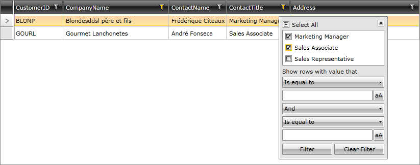

# Filtering through RadGridView

## 

If you bind RadGridView.ItemsSource to RadDataServiceDataSource.DataView, you will get automatic server-side filtering. When the user defines his filtering criteria through RadGridView’s UI, RadGridView will automatically transfer the resulting FilterDescriptors to RadDataServiceDataSource. If RadDataServiceDataSource.AutoLoad is true, the control will automatically go to the server and get the data that matches these FilterDescriptors:

#### __XAML__

{{region raddataservicedatasource-filtering-filtering-through-radgridview_0}}
	<Grid x:Name="LayoutRoot" Background="White">
	 <telerik:RadDataServiceDataSource Name="customersDataSource" QueryName="Customers" AutoLoad="True">
	  <telerik:RadDataServiceDataSource.DataServiceContext>
	   <local:MyNorthwindContext/>
	  </telerik:RadDataServiceDataSource.DataServiceContext>
	 </telerik:RadDataServiceDataSource>
	 <telerik:RadGridView Grid.Row="0" ItemsSource="{Binding DataView, ElementName=customersDataSource}" 
	      IsBusy="{Binding IsBusy, ElementName=customersDataSource}" 
	    ShowGroupPanel="False"/>  
	</Grid>
	{{endregion}}

Performing the filtering operation from the UI of the RadGridView should be as follows:

         
      

