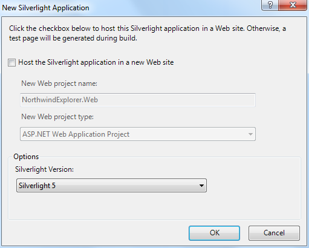
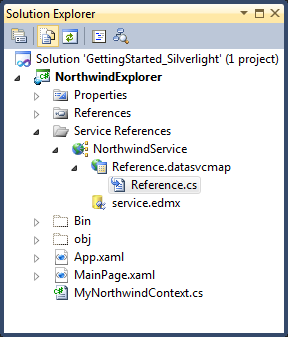

# Creating the Client Application

## 

Once you have created the Server Application, you may start developing the Client one. 

To display the data from the WCF Data Service, create a new WPF application with a data source that is based on the service. Later in this walk-through, you will add data-bound controls to the application.

1. In __Solution Explorer__, right-click the solution node, click __Add__, and select __New Project__.

1. In the __New Project__ dialog, expand __Visual C#__ or __Visual Basic__, and then select __Windows__.

1. Select the __WPF Application__ project template.

1. In the __Name__ box, type NorthwindExplorer and click __OK__. Visual Studio adds the NorthwindExplorer project to the solution.

1. On the __Data__ menu, click __Show Data Sources__. The __Data Sources__ window opens.

1. In the __Data Sources__ window, click __Add New Data Source__. The __Data Source Configuration Wizard__ opens.

1. In the __Choose a Data Source Type__ page of the wizard, select __Service__ and then click __Next__.

1. In the __Address__ box, type [http://services.odata.org/Northwind/Northwind.svc](http://services.odata.org/Northwind/Northwind.svc) and then click __Go__.

1. Visual Studio searches the specified address for available services, and adds NorthwindEntities to the list of available services in the __Services__ box.

1. In the __Namespace__ box, type NorthwindService.

1. In the __Services__ box, click __NorthwindEntities__ and then click __OK__. Visual Studio downloads the service information and then returns to the __Data Source Configuration Wizard__. 

1. In the __Add Service Reference__ page, click __Finish__.  Visual Studio adds nodes that represent the data returned by the service to the __Data Sources__ window. 

1. On the __Project__ menu, click __Add Class__.

1. Change the name to MyNorthwindContext, and click __Add__. 

1. Replace the class declaration with the following code:

#### __C#__

{{region raddataservicedatasource-getting-started-creating-the-client-application_0}}
	public class MyNorthwindContext : NorthwindEntities
	{
	 public MyNorthwindContext() : base(new Uri("http://services.odata.org/Northwind/Northwind.svc", UriKind.Absolute)){}
	}
	{{endregion}}

#### __VB.NET__

{{region raddataservicedatasource-getting-started-creating-the-client-application_1}}
	Public Class MyNorthwindContext
	 Inherits NorthwindEntities
	 Public Sub New()
	  MyBase.New(New Uri("http://services.odata.org/Northwind/Northwind.svc", UriKind.Absolute))
	 End Sub
	End Class
	{{endregion}}

When we added the Service Reference, Visual Studio generated a hidden file that contains all client-side proxy classes. You can find this file if you tell the Solution Explorer to “Show All Files” and then drill-down in the Service References node all the way to the file called Reference. When you use the Add Service Reference dialog to add a data service to an application, an entity container class is created that inherits from the DataServiceContext class. This class includes properties that return typed DataServiceQuery instances. In this case this class is called NorthwindEntities and we have further derived from it in order to specify the Uri where it should get its data from. This was done so we can easily declare RadDataServiceDataSource.DataServiceContext in XAML later on.



To display the data from the WCF Data Service, create a new Silverlight application with a data source that is based on the service. Later in this walk-through, you will add data-bound controls to the application.

1. In Solution Explorer, right-click the solution node, click Add, and select New Project.

1. In the New Project dialog, expand Visual C# or Visual Basic, and then select Silverlight.

1. Select the Silverlight Application project template.

1. In the Name box, type NorthwindExplorer and click OK. The New Silverlight Application Wizard opens.

1. Uncheck the Web site check-box and click OK. Visual Studio adds the NorthwindExplorer project to the solution.

               
            

1. On the Data menu, click Show Data Sources. The Data Sources window opens.

1. In the Data Sources window, click Add New Data Source. The Data Source Configuration Wizard opens.

1. In the Choose a Data Source Type page of the wizard, select Service and then click Next.

1. 
              In the Address box, type
              [http://services.odata.org/Northwind/Northwind.svc](http://services.odata.org/Northwind/Northwind.svc)
              and then click Go.
            

1. Visual Studio searches the specified address for available services, and adds NorthwindEntities to the list of available services in the Services box.

1. In the Namespace box, type NorthwindService.

1. In the Services box, click NorthwindEntities and then click OK. Visual Studio downloads the service information and then returns to the Data Source Configuration Wizard.

1. In the Add Service Reference page, click Finish.  Visual Studio adds nodes that represent the data returned by the service to the Data Sources window.

1. On the Project menu, click Add Class.

1. Change the name to MyNorthwindContext, and click Add.

1. Replace the class declaration with the following code:

#### __C#__

{{region raddataservicedatasource-getting-started-creating-the-client-application_2}}
	public class MyNorthwindContext : NorthwindEntities
	{
	 public MyNorthwindContext() : base(new Uri("http://services.odata.org/Northwind/Northwind.svc", UriKind.Absolute)){}
	}
	{{endregion}}

#### __VB.NET__

{{region raddataservicedatasource-getting-started-creating-the-client-application_3}}
	Public Class MyNorthwindContext
	 Inherits NorthwindEntities
	 Public Sub New()
	  MyBase.New(New Uri("http://services.odata.org/Northwind/Northwind.svc", UriKind.Absolute))
	 End Sub
	End Class
	{{endregion}}

When we added the Service Reference, Visual Studio generated a hidden file that contains all client-side proxy classes. You can find this file if you tell the Solution Explorer to “Show All Files” and then drill-down in the Service References node all the way to the file called Reference. When you use the Add Service Reference dialog to add a data service to an application, an entity container class is created that inherits from the DataServiceContext class. This class includes properties that return typed DataServiceQuery instances. In this case this class is called NorthwindEntities and we have further derived from it in order to specify the Uri where it should get its data from. This was done so we can easily declare RadDataServiceDataSource.DataServiceContext in XAML later on.

         
      

See Also

[Creating the Server Application]()

[Creating the Data-bound Controls]()


