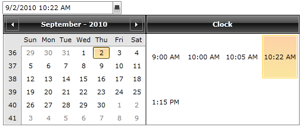

# Clock Items

You can limit the time items available in the clock view of your __RadDateTimePicker__ control in several ways. This topic explains how to achieve this, going through the following features:

* [Using the StartTime, EndTime and TimeInterval features](#using-the-starttime-endtime-and-timeinterval-features)

* [Setting a custom ClockItemsSource for the clock view](#setting-a-custom-clockitemssource-for-the-clock-view)

## Using the StartTime, EndTime and TimeInterval features

If you want to slightly change the default time items in the __RadDateTimePicker__ control's view you can use the following properties:

* __StartTime__ - it is of type __TimeSpan__ and represents the starting time of the clock's items.

* __EndTime__ - it is also of type __TimeSpan__ and corresponds to the time of the last clock item.

The default value for the __StartTime__ property is equal to 12:00AM and the value for the __EndTime__ is 11:00PM. The default time interval is equal to one hour. You can change its default value by setting the value of the __TimeInterval__ property.

Here is demonstrated how to change these properties in XAML:

#### __XAML__

{{region xaml-raddatetimepicker-features-clock-items_0}}
	<telerik:RadDateTimePicker StartTime="12:00" EndTime="18:00" TimeInterval="0:30"/>
	{{endregion}}

>The __TimeInterval__ property is also of type __TimeSpan__. In this example you set its value to 30 minutes, this is why you need to set the __TimeInterval__ to 0:30, meaning 0 hours and 30 minutes. You can also achieve the same result in code-behind.

Here is the result:
         

## Setting a custom ClockItemsSource for the clock view

If you want to completely change the set of clock items you can use the __ClockItemsSource__ property. It provides you with a simple way to specify the clock's items. Like with any other __ItemsControls__ you can use data binding to provide your set of items.

For the purpose of the next example the __ClockItemsSource__ property is set in the code behind. However, you can also set it through binding.

#### __C#__

{{region cs-raddatetimepicker-features-clock-items_1}}
	public ClockItemsSample()
	{
	    InitializeComponent();
	    this.radDateTimePicker.ClockItemsSource = this.LoadDataObjects();
	}
	public ObservableCollection<TimeSpan> LoadDataObjects()
	{
	    ObservableCollection<TimeSpan> times = new ObservableCollection<TimeSpan>()
	    {
	        new TimeSpan(9,0,0),
	        new TimeSpan(10,0,0),
	        new TimeSpan(10,5,0),
	        new TimeSpan(10,22,0),
	        new TimeSpan(13,15,0)
	    };
	    return times;
	}
{{endregion}}

#### __VB.NET__

{{region vb-raddatetimepicker-features-clock-items_2}}
	Public Sub New()
	 InitializeComponent()
	 Me.radDateTimePicker.ClockItemsSource = Me.LoadDataObjects()
	End Sub
	Public Function LoadDataObjects() As ObservableCollection(Of TimeSpan)
	 Dim times As New ObservableCollection(Of TimeSpan)() With {
	  New TimeSpan(9, 0, 0),
	  New TimeSpan(10, 0, 0),
	  New TimeSpan(10, 5, 0),
	  New TimeSpan(10, 22, 0),
	  New TimeSpan(13, 15, 0)
	 }
	 Return times
	End Function
{{endregion}}

Here is the result:
         

# See Also

 * [Overview]()

 * [Visual Structure]()

 * [Date Items]()

 * [Selection]()

 * [Formatting]()
