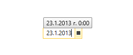
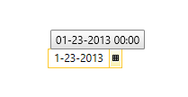

# How to set different culture

In many scenarios it is useful to set a specific Culture in your application that differs from the Culture of the environment. In those cases the easiest and straight forward approach is to set the __CurrentCulture__ and __CurrentUICulture__ to the desired custom __CultureInfo__.
            

The __RadDateTimePicker__ control uses that Culture in order to parse the input date and time that is added in the TextBox of the control.
            

## Setting different CurrentCulture and CurrentUICulture

The next code snippet demonstrates how to set the CurrentCulture and CurrentUICulture to US culture:
                

#### __C#__

{{region raddatetimepicker-how-to-set-culture-1}}
	InitializeComponent();
	
	var culture = new CultureInfo("en-US");
	Thread.CurrentThread.CurrentCulture = culture;
	Thread.CurrentThread.CurrentUICulture = culture;
	{{endregion}}

The next figures show the difference with the custom en-US culture and the normal environment culture (which in this case is bg-BG):
                

                        Figure 1. With the custom en-US set
                    

                        Figure 2. With the normal environment culture
                    

## Setting Custom DateTimeFormat

If you want to customize the patter of the ShortDatePattern and ShortTimePattern all you need to do is:
                

* Create a CultureInfo object and set it to the desired culture
                        

* Create a DateTimeFormatInfo object and set its ShortDatePattern, ShortTimePattern
                        

* Set newly created CultureInfo to the CurrentCulture and CurrentUICulture
                        

The next code snippet shows how to set the date pattern in order to change the date separator from “/” to “-”:
                

>In order for the parsing of the input date to be correct you need to make sure that the __DateSeparator__ is set to the desired symbol in the ShortDatePattern.
                        

#### __C#__

{{region raddatetimepicker-how-to-set-culture-2}}
	InitializeComponent();
	
	var culture = new CultureInfo("en-US");
	var dtfInfo = new DateTimeFormatInfo
	{
	    ShortDatePattern = "MM-dd-yyyy",
	    ShortTimePattern = "HH:mm",
	    DateSeparator = "-"
	};
	culture.DateTimeFormat = dtfInfo;
	Thread.CurrentThread.CurrentCulture = culture;
	Thread.CurrentThread.CurrentUICulture = culture;
	{{endregion}}



#### __C#__

{{region raddatetimepicker-how-to-set-culture-3}}
	InitializeComponent();
	
	var culture = new CultureInfo("en-US");
	var dtfInfo = new DateTimeFormatInfo
	{
	    ShortDatePattern = "MM-dd-yyyy",
	    ShortTimePattern = "HH:mm"
	};
	culture.DateTimeFormat = dtfInfo;
	Thread.CurrentThread.CurrentCulture = culture;
	Thread.CurrentThread.CurrentUICulture = culture;
	{{endregion}}



The next figure shows the final result:
                

                        Figure 3. Setting US culture with custom ShortDate/TimePattern
                    
