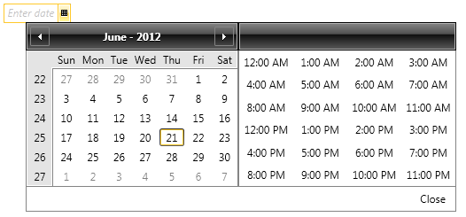
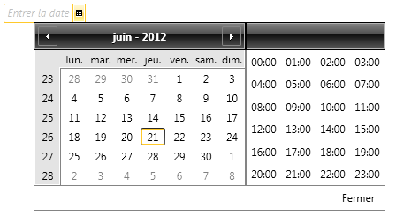

# Localization

The built-in localization mechanism in Silverlight and WPF allows you to localize any string resource used by the RadDateTimePicker control. Once translated, you might use your resources in both Silverlight and WPF projects without changing anything.      	

>tipTo learn more about the ways to localize the RadControls please read the common topic about [Localization](http://www.telerik.com/help/silverlight/common-localization.html)[Localization](http://www.telerik.com/help/wpf/common-localization.html).       	

In __RadDatetimePicker__ you can localize the Enter date message, Close link and  Error tooltip:

The next images show the DateTimePicker localized in French:

>The days of the week and months are automatically localized by the DateTime class using the current culture settings of the application.
        	

## Resource Keys    
   
The resources of the control can be localized by using an unique identifier called resource key that is assigned to each localizable string. Below you may find a list of the Resources available and their default values:    	
		
Key | Value
---|---
Close | Close 
EnterDate | Enter Date 
Error | Error