# Connections

This tutorial will walk you through the functionality and the main features of the __RadDiagramConnection__. It contains the following sections:
	  

* [Overview](#overview)

* [Configure the Source and Target of a Connection](#configure-the-source-and-target-of-a-connection)

* [Connection Types](#connection-types)

* [CapTypes](#captypes)

* [Connection Content](#set-content)

* [Customize the Connection Appearance](#customize-the-connection-appearance)

* [Connection Edit Mode](#connection-edit-mode)

* [Connection Bridges](#connection-bridge)

* [Connection Selection State](#connection-selection-state)

* [Connection ZIndex](#connection-zindex)

* [Connection Bounds](#connection-bounds)

## Overview

>Please note that the examples in this tutorial are showcasing Telerik Windows8 theme. In the
			[Setting a Theme](http://www.telerik.com/help/silverlight/common-styling-apperance-setting-theme.html#Setting_Application-Wide_Built-In_Theme_in_the_Code-Behind)[Setting a Theme](http://www.telerik.com/help/wpf/common-styling-apperance-setting-theme-wpf.html#Setting_Application-Wide_Built-In_Theme_in_the_Code-Behind)
			article you can find more information on how to set an application-wide theme.
		  

The __RadDiagramConnection__ is basically an object that connects zero, one or two shapes:
		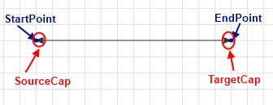

You can use its extensive API to configure its source and target points or shapes. You can choose from a list of predefined cap types thus customizing the start and end point of the connection to better fit in your application scenario. You can also control the type of a connection using the ConnectionType property, add a custom content and customize the overall look and feel of the items.
		

## Configure the Source and Target of a Connection

You can configure the source and the target of a connection as a point or as a shape. The __RadDiagramConnection__ class exposes the following properties that allow you to control the start and end points of a connection:
		

* __StartPoint/EndPoint__ - these properties are of type __Point__ and they set or get the start/end point of a connection.
			

* __Source/Target__ - these properties get or set the source/target __RadDiagramShape__ of a connection.
			

* __SourceConnectorPosition/TargetConnectorPosition__ - both properties are of type __string__ and they get or set the source/target connector position.
			

>You can find more information about the __RadDiagramShape__ connectors in the [DiagramShapes]() topic.
			  There are five predefined strings that you can use to define where to position the connectors of the connection:
			

* __Auto__ -  use it if you want to automatically determine the start/end point of a connection. This option will allow the connection to dynamically determine which shape connector to be used as a start/end point. Based on the end point position, the __SourceConnectorPosition__ will be set to the nearest shape connector. Alternatively, the __TargetConnectorPosition__ will be set to the nearest shape connector, based on the start point position of the connection.
				

* __Left__ - use it to define the left connector of a shape as the source/target point of the connection
				

* __Top__ - use it to define the top connector of a shape as the source/target point of the connection
				

* __Right__ - use it to define the right connector of a shape as the source/target point of the connection
				

* __Bottom__ - use it to define the bottom connector of a shape as the source/target point of the connection
				

>tipThe __Diagramming Framework__ provides a __ConnectorPosition__ static class, which you can use to define the connector positions from code-behind:
			  
				  using Telerik.Windows.Diagrams.Core;
				
				  this.xDiagram.Connections[0].SourceConnectorPosition = ConnectorPosition.Bottom;
				

* __SourceCapSize/TargetCapSize__ - these properties are of type __Size__ and they get or set the size of the __SourceCap/TargetCap__.
			

* __SourceCapType/TargetCapType__ - both properties are an enumeration of type __CapType__ that allow you to choose a cap from a set of predefined Cap types. For more detailed information, please, view the [CapTypes](#captypes) section below.
			

You can also attach a connection to a source and target shape using the __RadDiagramConnection.Attach()__ method. It defines the following parameters:
		

* __source of type IConnector__ - required parameter that sets the __Source__ of the connection.
			

* __target of type IConnector__ - required parameter that sets the __Target__ of the connection.
			

## Connection Types

You can control the connection type through the __ConnectionType__ property. As an enumeration of type  __Telerik.Windows.Diagrams.Core.ConnectionType__, it exposes the following members:
		

* __Polyline__ - this type allows you to define multiple points a connection has to pass through. By default such a connection have two points it has to pass through - its source connector(or __StartPoint__) and its target connector(or __EndPoint__). This is why by default the __Polyline ConnectionType__visualizes a straight connection.
			

	
    <Grid>
        <telerik:RadDiagram>
            <telerik:RadDiagramShape x:Name="xShape1" Content="Shape1"  Geometry="{telerik:FlowChartShape ShapeType=Database1Shape}" Position="250,100" />
            <telerik:RadDiagramShape x:Name="xShape4" Content="Shape4" Geometry="{telerik:FlowChartShape ShapeType=Database2Shape}" Position="600,400" />
            
            <telerik:RadDiagramConnection Source="{Binding ElementName=xShape1}" Target="{Binding ElementName=xShape4}" ConnectionType="Polyline" />
        </telerik:RadDiagram>
    </Grid>			  
			  

Sample of a straight Polyline connection between two shapes: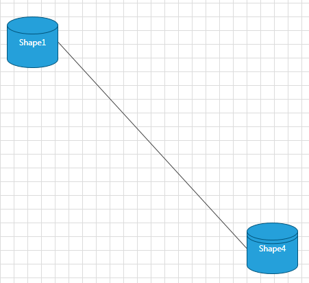If you want to change the route of the connection, you can add connection points in runtime while pressing the __Ctrl__ key and using the mouse to place points on the connection. You can move each point around the diagramming surface to create a curved connection. You can also explicitly define the connection points in code-behind through the __RadDiagramConnection.ConnectionPoints__ property. You can populate the __ConnectionPoints__ collection with objects of type __Point__:
			

	
<telerik:RadDiagram>
    <telerik:RadDiagramShape x:Name="xShape1"
                                Content="Shape1"
                                Geometry="{telerik:FlowChartShape ShapeType=Database1Shape}"
                                Position="250,100" />
    <telerik:RadDiagramShape x:Name="xShape4"
                                Content="Shape4"
                                Geometry="{telerik:FlowChartShape ShapeType=Database2Shape}"
                                Position="400,300" />

    <telerik:RadDiagramConnection x:Name="xConnection"
                                    ConnectionType="Polyline"
                                    Source="{Binding ElementName=xShape1}"
                                    Target="{Binding ElementName=xShape4}" />
</telerik:RadDiagram>			  
			  

	
xConnection.ConnectionPoints.Add(new Point(300, 140));
xConnection.ConnectionPoints.Add(new Point(420, 200));
xConnection.ConnectionPoints.Add(new Point(440, 300));			  
			  

	
xConnection.ConnectionPoints.Add(New Point(300, 140))
xConnection.ConnectionPoints.Add(New Point(420, 200))
xConnection.ConnectionPoints.Add(New Point(440, 300))			  
			  

Sample of a curved Polyline connection: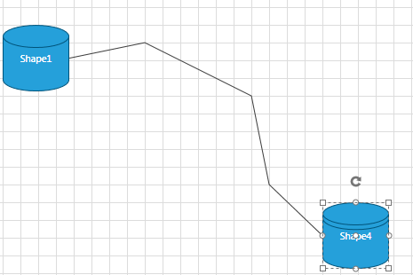

>tipYou can use a default routing algorithm to automatically create connection points and route your connections. This basically ensures that the diagramming framework will use a routing algorithm to make sure that the path of the connection won't collide with any shapes. In order to use this feature, you can set the __RadDiagram RouteConnections__ property to __True__. Please refer to the [Routing]() tutorial for more information on the routing algorithm.
			  If you want to use a rounded polyline connection, you can set the __RadDiagram ConnectionRoundedCorners__ to __True__.
			

#### __XAML__

{{region raddiagram_features_connection_5}}
	        <telerik:RadDiagram x:Name="xDiagram" ConnectionRoundedCorners="True">
	            <telerik:RadDiagramShape x:Name="xShape1"
	                                     Content="Shape1"
	                                     Geometry="{telerik:FlowChartShape ShapeType=Database1Shape}"
	                                     Position="240,260" />
	            <telerik:RadDiagramShape x:Name="xShape2"
	                                     Content="Shape2"
	                                     Geometry="{telerik:FlowChartShape ShapeType=DataStoreShape}"
	                                     GlidingStyle="Rectangle"
	                                     Position="600,80"
	                                     UseGlidingConnector="True" />
	            <telerik:RadDiagramShape x:Name="xShape3"
	                                     Content="Shape3"
	                                     Geometry="{telerik:FlowChartShape ShapeType=DataStoreShape}"
	                                     Position="600,380" />
	            <telerik:RadDiagramConnection ConnectionType="Polyline"
	                                          Source="{Binding ElementName=xShape1}"
	                                          SourceConnectorPosition="Top"
	                                          Target="{Binding ElementName=xShape2}"/>
	            <telerik:RadDiagramConnection ConnectionType="Polyline"
	                                          Source="{Binding ElementName=xShape1}"
	                                          SourceConnectorPosition="Bottom"
	                                          Target="{Binding ElementName=xShape3}" />
	
	        </telerik:RadDiagram>
	{{endregion}}

>Please note that in the above example the __ConnectionPoints__ of the connections are added in runtime using the __Ctrl__ key and the mouse.
			  

* __Bezier__ - this connection type allows you to create a Bézier curve. The Bezier connection is a curve specified by four points: two end points (p1 and p2) - the source/start and target/end of the connection and two handle points (h1 and h2) and a tension parameter. The curve begins at p1 and ends at p2 and it doesn't pass through the handle points, but the handle points act as magnets, pulling the curve in certain directions and influencing the way the curve bends. The following illustration shows a Bézier __RadDiagramConnection__ along with its endpoints and handle points.
			

Illustration of a Bezier connection definition points: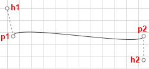The __RadDiagramConnection.BezierTension__ parameter defines the curve that will be produced for a given set of end and handle points. The following illustration shows four Bezier connections defined by the same set of end and handle points:
			

	
        <telerik:RadDiagram x:Name="xDiagram" Margin="50">
            <telerik:RadDiagramShape x:Name="xShape1"
                                Content="Shape1"
                                Geometry="{telerik:FlowChartShape ShapeType=Database1Shape}"
                                Position="50,50" />
            <telerik:RadDiagramShape x:Name="xShape2"
                                Content="Shape2"
                                Geometry="{telerik:FlowChartShape ShapeType=DataStoreShape}"
                                Position="450,100" />
            <telerik:RadDiagramConnection ConnectionType="Bezier" BezierTension="3"
                                    Source="{Binding ElementName=xShape1}"
                                    Target="{Binding ElementName=xShape2}" Stroke="Red"/>
            <telerik:RadDiagramConnection ConnectionType="Bezier" BezierTension="9"
                                    Source="{Binding ElementName=xShape1}"
                                    Target="{Binding ElementName=xShape2}" Stroke="Blue"/>
            <telerik:RadDiagramConnection ConnectionType="Bezier" BezierTension="16"
                                    Source="{Binding ElementName=xShape1}"
                                    Target="{Binding ElementName=xShape2}" Stroke="Green"/>
        </telerik:RadDiagram>			  
			  

Illustration of a Bezier connection tension parameter:By default when you create a Bezier connection and attach its endpoints to __RadDiagramShapes__, the position of the handle points of the connection will be calculated based on the connector positions. Both handle points will be added to the __RadDiagramConnection.ConnectionPoints__ collection. The following snapshot illustrates the default direction of the Bezier connection handles based on the position of the connector to which the connection is attached.
			

Illustration of a Bezier connection default handle points directions: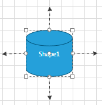The offset between a Bezier connection handle point and its corresponding endpoint is controlled thorough the __BezierAutoOffset DiagramConstants__. Its default value is 30px, but you can change it to better fit your needs:
			

	
DiagramConstants.BezierAutoOffset = 40;			  
			  

	
DiagramConstants.BezierAutoOffset = 40			  
			  

When attaching a Besizer connection to a __RadDiagramShape__ you need to consider if it is attached to a built-in connector or to a custom connector. If the connection is attached to a custom connector, then you will have to manually set the position of the Bezier handle points. You can change the position of the points after you access them from the __RadDiagramConnection.ConnectionPoints__ collection, but you will also have to set the __RadDiagramConnection.IsModified__ property to __True__ to apply the changes:
			

	
this.xDiagram.Connections[0].ConnectionPoints[0] = new Point(100, 100);
this.xDiagram.Connections[0].ConnectionPoints[1] = new Point(220, 200);
this.xDiagram.Connections[0].IsModified = true;			  
			  

	
Me.xDiagram.Connections(0).ConnectionPoints(0) = New Point(100, 100)
Me.xDiagram.Connections(0).ConnectionPoints(1) = New Point(220, 200)
Me.xDiagram.Connections(0).IsModified = True			  
			  

If you don't want to manually traverse the __ConnectionPoints__ collection and then set the __IsModified__ property, you can use the __RadDiagramConnection.SetBezierHandles(Point,Point)__ method. It facilitates the definition of custom coordinates for the two handle points of a Bezier connection:
			

	
(this.xDiagram.Connections[0] as RadDiagramConnection).SetBezierHandles(new Point(100, 100), new Point(220, 200));	  
			  

	
TryCast(Me.xDiagram.Connections(0), RadDiagramConnection).SetBezierHandles(New Point(100, 100), New Point(220, 200))
			  

>Please note that if you create custom connectors which names include any of the following strings:
			  

* „right“

* “left”

* “bottom”

* “up”the __Bezier Connection__ handle points will point at the direction indicated by the respective string.
			  On the other hand, if you attach a __Bezier Connection__ to a custom connector which name doesn't indicate a direction, the handle points of the connection will match the start and end point of the connection.
			  

* __Spline__ - this connection type represents a cardinal spline. The connection is specified by an array of points - the connection passes smoothly through each point in the array; there are no sharp corners and no abrupt changes in the tightness of the curve. The following illustration shows a set of points and a spline connection that passes through each point in the set.
			

Sample of a Spline connection:In order to set the array of points, you will have to populate the __RadDiagram.ConnectionPoints__ collection. You can do that manually in code-behind:
			

	
<telerik:RadDiagram x:Name="xDiagram" >
    <telerik:RadDiagramShape x:Name="xShape1"
                            Content="Shape1"
                            Geometry="{telerik:FlowChartShape ShapeType=Database1Shape}"
                            Position="0,0" />
    <telerik:RadDiagramShape x:Name="xShape2"
                            Content="Shape2"
                            Geometry="{telerik:FlowChartShape ShapeType=DataStoreShape}"
                            Position="450,100" />
    <telerik:RadDiagramConnection ConnectionType="Spline"
                                  Source="{Binding ElementName=xShape1}"
                                  Target="{Binding ElementName=xShape2}" />
</telerik:RadDiagram>			  
			  

	
this.xDiagram.Connections[0].ConnectionPoints.Add(new Point(140, 20));
this.xDiagram.Connections[0].ConnectionPoints.Add(new Point(250, 150));
this.xDiagram.Connections[0].ConnectionPoints.Add(new Point(350, 50));			  			  
						  

	
Me.xDiagram.Connections(0).ConnectionPoints.Add(New Point(140, 20))
Me.xDiagram.Connections(0).ConnectionPoints.Add(New Point(250, 150))
Me.xDiagram.Connections(0).ConnectionPoints.Add(New Point(350, 50))	  			  
						  

## CapTypes
<table>CapTypes enumeration members:<tr><td>

<b>None</b>

	 
		<telerik:RadDiagramConnection
            SourceCapType="None"
            TargetCapType="None"
            StartPoint="10,360"
            EndPoint="80,360" />
			  

</td><td>

<b>Arrow1</b>

	
		<telerik:RadDiagramConnection
            SourceCapType="Arrow1"
            TargetCapType="Arrow1"
            StartPoint="10,30"
            EndPoint="80,30" />
			  

</td><td>

<b>Arrow1Filled</b>

	
		<telerik:RadDiagramConnection
            SourceCapType="Arrow1Filled"
            TargetCapType="Arrow1Filled"
            StartPoint="10,60"
            EndPoint="80,60" />
				

</td></tr><tr><td>

<b>Arrow2</b>

	
		<telerik:RadDiagramConnection
            SourceCapType="Arrow2"
            TargetCapType="Arrow2"
            StartPoint="10,90"
            EndPoint="80,90" />
				

</td><td>

<b>Arrow2Filled</b>

	
		<telerik:RadDiagramConnection
            SourceCapType="Arrow2Filled"
            TargetCapType="Arrow2Filled"
            StartPoint="10,120"
            EndPoint="80,120" />
			  

</td><td>

<b>Arrow3</b>

	
		<telerik:RadDiagramConnection
            SourceCapType="Arrow3"
            TargetCapType="Arrow3"
            StartPoint="10,150"
            EndPoint="80,150" />
			  

</td></tr><tr><td>

<b>Arrow4</b>

	
		<telerik:RadDiagramConnection
            SourceCapType="Arrow4"
            TargetCapType="Arrow4"
            StartPoint="10,180"
            EndPoint="80,180" />
				

</td><td>

<b>Arrow4Filled</b>

	
		<telerik:RadDiagramConnection
            SourceCapType="Arrow4Filled"
            TargetCapType="Arrow4Filled"
            StartPoint="10,210"
            EndPoint="80,210" />
			  

</td><td>

<b>Arrow5</b>

	
		<telerik:RadDiagramConnection
            SourceCapType="Arrow5"
            TargetCapType="Arrow5"
            StartPoint="10,240"
            EndPoint="80,240" />
				

</td></tr><tr><td>

<b>Arrow5Filled</b>

	
		<telerik:RadDiagramConnection
            SourceCapType="Arrow5Filled"
            TargetCapType="Arrow5Filled"
            StartPoint="10,270"
            EndPoint="80,270" />
				

</td><td>

<b>Arrow6</b>

	
		<telerik:RadDiagramConnection
            SourceCapType="Arrow6"
            TargetCapType="Arrow6"
            StartPoint="10,300"
            EndPoint="80,300" />
				

</td><td>

<b>Arrow6Filled</b>

	
		<telerik:RadDiagramConnection
            SourceCapType="Arrow6Filled"
            TargetCapType="Arrow6Filled"
            StartPoint="10,330"
            EndPoint="80,330" />
				

</td></tr></table>

## Set Content

You can label a connection by setting its __Content__ property. The __Content__ property can define a string, a __UIElement__ or it can be bound to a business property.
		

* Label a connection with a sample string:
			

#### __XAML__

{{region raddiagram_features_connection_0}}
	    <Grid>
	        <telerik:RadDiagram>
	            <telerik:RadDiagramShape
	                x:Name="ConditionShape"
	                Width="80"
	                Height="80"
	                Content="condition"
	                FontWeight="Bold"
	                Geometry="{telerik:FlowChartShape ShapeType=DecisionShape}"
	                Position="160,80" />
	            <telerik:RadDiagramShape
	                x:Name="StatementShape1"
	                Width="100"
	                Content="statement(s)"
	                FontWeight="Bold"
	                Position="60,280" />
	            <telerik:RadDiagramConnection
	                Content="if condition is false"
	                FontWeight="Bold"
	                Source="{Binding ElementName=ConditionShape}"
	                SourceConnectorPosition="Bottom"
	                StrokeThickness="2"
	                Target="{Binding ElementName=StatementShape1}"
	                TargetCapType="Arrow1Filled" />
	        </telerik:RadDiagram>
	    </Grid>
	{{endregion}}

* Define __UIElements__ in the __Content__ of the connection:
			

#### __XAML__

{{region raddiagram_features_connection_1}}
	    <Grid>
	        <telerik:RadDiagram>
	            <telerik:RadDiagramShape x:Name="ConditionShape"
	                                     Width="80"
	                                     Height="80"
	                                     Content="condition"
	                                     FontWeight="Bold"
	                                     Geometry="{telerik:FlowChartShape ShapeType=DecisionShape}"
	                                     Position="160,80" />
	            <telerik:RadDiagramShape x:Name="StatementShape1"
	                                     Width="100"
	                                     Content="statement(s)"
	                                     FontWeight="Bold"
	                                     Position="60,280" />
	            <telerik:RadDiagramConnection FontWeight="Bold"
	                                          Source="{Binding ElementName=ConditionShape}"
	                                          SourceConnectorPosition="Bottom"
	                                          StrokeThickness="2"
	                                          Target="{Binding ElementName=StatementShape1}"
	                                          TargetCapType="Arrow1Filled">
	                <telerik:RadDiagramConnection.Content>
	                    <Grid>
	                        <Grid.RowDefinitions>
	                            <RowDefinition />
	                            <RowDefinition />
	                            <RowDefinition />
	                        </Grid.RowDefinitions>
	                        <StackPanel Margin="3" Orientation="Horizontal">
	                            <TextBlock Text="StrokeThickness: " />
	                            <TextBlock Text="{Binding RelativeSource={RelativeSource AncestorType=telerik:RadDiagramConnection}, Path=StrokeThickness}" />
	                        </StackPanel>
	                        <StackPanel Grid.Row="1"
	                                    Margin="3"
	                                    Orientation="Horizontal">
	                            <TextBlock Text="StartPoint: " />
	                            <TextBlock Margin="0,0,4,0" Text="{Binding RelativeSource={RelativeSource AncestorType=telerik:RadDiagramConnection}, Path=StartPoint}" />
	                        </StackPanel>
	                        <StackPanel Grid.Row="2"
	                                    Margin="3"
	                                    Orientation="Horizontal">
	                            <TextBlock Text="EndPoint: " />
	                            <TextBlock Text="{Binding RelativeSource={RelativeSource AncestorType=telerik:RadDiagramConnection}, Path=EndPoint}" />
	                        </StackPanel>
	                    </Grid>
	                </telerik:RadDiagramConnection.Content>
	            </telerik:RadDiagramConnection>
	        </telerik:RadDiagram>
	    </Grid>
	{{endregion}}

* Bind the __Content__ to a business property:
			For the purpose of this tutorial, let's define a sample business class and set it as the __DataContext__ of the UserControlWindow.
			

	
	 public class DataItem : ViewModelBase
        {
            private string ipAddress;
            public string IpAddress
            {
                get { return ipAddress; }
                set
                {
                    ipAddress = value;
                    this.OnPropertyChanged("IpAddress");
                }
            }
        }
		....
	this.DataContext = new DataItem() { IpAddress = "192.168.92.0" };
				

	
Public Class DataItem
	Inherits ViewModelBase
	Private m_ipAddress As String
	Public Property IpAddress() As String
		Get
			Return m_ipAddress
		End Get
		Set
			m_ipAddress = value
			Me.OnPropertyChanged("IpAddress")
		End Set
	End Property
End Class
	...
Me.DataContext = New DataItem() With { .IpAddress = "192.168.92.0" }
				

#### __XAML__

{{region raddiagram_features_connection_2}}
	    <Grid>
	        <telerik:RadDiagram>
	            <telerik:RadDiagramShape x:Name="ConditionShape"
	                                     Height="30"
	                                     Content="Router"
	                                     FontWeight="Bold"
	                                     Geometry="{telerik:FlowChartShape ShapeType=Database1Shape}"
	                                     Position="80,80" />
	            <telerik:RadDiagramShape x:Name="StatementShape1"
	                                     Content="PC 1"
	                                     FontWeight="Bold"
	                                     Position="120,220" />
	            <telerik:RadDiagramConnection VerticalContentAlignment="Top"
	                                          Content="{Binding IpAddress}"
	                                          FontWeight="Bold"
	                                          Source="{Binding ElementName=ConditionShape}"
	                                          Target="{Binding ElementName=StatementShape1}"
	                                          TargetCapType="Arrow1Filled" />
	        </telerik:RadDiagram>
	    </Grid>
	{{endregion}}

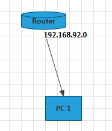

* If you want to customize the visual representation of the bound property, you can take advantage of the __RadDiagramConnection ContentTemplate__ property:
			

#### __XAML__

{{region raddiagram_features_connection_3}}
	    <Grid>
	        <telerik:RadDiagram>
	            <telerik:RadDiagramShape x:Name="ConditionShape"
	                                     Height="30"
	                                     Content="Router"
	                                     FontWeight="Bold"
	                                     Geometry="{telerik:FlowChartShape ShapeType=Database1Shape}"
	                                     Position="80,80" />
	            <telerik:RadDiagramShape x:Name="StatementShape1"
	                                     Content="PC 1"
	                                     FontWeight="Bold"
	                                     Position="120,220" />
	            <telerik:RadDiagramConnection VerticalContentAlignment="Top"
	                                          Content="{Binding IpAddress}"
	                                          FontWeight="Bold"
	                                          Source="{Binding ElementName=ConditionShape}"
	                                          Target="{Binding ElementName=StatementShape1}"
	                                          TargetCapType="Arrow1Filled">
	                <telerik:RadDiagramConnection.ContentTemplate>
	                    <DataTemplate>
	                        <StackPanel Margin="-60,5,0,0" Orientation="Horizontal">
	                            <TextBlock Text="Interface: " />
	                            <TextBlock Text="{Binding}" />
	                        </StackPanel>
	                    </DataTemplate>
	                </telerik:RadDiagramConnection.ContentTemplate>
	            </telerik:RadDiagramConnection>
	        </telerik:RadDiagram>
	    </Grid>
	{{endregion}}

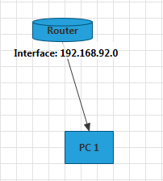

## Customize the Connection Appearance

You can easily customize the visual appearance of the __RadDiagramConnection__ by using the following properties:
		

* __Stroke__ - gets or sets the brush that specifies how the __RadDiagramConnection__ is painted.
			

* __StrokeDashArray__ - gets or sets a collection of __Double__ values that indicate the pattern of dashes and gaps that is used to outline the __RadDiagramConnection__.
			

* __StrokeThickness__ - gets or sets the width of the __RadDiagramConnection__ outline.
			

* __Background__ - gets or sets the brush that specifies the __SourceCap__ and __TargetCap__ inner background.
			

>tipYou can use the __RadDiagram.ConnectionStyle__ property to explicitely apply a style on all __RadDiagramConnections__ in a __RadDiagram__ instance. [Read more](2ab56752-2384-426a-926c-34fc2108c2e6#ConnectionStyles).
		  

## Connection Edit Mode

You can set the __RadDiagramConnection__ in edit mode using the __IsInEditMode__ property. By default when an item enters edit mode, the __RadDiagramConnection.Content__ is displayed inside a __TextBox__ control so that you can change its value.
		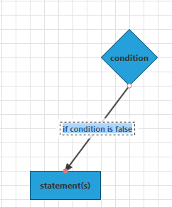

If the __RadDiagramConnection.Content__ property is bound to a business item, you can set the connection __EditTemplate__ to define how the business item will be edited. For example if we use the __DataItem__ class, defined above, as a __DataContext__ of the __RadDiagram__, we can set up the following connection:
		

#### __XAML__

{{region raddiagram_features_connection_4}}
	    <Grid>
	        <telerik:RadDiagram>
	            <telerik:RadDiagramShape x:Name="ConditionShape"
	                                     Height="30"
	                                     Content="Router"
	                                     FontWeight="Bold"
	                                     Geometry="{telerik:FlowChartShape ShapeType=Database1Shape}"
	                                     Position="80,80" />
	            <telerik:RadDiagramShape x:Name="StatementShape1"
	                                     Width="100"
	                                     Content="PC 1"
	                                     FontWeight="Bold"
	                                     Position="120,220" />
	            <telerik:RadDiagramConnection VerticalContentAlignment="Top"
	                                          Content="{Binding}"
	                                          FontWeight="Bold"
	                                          Source="{Binding ElementName=ConditionShape}"
	                                          Target="{Binding ElementName=StatementShape1}"
	                                          TargetCapType="Arrow1Filled">
	                <telerik:RadDiagramConnection.ContentTemplate>
	                    <DataTemplate>
	                        <TextBlock Text="{Binding IpAddress}" />
	                    </DataTemplate>
	                </telerik:RadDiagramConnection.ContentTemplate>
	                <telerik:RadDiagramConnection.EditTemplate>
	                    <DataTemplate>
	                        <TextBox Text="{Binding IpAddress}" />
	                    </DataTemplate>
	                </telerik:RadDiagramConnection.EditTemplate>
	            </telerik:RadDiagramConnection>
	        </telerik:RadDiagram>
	    </Grid>
	{{endregion}}

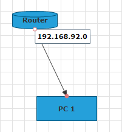

>Apart from setting the __IsInEditMode__ property to __True__, you can also enter edit mode by pressing __F2__ or double-clicking on the shape. For more information please refer to the [Items Editing]() tutorial.
		  

## Connection Bridge

The Connection Bridge is essentially what you see when two connections collide. The __RadDiagram__ allows you to define what kind of bridge to display through the __ConnectionBridge__ property. It is an enumeration of type __BridgeType__ that exposes the following members:
		

* __None__ - there is no bridge to visualize the intersection of the connections
			

* __Bow__ - a half circle is displayed to indicate the intersection of the connections
			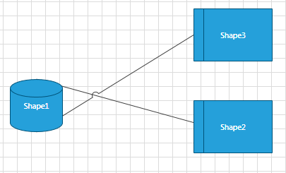

* __Gap__ - a gap is displayed to indicate the intersection of the connections
			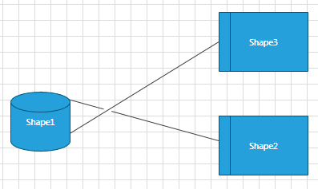

## Connection Selection State

The following properties allow you to track and control the selection state of a connection:

* __IsSelected__ - gets or sets whether the connection is selected.
			

* __IsSelectedInGroup__ - gets a value indicating whether this connection is selected in a group.
			

## Connection ZIndex

You can get or set the z-order rendering behavior of the __RadDiagramConnection__ through the __ZIndex__ property.
		

## Connection Bounds

You can get the bounds of a __RadDiagramConnection__ through the __Bounds__ property. It is of type __Rect__ and it describes the width, height and location of the connection's bounds.
		

# See Also

 * [Structure]()

 * [Getting Started]()

 * [Populating with Data]()

 * [Shapes]()

 * [Items Editing]()

 * [Rotation]()

 * [Selection]()

 * [Diagram Events]()

 * [Items Events]()
