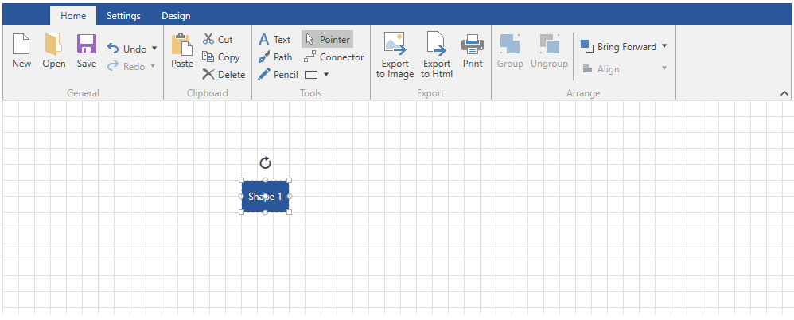

# Overview
 
With the __R1 2019__ version Telerik UI for WPF we have introduced the __RadDiagramRibbon__ control. It allows users to examine and modify the settings of the diagramming items in run-time.

The control is a configured [RadRibbonView]() which is used as a top level navigation control for the RadDiagram. Its main purpose is to provide you with a ready-to-use view that contains the most common features and settings of the RadDiagram. RadDiagramRibbon is fully customizable and scales its child widgets automatically based on the available area. 

>In order to use the __RadDiagramRibbon__ control along with the __RadDiagram__ in your projects you have to add references to the following assemblies:
>	- Telerik.Windows.Controls
>	- Telerik.Windows.Controls.Navigation
>	- Telerik.Windows.Controls.Input
>	- Telerik.Windows.Controls.Diagrams
>	- Telerik.Windows.Controls.Diagrams.Ribbon
>	- Telerik.Windows.Controls.RibbonView
>	- Telerik.Windows.Diagrams.Core
>	- Telerik.Windows.Controls.Diagrams.Extensions

__RadDiagramRibbon__ exposes a __Diagram__ property which is used to associate the ribbon with a particular diagram instance.

#### __[XAML] Example 1: Specify RadDiagramRibbon in XAML__
{{region raddiagram-extensions-diagramribbon-overview-0}}
	<Grid>
		<Grid.RowDefinitions>
			<RowDefinition Height="Auto"/>
			<RowDefinition Height="*"/>
		</Grid.RowDefinitions>
		<telerik:RadDiagramRibbon Diagram="{Binding ElementName=diagram}"/>
		<telerik:RadDiagram x:Name="diagram" Grid.Row="1">
			<telerik:RadDiagramShape Content="Shape 1"/>
		</telerik:RadDiagram>
	</Grid>
{{endregion}}

#### __Figure 1: DiagramRibbon Overview__ 

>Please note that the examples in this tutorial are showcasing the Windows8 theme. In the [Setting a Theme]() article you can find more information on how to set an application-wide theme.

## Customize Tabs and Groups

__RadDiagramRibbon__ by design contains three build-in __RibbonTabs__ which hold different types of settings for customizing your __RadDiagram__: __Home, Settings and Design__. To add a new tab or a new group, you can use the __AdditionalTabs__ and __AdditionalGroups__ collection properties. 

### Add New RadRibbonTab

To add a new tab you can just call the __Add()__ method of the __AdditionalTabs__ collection or declare it dirrectly in __XAML__. The new tab will be placed at the last position.

#### __[XAML] Example 2: Add RadRibbonTab in XAML__
{{region xaml-raddiagram-extensions-diagramribbon-overview-1}}
	<telerik:RadDiagramRibbon x:Name="diagramRibbon"
							  Diagram="{Binding ElementName=diagram}" >
		<telerik:RadRibbonTab Header="New Tab">
			<telerik:RadRibbonGroup Header="New Group"/>
		</telerik:RadRibbonTab>		
	</telerik:RadDiagramRibbon>
{{endregion}}

#### __[C#] Example 3: Add RadRibbonTab programmatically__
{{region cs-raddiagram-extensions-diagramribbon-overview-2}}
	public MainWindow()
	{
		InitializeComponent();
		RadRibbonTab newTab = new RadRibbonTab();
		newTab.Header = "New Tab";
		newTab.Items.Add(new RadRibbonGroup() { Header="New Group" });
		diagramRibbon.AdditionalTabs.Add(newTab);
	}
{{endregion}}

#### __Figure 2: Add new tab__ 

### Add New RadRibbonGroup

To add a new group to __Home__ tab for example first you can create a new __RadRibbonGroup__ and add a RadRibbonButton to that group. Then you need to specify to which tab you want to add the group. To do that you can set the __DiagramRibbonExtensions.RibbonTabHeader__ attached property. The last step is to add the new group to the __AdditionalGroups__ collection.

#### __[XAML] Example 2: Add RadRibbonGroup in XAML__
{{region raddiagram-extensions-diagramribbon-overview-1}}
	<telerik:RadDiagramRibbon x:Name="diagramRibbon"
							  Diagram="{Binding ElementName=diagram}" >
		<telerik:RadDiagramRibbon.AdditionalGroups>
			<telerik:RadRibbonGroup Header="New Group"  telerik:DiagramRibbonExtensions.RibbonTabHeader="Home">
				<telerik:RadRibbonButton Content="My Button" VerticalContentAlignment="Center" Foreground="White" Background="#2A579A"/>
			</telerik:RadRibbonGroup>
		</telerik:RadDiagramRibbon.AdditionalGroups>	
	</telerik:RadDiagramRibbon>
{{endregion}}

#### __[C#] Example 5: Add RadRibbonGroup programmatically__
{{region raddiagram-extensions-diagramribbon-overview-2}}
	public void AddNewGroup()
	{
		RadRibbonButton button = new RadRibbonButton();
		button.Content = "My Button";
		button.Foreground = Brushes.White;
		button.Background = new SolidColorBrush((Color)(ColorConverter.ConvertFromString("#2A579A")));
		button.VerticalContentAlignment = VerticalAlignment.Center;

		RadRibbonGroup newGroup = new RadRibbonGroup();
		newGroup.Name = "new_group";
		newGroup.Header = "Group Name";
		newGroup.Items.Add(button);
		newGroup.SetValue(DiagramRibbonExtensions.RibbonTabHeaderProperty, "Home");

		this.diagramRibbon.AdditionalGroups.Add(newGroup);
	}
{{endregion}}

#### __Figure 3: Add new group__ 

## Keyboard Support

__RadDiagramRibbon__ provides a keyboard navigation mechanism using key tips and the arrow keys. The key tips are enabled by default. This feature can be disabled by setting the __KeyTipService.IsKeyTipsEnabled__ attached property on the __RadDiagramRibbon__ to __False__.

#### __[XAML] Example 3: Disable DiagramRibbon KeyTips__
{{region raddiagram-extensions-diagramribbon-overview-2}}
	<telerik:RadDiagramRibbon telerik:KeyTipService.IsKeyTipsEnabled="False" />
{{endregion}}

## DiagramRibbon Commands

The __RadDiagramRibbon__ control provides built-in commands which can be used in an MVVM scenario to modify your diagram and its items. The static __DiagramRibbonCommands__ class is located in the **Telerik.Windows.Controls.Diagrams.Ribbon** assembly:

* __SugiyamaLayout__: Rearange the RadDiagram items in Sugiyama Layout. [(Read more)](#astarrouter)
* __TreeLayout__: Rearange the RadDiagram items in Tree Layout. [(Read more)](#orgtreerouter)
* __ChangeConnectionType__: Change the connection type. [(Read more)](#connection-types)
* __ChangeUseFreeConnectors__: Change UseFreeConnectors property of the RadDiagram.
* __EnableAStarRouter__: Set AStarRouter to the RadDiagram and update all connections.
* __RouteAll__: Update all connections in the RadDiagram.

## Events

* __HtmlExportButtonClicked__: This event is called when the HTML Export button is clicked. Plase note that there is no built-in logic which will export the RadDiagram in HTML file and this event is exposed so that you can handle it and call your exporting logic. More information on how to export RadDiagram in HTML can be found in the [Html Support]() article.

## See Also

* [Getting Started]()
* [DiagramExtensions ViewModels]()
* [Extensions Overview]()
